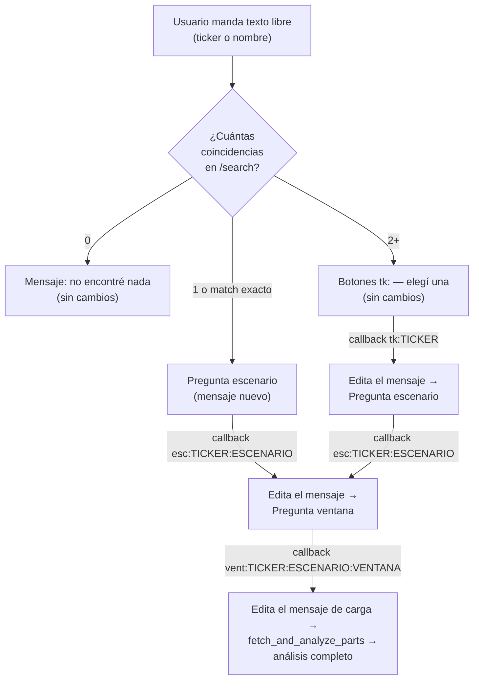

# Spec: Migración de datos históricos anual → trimestral (EPS TTM real, P/S, margen bruto, WACC, pilares, CAGR de Graham/DCF, FCF) [Iter-2 — ampliación de alcance]

**Rol:** `architect`.
**Pipeline:** BMAD + SDD + Ralph Loop (ver `/Users/danielavergara/Documents/Programming/claude/contextos/pipeline.md`)
**Historial de esta spec:** nació acotada a "arreglar el EPS/PER desactualizado" (ver "Alcance original — v1" más abajo, conservado íntegro por trazabilidad). Daniela confirmó con `curl` real que `period="quarter"` funciona en el plan gratuito para `/income-statement` (fixture `tests/fixtures/fmp/income_statement_quarterly_nvda_real.json`). Después de esa confirmación, **amplió el alcance dos veces por escrito, ambas con la misma respuesta literal: "todo trimestral"** — incluyendo lo que la v1 dejaba explícitamente fuera (Decisión #6 original, ahora **revocada**, ver "Ampliación de alcance"). Esta versión (Iter-2) es la spec vigente completa — no hace falta leer la v1 para implementar, pero se conserva para trazabilidad de por qué existen ciertas decisiones.
**Siguiente paso:** `security` revisa la superficie ampliada — sigue sin haber ningún endpoint HTTP nuevo (los 3 endpoints de datos propios del ticker ya existían y ya estaban auditados; solo cambian `period`/`limit` en las llamadas). Los 3 endpoints (`/income-statement`, `/balance-sheet-statement`, `/cash-flow-statement`) con `period="quarter"` ya están **confirmados con `curl` real** (ver actualización 2026-07-31 más abajo) — no queda ningún endpoint de esta spec sin verificar. Sigue habiendo **fallbacks condicionales que pueden duplicar temporalmente una llamada** (ver Decisión #8) si alguno falla en producción por otra razón (rate limit, timeout, cambio de política de FMP) — `security` debería confirmar que ese manejo sigue el mismo patrón defensivo ya auditado en el resto del proyecto (no hay código nuevo de manejo de errores, se reutiliza `fmp_client.FMPError` tal cual). Después `qa` agrega criterios de cobertura/testabilidad. Este proyecto no usa un paso de `frontend` separado.

---

## Alcance original — v1 (conservado por trazabilidad, ver "Ampliación de alcance" para lo vigente)

### Contexto

Daniela reportó que al consultar NVDA el bot mostró un PER y un EPS "desactualizados", y el pilar "Utilidades positivas y crecientes" salió en ❌ de forma sospechosa. La causa está confirmada por inspección de código:

- En `src/investbot/query_handler.py` (líneas 146-163 de la versión pre-spec), lo que el código llama `eps_ttm` es en realidad `net_income / shares_outstanding` calculado sobre `income_statements[0]`, el **último reporte ANUAL** — no un TTM real.
- En `src/investbot/summary.py`, `_MODELO_FORMULAS` (líneas 80-88) le promete al usuario "**EPS (TTM)**" — promesa que el dato no cumplía.
- `net_income_historial` (vía `_annual_series`) alimenta el pilar `utilidades_crecientes` en `rules.py` comparando solo el extremo más reciente contra el más antiguo de hasta 5 años anuales.
- Para una empresa con año fiscal no calendario y crecimiento volátil (caso NVDA), el último anual puede estar meses desalineado de la realidad TTM.

**Decisión ya tomada por Daniela en esta etapa:** implementar un EPS TTM real sumando los últimos 4 trimestres (`period="quarter", limit=4` sobre `/income-statement`).

**Supuestos que la v1 dejaba sin verificar — ahora CONFIRMADOS el 2026-07-31 con `curl` real** (`/income-statement?symbol=NVDA&period=quarter&limit=4`, capturado en `tests/fixtures/fmp/income_statement_quarterly_nvda_real.json`, documentado en `tests/fixtures/fmp/README.md`):
1. `period="quarter"` funciona en el plan gratuito de FMP para `/income-statement` — **confirmado**: respuesta 200 con 4 trimestres, sin 402 (había además una señal contradictoria de un tercero, la documentación pública de FinanceToolkit, afirmando que lo trimestral requería plan Premium — el `curl` real la descarta para este endpoint/cuenta).
2. Los nombres de campo son los mismos que en la respuesta anual — **confirmado**: `netIncome`, `revenue`, `costOfRevenue`, `interestExpense`, `incomeTaxExpense`, `incomeBeforeTax`, `weightedAverageShsOutDil`, `weightedAverageShsOut`, `date` están presentes con el mismo shape. (Nota menor sin impacto: el campo de EPS diluido viene como `epsDiluted` en la respuesta trimestral real vs. `epsdiluted` — minúscula — en el fixture anual sintético existente; **irrelevante para esta spec**, ningún código lee ese campo, solo se usa `eps`/`netIncome`/los campos listados arriba.)
3. FMP devuelve los trimestres en orden recent-first — **confirmado**: la respuesta real trae Q1 FY2027 (2026-04-26) primero y Q2 FY2026 (2025-07-27) último.

**Actualización 2026-07-31 — los 3 endpoints ya están confirmados con `curl` real:** además del `curl` original de `/income-statement?period=quarter`, Daniela corrió `/balance-sheet-statement?symbol=NVDA&period=quarter&limit=4` y `/cash-flow-statement?symbol=NVDA&period=quarter&limit=4` — ambos devolvieron 200 con 4 trimestres, capturados en `tests/fixtures/fmp/balance_sheet_quarterly_nvda_real.json` y `tests/fixtures/fmp/cash_flow_quarterly_nvda_real.json` (documentados en `tests/fixtures/fmp/README.md`). Los campos usados por este proyecto (`totalCurrentAssets`, `totalCurrentLiabilities`, `shortTermDebt`, `longTermDebt`, `operatingCashFlow`, `capitalExpenditure`, `freeCashFlow`, `netIncome`) están presentes con el mismo shape que las respuestas anuales. **Ya no queda ningún supuesto de disponibilidad/shape sin verificar para esta spec** — los 3 fixtures "no verificados con curl real" que se piden más abajo (checklist de tests) deben reemplazarse por estos 3 fixtures reales, no crearse como sintéticos.

### Decisiones de la v1 que siguen vigentes sin cambios

- **`fmp_client.py` no cambia.** `get_income_statement`, `get_balance_sheet_statement` y `get_cash_flow_statement` ya aceptan `period`/`limit` como kwargs (`fmp_client.py` líneas 170-218) — ningún endpoint nuevo, ninguna función nueva en el cliente HTTP.
- **`valuation.py` no cambia de firma en sus funciones públicas existentes** — solo gana parámetros nuevos *opcionales con default retrocompatible* (ver Decisión #13/#14 en la Ampliación) — ningún llamador existente se rompe.
- **Transparencia por consulta**: el bot le dice a Daniela qué fuente de datos se usó realmente (trimestral real vs. anual de respaldo) — mismo principio que `fuente_peers`/`_build_peers_note`.
- **Ningún fallo de estas llamadas es visible como error** — siempre fallback silencioso, nunca peor que el comportamiento pre-spec.

### Decisión de la v1 REVOCADA

La v1 tenía una **Decisión #6** que dejaba `net_income_historial`/`revenue_historial`/`eps_historial` (pilares + CAGR de Graham) **fuera de alcance**, 100% anuales, con el razonamiento de que mezclar TTM dentro de una serie de tendencia interanual introducía una inconsistencia conceptual, y lo flageaba explícitamente para confirmación de Daniela antes de `implementer`. **Daniela confirmó por escrito, 2 veces, "todo trimestral"** — pedido explícitamente para no asumir de más. Esta decisión queda **revocada** — ver Decisión #12 en la Ampliación de alcance para el reemplazo completo.

---

## Ampliación de alcance (2026-07-31) — "todo trimestral", confirmado 2 veces por escrito por Daniela

Daniela pidió expandir la migración a trimestral a:
1. `revenue_historial`, `net_income_historial`, `eps_historial` (pilares de crecimiento en `rules.py` + CAGR "g" de Graham en `valuation.py`) — antes excluidos por la Decisión #6 original.
2. `fcf_historial` usado para proyectar el DCF a 5 años (antes 100% anual, vía `/cash-flow-statement`).
3. El balance sheet usado para el ratio de liquidez — Daniela dejó explícitamente que el `architect` decidiera qué significa "trimestral" acá, dado que es un snapshot, no una serie.

Al diseñar esto en detalle encontré que un swap ingenuo de `period="annual"` → `period="quarter"` en los 3 endpoints, sin más ajustes, **rompería silenciosamente 3 cálculos que hoy asumen que cada dato es "de un año completo"**: el ratio P/S, el costo de la deuda (Kd) dentro del WACC, y la base de proyección del DCF. Esto no es una desviación del pedido de Daniela — es lo que hace falta para que "todo trimestral" produzca números correctos en vez de números ~4x distorsionados. Lo documento explícitamente como hallazgo propio del `architect` (Decisión #11), no lo aplico en silencio.

### Estado actual (ampliado — además de lo ya descrito en "Alcance original")

- `src/investbot/query_handler.py` (líneas ~107-227 de la versión pre-spec): construye `revenue`, `cost_of_revenue`, `current_assets`, `current_liabilities` desde `latest_income`/`latest_balance` (ambos `[0]` de listas **anuales**); `wacc_inputs` (líneas ~219-227) usa `latest_income.get("interestExpense"/"incomeTaxExpense"/"incomeBeforeTax")` — **cifras de UN AÑO COMPLETO**, combinadas en `valuation.calculate_wacc` con `total_debt` (un stock del balance) para obtener `Kd = interest_expense / total_debt` (línea 175 de `valuation.py`) — una tasa que solo tiene sentido como "% anual" si `interest_expense` es efectivamente anual.
- `rules.calculate_ps` (línea 70-78): `market_cap / revenue` — `revenue` hoy es la cifra anual completa; el ratio P/S es, por convención universal, "capitalización / ventas de los últimos 12 meses" — si `revenue` pasara a ser la cifra de **un solo trimestre**, el P/S resultante sería ~4x más alto de lo real, sin que el código lo detecte (no hay guarda para esto, es una distorsión silenciosa de la fórmula, no un `None`).
- `rules.calculate_gross_margin` (línea 21-25): `(revenue - cost_of_revenue) / revenue` — es un **ratio entre dos flujos del mismo período** (revenue y costo de ventas del mismo trimestre o del mismo año) — el factor de escala del período se cancela algebraicamente. **Esta fórmula SÍ tolera pasar a base trimestral sin distorsión** (más allá del ruido normal de estacionalidad de márgenes, aceptado como riesgo menor, ver Decisión #15).
- `valuation.calculate_wacc` (líneas 128-181): `tax_rate = income_tax_expense / income_before_tax` (línea 173) es también un ratio entre 2 flujos del mismo período — **tolera base trimestral igual que el margen bruto**. El problema es específicamente `kd_pretax = interest_expense / total_debt` (línea 175): acá se combina un flujo (`interest_expense`) con un stock (`total_debt`, que no tiene "período"), así que `interest_expense` **debe** representar un año completo para que el resultado sea una tasa anual coherente.
- `valuation.calculate_dcf_fair_value` (líneas 184-242): `fcf_reciente = fcf_historial[-1]` (línea 215) es el **ancla de la proyección a 5 años** — la proyección multiplica año a año por `(1+g_fcf)` y descuenta por `(1+wacc)^t` con `t` en años. Si `fcf_historial[-1]` fuera el FCF de un solo trimestre en vez de TTM, todo el DCF proyectado quedaría ~4x subestimado desde el año 1.
- `valuation.calculate_cagr` (líneas 52-77) y sus 4 sitios de uso (`compute_valuation` líneas 312-315/333-336; `compute_valuation_scenarios` líneas 476-479/493-496): `n_años = len(historial) - 1` — asume que **cada paso de la lista es exactamente 1 año**. Con una lista de trimestres, esto calcularía un CAGR "por período" en vez de "por año" (ej. con 12 trimestres, `n_años` calculado sería 11 en vez de ~2.75), inflando artificialmente el exponente `1/n_años` y produciendo un `g` completamente incorrecto.
- `rules._es_creciente`/`evaluate_pillars` (líneas 128-173): **no calculan ningún `n_años`**, solo comparan `historial[-1]` contra `historial[0]` — agnósticas al período de los datos que reciben. No requieren ningún cambio de código, solo cambia qué lista les llega.
- `tests/fixtures/adobe/cash_flow.json` / `balance_sheet.json`: confirmé los nombres de campo reales usados por el código (`operatingCashFlow`, `capitalExpenditure`, `totalCurrentAssets`, `totalCurrentLiabilities`, `shortTermDebt`, `longTermDebt`) — ninguno de los 2 fixtures tiene una variante trimestral hoy.

### Estado objetivo (reemplaza el de la v1)

1. **Presupuesto de requests sin aumento en el camino feliz.** `/income-statement`, `/cash-flow-statement` y `/balance-sheet-statement` pasan de "1 llamada anual fija" a "1 llamada trimestral primaria, con fallback condicional a la llamada anual de hoy solo si la trimestral falla o es insuficiente" — el total de "datos propios del ticker" se mantiene en **6** llamadas cuando las 3 fuentes trimestrales responden bien (igual que hoy), subiendo hasta 9 solo en el peor caso (las 3 fallan a la vez).
2. `eps_ttm`, el ratio P/S, el margen bruto y los inputs del WACC (`interest_expense`, `income_tax_expense`, `income_before_tax`) se derivan, cuando la fuente trimestral está disponible, de sumas TTM (últimos 4 trimestres) — nunca de un solo trimestre suelto. `shares_outstanding` sigue siendo del reporte más reciente (ahora el trimestre más reciente).
3. `revenue_historial`, `net_income_historial`, `eps_historial` y `fcf_historial` pasan a ser series **crudas** trimestre-a-trimestre (no TTM móvil) cuando la fuente trimestral está disponible — alimentan, sin cambios de código en `rules.py`, los mismos pilares de crecimiento; alimentan, con una corrección matemática puntual en `valuation.py` (Decisión #13), el mismo CAGR de Graham y de FCF.
4. La base de proyección del DCF (`fcf_reciente` en `calculate_dcf_fair_value`) pasa a ser el FCF TTM (suma de los últimos 4 trimestres), no el último trimestre suelto ni el último año.
5. El balance sheet usado para liquidez y para `total_debt` del WACC pasa a ser, cuando está disponible, el snapshot del **trimestre más reciente** (más fresco que el año fiscal más reciente) — sin ningún cambio de fórmula, es la misma foto, tomada más seguido.
6. Cualquier fallo, parcial o total, de cualquiera de las 3 fuentes trimestrales cae de forma automática y silenciosa al comportamiento 100% anual que el bot ya tenía antes de esta spec — nunca hay un mensaje de error visible ni una degradación peor que hoy.

### Decisión #8 — Consolidación de requests: 1 llamada primaria trimestral por endpoint, con fallback condicional (reemplaza la Decisión #1 y la primera mitad de la Decisión #3 de la v1)

La v1 asumía que la llamada trimestral se **sumaba** a la anual existente (7 llamadas en vez de 6). Con "todo trimestral" ya no hace falta la anual en el camino feliz — se pide directamente una ventana trimestral suficientemente amplia para servir tanto el valor TTM como la serie de crecimiento:

```python
# income-statement: PRIMARIA trimestral, fallback condicional a anual
try:
    quarterly_income = await fmp_client.get_income_statement(
        clients.fmp_http, clients.fmp_api_key, ticker,
        period="quarter", limit=VENTANA_TRIMESTRES,  # Pregunta F — 12 o 20, sin fijar
    )
except fmp_client.FMPError:
    quarterly_income = []

income_ttm = rules.calculate_income_statement_ttm(quarterly_income)  # Decisión #9
if income_ttm.disponible:
    income_statements_fuente = "trimestral_real"
    income_statements_para_historial = quarterly_income  # crudo, recent-first
else:
    # Fallback: la llamada anual que el bot ya hacía antes de esta spec.
    income_statements_para_historial = await fmp_client.get_income_statement(
        clients.fmp_http, clients.fmp_api_key, ticker  # period="annual" default, limit=5
    )
    income_statements_fuente = "anual_fallback"
```

Mismo patrón, en paralelo, para `cash-flow-statement` (Decisión #14) y para `balance-sheet-statement` (Decisión #16) — **3 decisiones de fuente independientes por consulta**, cada una best-effort, ninguna bloquea a las otras (mismo principio de independencia ya usado en el proyecto para `own_metrics`/`vix_quote`/Finnhub/SEC EDGAR).

**El abort-check existente** (`if not quote or not profile or not income_statements or not balance_sheets or not cash_flows: return [...]`) se preserva en espíritu: si tanto la llamada trimestral como el fallback anual de un endpoint fallan/vienen vacíos, ese hueco de datos participa del abort-check exactamente como participaba la llamada anual única de hoy — no se relaja el piso de disponibilidad actual del bot, solo se le da una oportunidad de éxito trimestral antes de caer al camino de siempre.

**Presupuesto de requests resultante** (ver Decisión #18 para el detalle en README):
- Camino feliz (las 3 fuentes trimestrales responden con datos suficientes): **6 llamadas propias del ticker — igual que hoy, sin aumento.**
- Peor caso (las 3 fuentes trimestrales fallan simultáneamente, ej. FMP retira `period=quarter` del plan gratuito): **9 llamadas propias del ticker** (6 + 3 fallbacks anuales condicionales) — mismo techo que el comportamiento de hoy más 3, ocurre solo si FMP degrada ampliamente su soporte trimestral, no en operación normal.

### Decisión #9 — `rules.py`: funciones TTM generalizadas (reemplazan `calculate_eps_ttm_from_quarters`/`EpsTtmQuarterlyResult` de la v1)

La v1 diseñaba una función específica solo para EPS. Con el alcance ampliado, generalizo el mecanismo de "sumar un campo sobre los últimos 4 trimestres" para reutilizarlo en `netIncome`, `revenue`, `costOfRevenue`, `interestExpense`, `incomeTaxExpense` e `incomeBeforeTax` — **reemplaza por completo** el diseño angosto de la v1:

```python
def sum_ttm_field(quarterly_statements: list[dict], field: str) -> Optional[float]:
    """Suma `field` de los primeros 4 elementos de `quarterly_statements`
    (recent-first, ver Supuesto #3 confirmado). `None` si hay menos de 4
    elementos o si alguno de los 4 tiene el campo ausente/`None`/no numérico
    — nunca suma parcialmente con menos de 4 trimestres reales."""
    primeros_4 = quarterly_statements[:4]
    valores = [q.get(field) for q in primeros_4]
    if len(quarterly_statements) < 4 or any(
        not isinstance(v, (int, float)) for v in valores
    ):
        return None
    return sum(valores)


@dataclass
class IncomeStatementTtmResult:
    disponible: bool
    net_income_ttm: Optional[float] = None
    revenue_ttm: Optional[float] = None
    cost_of_revenue_ttm: Optional[float] = None
    interest_expense_ttm: Optional[float] = None
    income_tax_expense_ttm: Optional[float] = None
    income_before_tax_ttm: Optional[float] = None
    shares_outstanding_reciente: Optional[float] = None


def calculate_income_statement_ttm(
    quarterly_statements: list[dict],
) -> IncomeStatementTtmResult:
    """TTM real de los 6 campos de `/income-statement` que hoy se leen del
    último reporte anual. Diseño ATÓMICO por decisión explícita: si
    CUALQUIERA de los 6 campos no se puede sumar en TTM (falta un trimestre,
    un campo viene no numérico), se descarta el paquete COMPLETO —
    `disponible=False` — en vez de mezclar fuentes campo por campo (ej. EPS
    TTM real pero P/S con revenue anual). Evita un resultado inconsistente
    donde distintos números de la misma respuesta salen de fuentes de datos
    distintas sin que el usuario pueda saberlo. Las 6 cifras vienen del
    mismo fetch, así que en la práctica fallan o funcionan juntas (mismo
    conjunto de 4 registros JSON) — confirmado empíricamente para NVDA: los
    6 campos están presentes en el fixture real
    `tests/fixtures/fmp/income_statement_quarterly_nvda_real.json`.
    """
    campos = (
        "netIncome", "revenue", "costOfRevenue",
        "interestExpense", "incomeTaxExpense", "incomeBeforeTax",
    )
    sumas = {campo: sum_ttm_field(quarterly_statements, campo) for campo in campos}
    if any(v is None for v in sumas.values()):
        return IncomeStatementTtmResult(disponible=False)

    shares = quarterly_statements[0].get("weightedAverageShsOutDil") or quarterly_statements[
        0
    ].get("weightedAverageShsOut")
    if not isinstance(shares, (int, float)) or shares <= 0:
        return IncomeStatementTtmResult(disponible=False)

    return IncomeStatementTtmResult(
        disponible=True,
        net_income_ttm=sumas["netIncome"],
        revenue_ttm=sumas["revenue"],
        cost_of_revenue_ttm=sumas["costOfRevenue"],
        interest_expense_ttm=sumas["interestExpense"],
        income_tax_expense_ttm=sumas["incomeTaxExpense"],
        income_before_tax_ttm=sumas["incomeBeforeTax"],
        shares_outstanding_reciente=shares,
    )
```

Constantes de fuente (mismo patrón que `peers.PEERS_FUENTE_*`):

```python
DATOS_FUENTE_TRIMESTRAL = "trimestral_real"
DATOS_FUENTE_ANUAL_FALLBACK = "anual_fallback"
```

**Por qué "acciones del trimestre más reciente" y no un promedio:** mismo razonamiento que la v1 — el número de acciones cambia por recompras/emisiones, usar el conteo más reciente refleja la estructura de capital actual, mismo criterio que el cálculo anual de hoy ya usa (no promedia entre años tampoco).

**Conocido y aceptado, no manejado por esta spec:** fechas de trimestre duplicadas/superpuestas (empresa que cambió su cierre fiscal a mitad de año) no se detectan — mismo criterio que la v1, hallazgo post-hoc si aparece.

### Decisión #10 — `query_handler.py`: rediseño del bloque de fetch propio del ticker (reemplaza la Decisión #3 de la v1)

```python
# --- income-statement: trimestral primario, fallback anual condicional ---
try:
    quarterly_income = await fmp_client.get_income_statement(
        clients.fmp_http, clients.fmp_api_key, ticker,
        period="quarter", limit=VENTANA_TRIMESTRES,
    )
except fmp_client.FMPError:
    quarterly_income = []

income_ttm = rules.calculate_income_statement_ttm(quarterly_income)

if income_ttm.disponible:
    eps_ttm = income_ttm.net_income_ttm / income_ttm.shares_outstanding_reciente
    revenue = income_ttm.revenue_ttm
    cost_of_revenue = income_ttm.cost_of_revenue_ttm
    shares_outstanding = income_ttm.shares_outstanding_reciente
    wacc_interest_expense = income_ttm.interest_expense_ttm
    wacc_income_tax_expense = income_ttm.income_tax_expense_ttm
    wacc_income_before_tax = income_ttm.income_before_tax_ttm
    eps_historial = rules._annual_series(quarterly_income, "eps") or rules._annual_series(
        quarterly_income, "netIncome"
    )
    revenue_historial = rules._annual_series(quarterly_income, "revenue")
    net_income_historial = rules._annual_series(quarterly_income, "netIncome")
    periodos_por_anio_eps = 4
    income_statements_fuente = rules.DATOS_FUENTE_TRIMESTRAL
else:
    # Fallback: exactamente el comportamiento de hoy, sin cambios.
    income_statements = await fmp_client.get_income_statement(
        clients.fmp_http, clients.fmp_api_key, ticker
    )
    if not income_statements:
        return [f"No pude obtener suficientes datos de {ticker} para analizarlo ahora mismo."]
    latest_income = income_statements[0]
    net_income = latest_income.get("netIncome")
    shares_outstanding = latest_income.get("weightedAverageShsOutDil") or latest_income.get(
        "weightedAverageShsOut"
    )
    eps_ttm = rules.calculate_eps(net_income, shares_outstanding)
    if eps_ttm is None:
        eps_ttm = latest_income.get("eps")
    revenue = latest_income.get("revenue")
    cost_of_revenue = latest_income.get("costOfRevenue")
    wacc_interest_expense = latest_income.get("interestExpense") or 0.0
    wacc_income_tax_expense = latest_income.get("incomeTaxExpense") or 0.0
    wacc_income_before_tax = latest_income.get("incomeBeforeTax") or 0.0
    eps_historial = _annual_series(income_statements, "eps") or _annual_series(
        income_statements, "netIncome"
    )
    revenue_historial = _annual_series(income_statements, "revenue")
    net_income_historial = _annual_series(income_statements, "netIncome")
    periodos_por_anio_eps = 1
    income_statements_fuente = rules.DATOS_FUENTE_ANUAL_FALLBACK

gross_margin = rules.calculate_gross_margin(revenue, cost_of_revenue)
per_result = rules.calculate_per(precio_actual, eps_ttm)
ps = rules.calculate_ps(market_cap, revenue)  # `revenue` ya es TTM cuando corresponde — Decisión #11
```

Nota de implementación: `_annual_series` (función ya existente en `query_handler.py`, o movida a `rules.py` si `qa`/`implementer` lo prefieren para reutilizarla desde ambos módulos — decisión de organización de código sin impacto de comportamiento) **no cambia una sola línea** — solo invierte recent-first a cronológico, agnóstica a si la lista de entrada es anual o trimestral.

`cash-flow-statement` y `balance-sheet-statement` siguen el mismo patrón try/fallback (Decisiones #14 y #16).

### Decisión #11 — Hallazgo del `architect` (no pedido explícitamente por Daniela, pero necesario para que "todo trimestral" no distorsione los números): por qué P/S y el Kd del WACC necesitan base TTM

No es una desviación del pedido de Daniela — es la forma correcta de hacer "todo trimestral" sin introducir un error de un orden de magnitud (~4x) en 2 números concretos:

- **P/S (`rules.calculate_ps`)**: `market_cap / revenue`. `market_cap` es un stock (valor de hoy). Por convención universal, el P/S se calcula contra ventas de los **últimos 12 meses** — si `revenue` fuera la cifra de un solo trimestre, el P/S resultante sería ~4x más alto que el P/S real, de forma silenciosa (sin excepción, sin `None`, solo un número mal escalado). **Corrección: `revenue` usa `income_ttm.revenue_ttm` cuando está disponible** (Decisión #10) — nunca un solo trimestre suelto.
- **Kd del WACC (`valuation.calculate_wacc`, línea 175)**: `interest_expense / total_debt`. `total_debt` es un stock (balance). Para que el cociente sea una tasa de interés *anual* coherente, `interest_expense` debe representar un año completo. **Corrección: `wacc_inputs["interest_expense"]` usa `income_ttm.interest_expense_ttm`** (Decisión #10).
- **Por qué el margen bruto y la tasa impositiva efectiva del WACC (`tax_rate = income_tax_expense / income_before_tax`) NO necesitan esta corrección**: ambos son ratios entre 2 flujos del **mismo período** — el factor de escala del período (trimestre vs año) se cancela algebraicamente en la división. Un margen bruto trimestral es, salvo estacionalidad, una aproximación razonable del margen anual — mismo tipo de riesgo aceptado que la Decisión #15, no una distorsión estructural como el P/S o el Kd. **Por consistencia y para no mostrarle a Daniela dos "revenues" distintos en el mismo mensaje** (uno TTM para P/S, otro trimestral para margen bruto), el diseño usa **igual `revenue`/`cost_of_revenue` TTM para ambos** cuando la fuente trimestral está disponible — no es obligatorio matemáticamente para el margen bruto, pero evita una inconsistencia de presentación confusa.
- `income_tax_expense`/`income_before_tax` del WACC **también se agregan en TTM** (`income_ttm.income_tax_expense_ttm`/`income_before_tax_ttm`) por la misma razón de consistencia de presentación (todos los inputs de `wacc_inputs` vienen del mismo paquete `IncomeStatementTtmResult`), aunque estrictamente su ratio interno ya toleraba base trimestral.

**Esto no es una pregunta abierta para Daniela** — es una corrección necesaria para que su pedido ("todo trimestral") no produzca resultados incorrectos. Se documenta explícitamente (no en silencio) porque cambia más números de los que un swap literal de `period=` haría creer a primera vista.

### Decisión #12 — REVOCA la Decisión #6 de la v1: pilares y CAGR de Graham SÍ pasan a trimestral

`net_income_historial`/`revenue_historial`/`eps_historial` pasan a ser las series crudas trimestrales construidas en la Decisión #10 (`rules._annual_series(quarterly_income, campo)`), cuando la fuente trimestral está disponible. **`rules._es_creciente`/`rules.evaluate_pillars` no cambian ni una línea de código** — siguen comparando `historial[-1]` contra `historial[0]`, agnósticas a si esos 2 puntos son de hace 2 trimestres o de hace 5 años. Solo cambia qué lista `query_handler.py` les pasa.

### Decisión #13 — Corrección matemática del CAGR (`periodos_por_anio`) en `valuation.py`

`calculate_cagr(valor_reciente, valor_antiguo, n_años)` sigue **sin cambios de fórmula** — el problema es cómo se calcula `n_años` antes de llamarla. Se agrega un parámetro `periodos_por_anio: int = 1` (default retrocompatible) en los 2 sitios que orquestan el CAGR:

```python
def compute_valuation(
    *,
    eps_ttm: float,
    eps_historial: list[float],
    per_promedio_peers: Optional[float],
    fcf_historial: list[float],
    y: Optional[float],
    wacc_inputs: dict,
    shares_outstanding: float,
    periodos_por_anio_eps: int = 1,   # NUEVO — 4 si eps_historial es trimestral
    periodos_por_anio_fcf: int = 1,   # NUEVO — 4 si fcf_historial es trimestral
    fcf_base: Optional[float] = None,  # NUEVO — ver Decisión #14
) -> ValuationResult:
    ...
    n_años_eps = (len(eps_historial) - 1) / periodos_por_anio_eps if eps_historial else 0
    ...
    n_años_fcf = (len(fcf_historial) - 1) / periodos_por_anio_fcf if fcf_historial else 0
    ...
    result.valor_justo_dcf = calculate_dcf_fair_value(
        fcf_historial=fcf_historial,
        wacc=wacc,
        shares_outstanding=shares_outstanding,
        periodos_por_anio=periodos_por_anio_fcf,   # NUEVO
        fcf_base_override=fcf_base,                 # NUEVO
    )
```

Mismos 2 parámetros nuevos (`periodos_por_anio_eps`, `periodos_por_anio_fcf`, `fcf_base`), mismos defaults, en `compute_valuation_scenarios` (líneas 429-440 y sus usos internos en 476-479/493-497/546-553). **Default `1` en ambos preserva exactamente el comportamiento anual de hoy para cualquier llamador que no pase estos parámetros** — cero regresión en `tests/test_valuation.py`/`tests/test_edge_cases.py`, que no los pasan.

`n_años` pasa de ser siempre un `int` a poder ser un `float` (ej. `19/4 = 4.75`) — `calculate_cagr` ya tolera esto sin cambios: la comparación `n_años < CAGR_MIN_N_AÑOS` y el exponente `1/n_años` funcionan igual con `float` que con `int`.

### Decisión #14 — FCF TTM como base de la proyección del DCF (nuevo parámetro `fcf_base_override`)

`calculate_dcf_fair_value` gana 2 parámetros nuevos, ambos opcionales con default retrocompatible:

```python
def calculate_dcf_fair_value(
    *,
    fcf_historial: list[float],
    wacc: Optional[float],
    shares_outstanding: float,
    terminal_growth: float = TERMINAL_GROWTH_RATE,
    years: int = DCF_PROJECTION_YEARS,
    g_fcf_override: Optional[float] = None,
    fcf_base_override: Optional[float] = None,  # NUEVO
    periodos_por_anio: int = 1,                  # NUEVO
) -> Optional[float]:
    if not fcf_historial or len(fcf_historial) < (CAGR_MIN_N_AÑOS * periodos_por_anio) + 1:
        return None
    if shares_outstanding is None or shares_outstanding <= 0:
        return None
    if wacc is None or wacc <= terminal_growth:
        return None

    fcf_antiguo = fcf_historial[0]
    fcf_mas_reciente_crudo = fcf_historial[-1]  # sigue siendo el ancla del CAGR (mide tendencia)
    n_años = (len(fcf_historial) - 1) / periodos_por_anio

    if g_fcf_override is not None:
        g_fcf = g_fcf_override
    else:
        g_fcf = calculate_cagr(fcf_mas_reciente_crudo, fcf_antiguo, n_años)
        if g_fcf is None:
            return None

    # Ancla de la PROYECCIÓN (no del CAGR): FCF TTM cuando está disponible,
    # el último punto crudo del historial en caso contrario (comportamiento
    # anual de hoy, sin cambios, cuando fcf_base_override es None).
    fcf = fcf_base_override if fcf_base_override is not None else fcf_mas_reciente_crudo
    fcf_proyectado = []
    for _ in range(years):
        fcf = fcf * (1 + g_fcf)
        fcf_proyectado.append(fcf)
    ...  # descuento y valor terminal sin cambios
```

**Por qué el CAGR (`g_fcf`) sigue midiéndose sobre el historial crudo trimestral (`fcf_historial[0]`/`fcf_historial[-1]`) y no sobre valores TTM móviles:** el CAGR mide *tendencia* (¿crece o decrece?), no *nivel* (¿cuánto genera hoy?) — son 2 preguntas distintas. Usar el nivel TTM como ancla de la proyección (para que el "año 1" proyectado represente un año completo) y el historial crudo trimestral para medir la tendencia (con la corrección de `periodos_por_anio`, Decisión #13) es la combinación mínima que corrige ambos problemas sin necesitar una serie TTM móvil completa (ver Decisión #15 para por qué no se adopta esa alternativa).

`query_handler.py::fetch_and_analyze_parts` calcula `fcf_ttm` reutilizando el `fcf_historial` ya construido (cronológico, antiguo→reciente):

```python
def calculate_fcf_ttm(fcf_historial: list[float]) -> Optional[float]:
    """FCF TTM = suma de los últimos 4 valores de `fcf_historial` (ya
    construido con la fórmula existente `operatingCashFlow -
    abs(capitalExpenditure)`, aplicada por período). `None` si hay menos de
    4 períodos disponibles — vive en rules.py junto al resto de funciones
    TTM (Decisión #9)."""
    ultimos_4 = fcf_historial[-4:]
    if len(ultimos_4) < 4:
        return None
    return sum(ultimos_4)
```

`fcf_base` solo se pasa como no-`None` a `compute_valuation_scenarios`/`compute_valuation` cuando la fuente de cash-flow es trimestral (`calculate_fcf_ttm` devuelve un valor) — en el fallback anual, `fcf_base=None` preserva el comportamiento de hoy (`fcf_historial[-1]`, el último año completo, sigue siendo la base).

### Decisión #15 — Riesgo de estacionalidad en pilares/CAGR con datos trimestrales crudos: aceptado, ya comunicado a Daniela

`_es_creciente` compara solo el extremo más reciente contra el más antiguo — con datos trimestrales crudos, esto puede comparar un trimestre estacionalmente fuerte contra uno estacionalmente débil sin relación real con "creció o no creció" (ej. el Q4 de una minorista, típicamente su mejor trimestre, contra un Q1 típicamente más débil de otro año). Lo mismo aplica al CAGR de Graham/DCF: el `g` calculado sobre 2 puntos trimestrales crudos hereda el mismo ruido estacional que hoy no existe con datos 100% anuales.

**Daniela fue avisada de este riesgo explícitamente antes de confirmar "todo trimestral" — se documenta acá como riesgo aceptado y ya comunicado, no como algo que bloquee el diseño ni que haya que resolver con lógica extra.**

**Alternativa considerada y NO adoptada:** construir una serie de **TTM móvil** (para cada trimestre `t`, sumar `t, t-1, t-2, t-3`) en vez de usar los valores trimestrales crudos — eliminaría la estacionalidad por completo, porque cada punto de la serie ya sería "un año completo terminando en ese trimestre". No se adopta en esta spec porque:
- No es "barata": requiere una función nueva de ventana móvil aplicada a cada campo de interés (revenue, netIncome, eps, fcf), su propio manejo de bordes (los primeros 3 trimestres de la ventana no tienen TTM válido), y cambia qué significa cada punto de `historial` de forma más profunda que un simple cambio de cadencia — es una feature de diseño aparte, no una corrección menor.
- Contradice el "todo trimestral" literal que confirmó Daniela dos veces — una serie de TTM móvil es, en la práctica, "todo anual, actualizado más seguido", no "todo trimestral".
- Si Daniela prefiere esto después de ver el resultado con datos crudos, es candidato natural para una spec patch puntual, con su propia definición de ventana y manejo de bordes.

### Decisión #16 — Balance sheet: snapshot del trimestre más reciente, sin cambio de fórmula

```python
try:
    quarterly_balance = await fmp_client.get_balance_sheet_statement(
        clients.fmp_http, clients.fmp_api_key, ticker, period="quarter", limit=1
    )
except fmp_client.FMPError:
    quarterly_balance = []

if quarterly_balance:
    latest_balance = quarterly_balance[0]
    balance_fuente = rules.DATOS_FUENTE_TRIMESTRAL
else:
    balance_sheets = await fmp_client.get_balance_sheet_statement(
        clients.fmp_http, clients.fmp_api_key, ticker  # period="annual" default
    )
    if not balance_sheets:
        return [f"No pude obtener suficientes datos de {ticker} para analizarlo ahora mismo."]
    latest_balance = balance_sheets[0]
    balance_fuente = rules.DATOS_FUENTE_ANUAL_FALLBACK

current_assets = latest_balance.get("totalCurrentAssets")
current_liabilities = latest_balance.get("totalCurrentLiabilities")
total_debt = (latest_balance.get("shortTermDebt") or 0.0) + (latest_balance.get("longTermDebt") or 0.0)
```

`limit=1` (no una ventana más grande) porque el balance sheet **no alimenta ninguna serie de crecimiento ni CAGR** — solo se usa como snapshot puntual (liquidez, `total_debt` del WACC), igual que hoy solo se usaba `balance_sheets[0]`. `rules.calculate_liquidity_ratio` **no cambia ni una línea** — sigue siendo `current_assets / current_liabilities` de lo que sea que `latest_balance` contenga, sin que la función sepa ni le importe si es un trimestre o un año.

### Decisión #17 — Wording period-agnóstico en `summary.MOTIVO_LABELS`

Los textos actuales (`summary.py` líneas 38-49) asumen literalmente "años" (`"el año más reciente..."`, `"hace unos años..."`, `"menos de 3 años de datos"`). Con el historial ahora potencialmente trimestral, se reformulan para ser correctos en ambos casos, sin duplicar el diccionario por fuente:

```python
MOTIVO_LABELS = {
    "eps_ttm_no_positivo": "la empresa tiene EPS (ganancia por acción) negativo o cero",
    "eps_base_no_positivo": "al inicio del historial disponible la empresa tenía pérdidas, así que no se puede calcular un crecimiento histórico confiable",
    "eps_reciente_no_positivo": "en el período más reciente disponible la empresa tuvo pérdidas",
    "fcf_base_no_positivo": "al inicio del historial disponible el flujo de caja libre era negativo",
    "fcf_reciente_no_positivo": "el flujo de caja libre del período más reciente disponible es negativo",
    "historial_insuficiente": "no hay suficiente historial financiero (se necesitan al menos ~2 años de historia, sea en reportes anuales o trimestrales)",
    "y_no_disponible": "no pude obtener la tasa del bono del tesoro (FRED/Treasury.gov)",
    "wacc_no_calculable": "no se pudo estimar el costo de capital (WACC) con los datos disponibles",
    "dcf_no_calculable": "no se pudo proyectar el flujo de caja con los datos disponibles",
    "per_peers_no_disponible": "no pude obtener el PER de los comparables del sector",
    "graham_multiplicador_no_positivo": "en este escenario el crecimiento estimado haría el múltiplo de Graham cero o negativo",
}
```

Cambian únicamente las 4 entradas listadas arriba (`eps_base_no_positivo`, `eps_reciente_no_positivo`, `fcf_base_no_positivo`, `fcf_reciente_no_positivo`, `historial_insuficiente`) — el resto del diccionario queda idéntico.

### Decisión #18 — `README.md`: presupuesto con caso típico y peor caso

Reemplaza la actualización de la tabla propuesta en la v1 (que asumía 7 llamadas fijas):

| Llamada | Cantidad (camino feliz) | Cantidad (peor caso — todas las fuentes trimestrales fallan) | Endpoint |
|---|---|---|---|
| Datos propios del ticker | **6** (igual que hoy) | **9** | `/quote`, `/profile`, `/income-statement` (trimestral, TTM + historial), `/balance-sheet-statement` (trimestral), `/cash-flow-statement` (trimestral, TTM + historial), `/key-metrics` |
| Resolución nombre→ticker | 0-1 | 0-1 | `/search` |
| Peers para Múltiplos | 3-5 | 3-5 | `/key-metrics` (anual) por peer |
| Contexto de mercado (VIX) | 1 | 1 | `/quote (symbol=^VIX)` |
| **Total por consulta completa** | **10-13** (sin cambio respecto a hoy) | **13-16** | |

Narrativa actualizada: *"En el caso típico (las 3 fuentes trimestrales responden), el presupuesto de requests no cambia respecto a la versión anterior del bot: 10-13 por consulta, ~19 a ~25 consultas/día. En el peor caso (FMP deja de servir `period=quarter` para alguno de los 3 endpoints propios del ticker de forma simultánea), sube a 13-16 por consulta, ~15 a ~19 consultas/día — sigue muy por encima del uso esperado de un único usuario."*

Se agrega además una explicación breve del mecanismo TTM/trimestral (mismo nivel de transparencia que el resto de fuentes documentadas), y se actualiza la lista de "Endpoints de datos crudos usados" (líneas 33-40) para reflejar que `/income-statement`, `/balance-sheet-statement` y `/cash-flow-statement` ahora se piden primero en modalidad trimestral, con fallback anual condicional.

---

## Preguntas abiertas — a confirmar con Daniela antes de Scope Freeze

1. **Pregunta F (nueva, no bloqueante para el diseño, sí para fijar el `limit` exacto antes de `implementer`): ¿qué ventana de trimestres pedir para pilares/CAGR — 12 (3 años) o 20 (5 años, la ventana "ideal" que el bot ya documentaba para el anual)?** Recomendación del `architect`: **20**, para mantener la misma calidad de CAGR/pilares que el bot ya ofrecía con datos anuales (mínimo hoy documentado: 3 años/3 registros; ideal: 5 años/5 registros). El costo de pedir una ventana más grande es 0 requests adicionales (sigue siendo 1 sola llamada HTTP, solo cambia el parámetro `limit`, más JSON para parsear — costo marginal). **No decido esto en silencio** — Daniela debe confirmar 12 o 20 (o un número distinto) antes de que `implementer` fije `VENTANA_TRIMESTRES`.
2. **Pregunta G (nueva, aviso explícito, no pedido de permiso): confirmar que Daniela entiende que "todo trimestral" bien hecho también corrige P/S y el Kd del WACC (Decisión #11), no solo EPS/pilares/CAGR/DCF.** No es una desviación de su pedido — es la consecuencia necesaria de hacerlo correctamente (la alternativa, no corregirlo, dejaría el P/S y el WACC ~4x distorsionados cuando la fuente sea trimestral, lo cual sería peor que el estado actual). Se avisa para que no sea una sorpresa al revisar el resultado, no para reabrir la decisión de fondo.
3. **Pregunta H (nueva, opcional, no bloqueante): ¿quiere Daniela una nota de transparencia visible en el chat indicando si el balance sheet mostrado es del trimestre más reciente o del año fiscal más reciente (fallback)?** Mismo principio que la nota de EPS TTM, pero de menor prioridad porque el balance sheet no cambia ninguna fórmula visible más allá de la fecha de corte. El `architect` recomienda agregarla por consistencia, pero no es indispensable — a decidir.
4. **Preguntas de la v1 ya resueltas, sin cambios:** el wording exacto de las notas de transparencia (`implementer` puede ajustar formato Markdown menor); los supuestos de `/income-statement` trimestral (confirmados). **La vieja Pregunta #1 de la v1 (Decisión #6) queda cerrada por la Decisión #12** — Daniela ya contestó "todo trimestral" 2 veces, no se vuelve a preguntar.

**Ninguna de las 4 es bloqueante para que `security`/`qa` continúen el pipeline** — la única que `implementer` no puede resolver por sí mismo sin una respuesta de Daniela es la #1 (necesita un número concreto para `VENTANA_TRIMESTRES`).

---

## Criterios de aceptación

### `rules.py`
- [ ] `sum_ttm_field` con 4 elementos válidos → suma correcta; con menos de 4 → `None`; con algún valor no numérico entre los primeros 4 → `None`; con más de 4 elementos → solo usa los primeros 4.
- [ ] `calculate_income_statement_ttm` con los 6 campos + acciones diluidas válidos en los primeros 4 trimestres → `disponible=True` con las 6 sumas correctas y `shares_outstanding_reciente` del trimestre `[0]`.
- [ ] `calculate_income_statement_ttm` con cualquiera de los 6 campos faltante/no numérico en al menos 1 de los primeros 4 trimestres → `disponible=False` (diseño atómico, ningún campo se calcula parcialmente).
- [ ] `calculate_income_statement_ttm` con acciones diluidas ausentes/cero/negativas en el trimestre más reciente (pero los 6 campos de flujo válidos) → `disponible=False`.
- [ ] `calculate_income_statement_ttm` con fallback `weightedAverageShsOut` cuando falta `weightedAverageShsOutDil` → usa el fallback correctamente.
- [ ] `calculate_income_statement_ttm` con lista vacía o de menos de 4 elementos → `disponible=False`, sin excepción.
- [ ] `calculate_fcf_ttm` con `fcf_historial` de 4 o más elementos → suma de los últimos 4; con menos de 4 → `None`.
- [ ] `rules._es_creciente`/`rules.evaluate_pillars` — test de regresión explícito confirmando que su código no cambió (mismos tests existentes deben seguir pasando sin modificación), y un test nuevo alimentándolas con una lista de 12-20 valores (simulando trimestres) para confirmar que siguen funcionando igual con listas más largas que 5 elementos.
- [ ] Ningún input a ninguna función nueva de `rules.py` lanza una excepción no capturada.

### `valuation.py`
- [ ] `calculate_cagr` sigue aceptando `n_años` como `float` (no solo `int`) sin cambiar su comportamiento de guardas (`n_años < CAGR_MIN_N_AÑOS` sigue funcionando con `float`).
- [ ] `compute_valuation`/`compute_valuation_scenarios` con `periodos_por_anio_eps`/`periodos_por_anio_fcf` no pasados (default `1`) → comportamiento **byte a byte idéntico** al de antes de esta spec (test de regresión explícito, no solo "no rompe", sino "produce el mismo número").
- [ ] `compute_valuation`/`compute_valuation_scenarios` con `periodos_por_anio_eps=4` y un `eps_historial` de 9 elementos trimestrales → el CAGR de Graham se calcula con `n_años=2.0`, no con `n_años=8`.
- [ ] `compute_valuation`/`compute_valuation_scenarios` con `periodos_por_anio_eps=4` y un `eps_historial` de menos de 9 elementos → CAGR de Graham `None` (motivo `historial_insuficiente`), igual que hoy pasa con menos de 3 años anuales.
- [ ] `calculate_dcf_fair_value` con `fcf_base_override=None` (default) → comportamiento idéntico al de antes de esta spec (usa `fcf_historial[-1]` como ancla de la proyección, test de regresión explícito).
- [ ] `calculate_dcf_fair_value` con `fcf_base_override` distinto de `fcf_historial[-1]` → la proyección arranca desde `fcf_base_override`, no desde `fcf_historial[-1]` (test que confirma que el resultado cambia de forma predecible).
- [ ] `calculate_dcf_fair_value` con `periodos_por_anio=4` → el piso de longitud mínima de `fcf_historial` pasa de 3 a 9 elementos (`(CAGR_MIN_N_AÑOS * 4) + 1`), test explícito con 8 elementos (rechaza) y 9 elementos (acepta).
- [ ] El CAGR (`g_fcf`) sigue calculándose sobre `fcf_historial[0]`/`fcf_historial[-1]` (valores crudos), nunca sobre `fcf_base_override` — test explícito que los distingue.

### `query_handler.py`
- [ ] `fetch_and_analyze_parts` intenta `/income-statement` con `period="quarter"` primero; solo llama a `/income-statement` con `period="annual"` si la trimestral falla o `calculate_income_statement_ttm(...).disponible` es `False` (verificable contando requests al `MockTransport` en ambos escenarios).
- [ ] Mismo patrón, tests independientes, para `/cash-flow-statement` y `/balance-sheet-statement`.
- [ ] Camino feliz (las 3 fuentes trimestrales disponibles) → exactamente 6 llamadas "propias del ticker" (test que cuenta requests).
- [ ] Peor caso (las 3 fuentes trimestrales fallan) → exactamente 9 llamadas "propias del ticker", y el resultado final es **byte a byte idéntico** al comportamiento del bot antes de esta spec completa (test de regresión general, el más importante de esta spec).
- [ ] Con solo 1 de las 3 fuentes trimestrales disponible (ej. income-statement sí, cash-flow no) → cada una cae a su propio fallback de forma independiente, sin que el fallo de una afecte a las otras 2 (3 tests, uno por cada fuente aislada).
- [ ] Con las 3 fuentes trimestrales disponibles → `ps`/`gross_margin`/WACC usan las cifras TTM (verificable con un fixture donde el TTM difiere deliberadamente de un solo trimestre, confirmando que el bot NO usa el valor de un solo trimestre suelto).
- [ ] `revenue_historial`/`net_income_historial`/`eps_historial`/`fcf_historial` con fuente trimestral disponible → contienen los valores crudos por trimestre (no TTM móvil), en orden cronológico.
- [ ] `ratios_dict`/notas de transparencia incluyen la fuente real usada para income-statement, cash-flow y balance sheet (3 flags independientes, no 1 solo agregado).

### `summary.py`
- [ ] Bullet de EPS TTM (heredado de la v1, sin cambios de diseño) — ver criterios ya definidos en el "Alcance original".
- [ ] `MOTIVO_LABELS` actualizado con el wording period-agnóstico de la Decisión #17 — test que confirma que ninguna de las 5 entradas modificadas contiene la palabra "año(s)" de forma que asuma exclusivamente cadencia anual.
- [ ] Ningún test existente de `summary.py` cambia sus aserciones más allá de lo estrictamente necesario por el wording de `MOTIVO_LABELS`.

### Tests/fixtures
- [ ] `tests/fixtures/fmp/income_statement_quarterly_nvda_real.json` (ya en el repo, **origen: real**) se usa para los tests de `calculate_income_statement_ttm` con datos reales de 4 trimestres.
- [ ] **Nuevo fixture, origen: SINTÉTICO** (no hay `curl` real con `limit=12` o `limit=20` — flag explícito, no se afirma "real" sin serlo) — una ventana de 12-20 trimestres construida a mano para testear pilares/CAGR con datos trimestrales, incluyendo casos de estacionalidad (Decisión #15) y el piso de `historial_insuficiente` con `periodos_por_anio=4`. Si Daniela o `implementer` prefieren una captura real antes de construir este fixture, hace falta correr `curl` con `limit` igual al valor que fije la Pregunta F — no está hecho todavía.
- [x] Fixtures reales para `/cash-flow-statement?period=quarter` y `/balance-sheet-statement?period=quarter` — confirmados con `curl` real el 2026-07-31 (`tests/fixtures/fmp/cash_flow_quarterly_nvda_real.json`, `tests/fixtures/fmp/balance_sheet_quarterly_nvda_real.json`), documentados en `tests/fixtures/fmp/README.md`.
- [ ] `_adobe_router` distingue los 3 endpoints por `period` (no solo income-statement).
- [ ] Tests de regresión explícitos para el "peor caso" (las 3 fuentes trimestrales fallan) confirmando identidad byte a byte con el comportamiento pre-spec completo.
- [ ] Tests de `compute_valuation`/`compute_valuation_scenarios`/`calculate_dcf_fair_value` con los parámetros nuevos en default (`periodos_por_anio_*=1`, `fcf_base=None`) — regresión byte a byte contra `tests/test_valuation.py` existente.

### `README.md`
- [ ] Tabla de presupuesto refleja caso típico (10-13, sin cambio) y peor caso (13-16) — no un solo número fijo.
- [ ] Lista de "Endpoints de datos crudos usados" refleja que los 3 endpoints ahora son trimestrales-primero con fallback anual.
- [x] Los 3 endpoints (`/income-statement`, `/balance-sheet-statement`, `/cash-flow-statement` con `period=quarter`) están verificados con `curl` real — ninguno queda pendiente.

---

## Artefactos a crear/modificar

- `src/investbot/rules.py` → `sum_ttm_field`, `IncomeStatementTtmResult`, `calculate_income_statement_ttm`, `calculate_fcf_ttm`, `DATOS_FUENTE_TRIMESTRAL`/`DATOS_FUENTE_ANUAL_FALLBACK` (reemplazan `EpsTtmQuarterlyResult`/`calculate_eps_ttm_from_quarters`/`EPS_TTM_FUENTE_*` de la v1, que no llegaron a implementarse).
- `src/investbot/valuation.py` → `calculate_dcf_fair_value` (parámetros `fcf_base_override`, `periodos_por_anio`); `compute_valuation`/`compute_valuation_scenarios` (parámetros `periodos_por_anio_eps`, `periodos_por_anio_fcf`, `fcf_base`); ajuste de los 4 sitios de cómputo de `n_años`.
- `src/investbot/query_handler.py` → rediseño del bloque de fetch propio del ticker (income-statement, cash-flow-statement, balance-sheet-statement, cada uno con su try/fallback independiente); construcción de `eps_ttm`/`revenue`/`cost_of_revenue`/`wacc_inputs`/`shares_outstanding` desde TTM cuando corresponde; `fcf_ttm` vía `rules.calculate_fcf_ttm`; propagación de las 3 fuentes (`income_statements_fuente`, `cash_flow_fuente`, `balance_fuente`) a `ratios_dict`/notas de transparencia.
- `src/investbot/summary.py` → bullet de EPS TTM (heredado de la v1); `MOTIVO_LABELS` (5 entradas con wording period-agnóstico); nota de transparencia adicional para la fuente del balance sheet (si se confirma la Pregunta H).
- `README.md` → tabla de presupuesto (caso típico + peor caso), lista de endpoints, aclaración de qué se verificó con `curl` real y qué no.
- `tests/fixtures/fmp/income_statement_quarterly_nvda_real.json` — **ya en el repo** (real, aportado por Daniela), reutilizado para tests de `calculate_income_statement_ttm`.
- `tests/fixtures/adobe/` (o `tests/fixtures/fmp/`, a definir por `implementer`/`qa`) → **nuevo fixture sintético** de ventana larga (12-20 trimestres, `VENTANA_TRIMESTRES` de la Pregunta F) para pilares/CAGR con datos trimestrales; **nuevos fixtures sintéticos** para `/cash-flow-statement` y `/balance-sheet-statement` trimestrales (ninguno de los 2 verificado con `curl` real).
- `tests/test_query_handler.py` → `_adobe_router` (3 endpoints distinguibles por `period`), tests de camino feliz/peor caso/fuentes independientes.
- `tests/test_rules.py` → tests de las funciones TTM nuevas.
- `tests/test_valuation.py` → tests de los parámetros nuevos (`periodos_por_anio_*`, `fcf_base`) en default y en uso real, regresión byte a byte de los tests existentes.
- `tests/test_summary.py` → tests del wording actualizado de `MOTIVO_LABELS`.

---

## Restricciones

- **`rules._es_creciente`/`rules.evaluate_pillars`/`rules.calculate_liquidity_ratio`/`rules.calculate_gross_margin` no cambian ni una línea de código** — agnósticas al período de los datos que reciben.
- **`valuation.py` no cambia ninguna fórmula existente** — los 3 parámetros nuevos (`periodos_por_anio_eps`, `periodos_por_anio_fcf`, `fcf_base`) son puramente aditivos, con default que preserva el comportamiento anual byte a byte.
- **Ningún llamador existente de `compute_valuation`/`compute_valuation_scenarios`/`calculate_dcf_fair_value`/`Clients(...)` se rompe** — todos los parámetros nuevos son opcionales con default retrocompatible.
- **`fmp_client.py` no cambia** — los 3 endpoints ya soportan `period`/`limit`.
- **Diseño atómico por endpoint, no por campo** — `calculate_income_statement_ttm` es todo-o-nada (Decisión #9); nunca se mezclan campos de fuentes distintas dentro del mismo endpoint en la misma consulta.
- **3 decisiones de fuente independientes** (income-statement, cash-flow-statement, balance-sheet-statement) — el fallo de una nunca bloquea ni afecta a las otras 2.
- **Ningún fallo de ninguna de las 3 fuentes trimestrales es visible para Daniela como error** — siempre fallback silencioso al comportamiento 100% anual de antes de esta spec, nunca peor que ese piso.
- **La serie de crecimiento usa datos crudos trimestrales, no TTM móvil** (Decisión #15, decisión explícita, alternativa considerada y descartada) — el riesgo de estacionalidad es aceptado y ya comunicado a Daniela, no requiere lógica adicional en esta spec.

---

## Handoff → security

### Specs producidas
- `contexto/specs/abiertas/SDD_eps_ttm_real.md` (esta spec — Iter-2, alcance ampliado a "todo trimestral", v1 conservada por trazabilidad al inicio del documento).

### Criterios de aceptación base
Ver "Criterios de aceptación" arriba, sección por archivo (`rules.py`, `valuation.py`, `query_handler.py`, `summary.py`, tests/fixtures, `README.md`).

### Decisiones de diseño tomadas (para que `security`/`qa`/`implementer` no las reabran)
- **Sin endpoints HTTP nuevos** — los 3 endpoints de datos propios del ticker ya existían y ya estaban auditados; solo cambian los valores de `period`/`limit` en las llamadas ya existentes.
- **3 fallbacks condicionales independientes** (income-statement, cash-flow-statement, balance-sheet-statement) — cada uno intenta trimestral primero, cae a anual solo si falla o es insuficiente; en el camino feliz el presupuesto de requests NO aumenta (6 llamadas propias del ticker, igual que hoy); en el peor caso sube a 9 (3 fallbacks simultáneos).
- **Diseño atómico por endpoint**: `calculate_income_statement_ttm` es todo-o-nada — nunca mezcla campos de fuentes distintas dentro del mismo endpoint.
- **Hallazgo propio del `architect` (Decisión #11): P/S y el Kd del WACC necesitan base TTM, no un solo trimestre, para no distorsionarse ~4x** — corrección necesaria, no una desviación del pedido de Daniela, documentada explícitamente para que no sea sorpresa.
- **CAGR corregido matemáticamente** (`periodos_por_anio`, Decisión #13) — sin esta corrección, un historial trimestral produciría un `g` completamente incorrecto en Graham/DCF.
- **FCF TTM como ancla de la proyección del DCF, CAGR medido sobre el historial crudo** (Decisión #14) — 2 preguntas distintas (nivel vs. tendencia), resueltas por separado.
- **Riesgo de estacionalidad en pilares/CAGR con datos trimestrales crudos: aceptado y ya comunicado a Daniela** (Decisión #15) — alternativa de TTM móvil considerada y descartada explícitamente, no una omisión.
- **La v1 de esta spec tenía una Decisión #6 (no tocar historiales) que queda revocada** — Daniela confirmó "todo trimestral" 2 veces por escrito, no se reabre esa pregunta.
- **Los 3 endpoints (`/income-statement`, `/balance-sheet-statement`, `/cash-flow-statement` con `period=quarter`) están confirmados con `curl` real** el 2026-07-31 — no queda ningún supuesto de disponibilidad/shape sin verificar para esta spec. El fallback defensivo ya diseñado se mantiene igual como red de seguridad ante fallos futuros (rate limit, timeout, cambio de política de FMP), no como sustituto de verificación.
- **1 pregunta bloqueante real para `implementer`**: el tamaño exacto de la ventana de trimestres (`VENTANA_TRIMESTRES`, Pregunta F — 12 o 20) no está fijado, necesita una respuesta de Daniela antes de escribir código. **Actualización (ver ampliación de ronda 2 más abajo): esta pregunta queda resuelta de una forma distinta a la prevista — no se fija un único default, se expone como elección del usuario en cada consulta.**

---

## Ampliación de alcance (2026-07-31, ronda 2) — selección interactiva de escenario de Valor Justo y ventana de historial, por consulta, vía botones inline

**Origen del pedido:** Daniela, después de confirmar "todo trimestral" (ronda 1, ver arriba), aclaró — tras 2 rondas de preguntas del `architect` para no asumir de más — que tanto el escenario de Valor Justo (Pesimista/Conservador/Optimista) como la ventana de historial (12 vs 20 trimestres, la misma decisión de la Pregunta F) deben elegirse **por el usuario, en cada consulta de ticker, con botones inline, antes de calcular y mostrar el análisis** — no una configuración de una sola vez como el cuestionario de `onboarding.py`. Mockup aprobado explícitamente por Daniela:

```
Vos: NVDA
Bot: ¿Qué escenario querés ver?
[Pesimista] [Conservador] [Optimista]
Bot: ¿Cuánto historial?
[Corto plazo (3 años)] [Largo plazo (5 años)]
Bot: [análisis completo con esas 2 elecciones]
```

**Esto NO reabre ningún cálculo ya diseñado.** Los 3 escenarios ya se calculan hoy sin costo de requests adicional (`compute_valuation_scenarios`, ver `valuation.py` líneas 429-576 y el comentario "Spec Patch Iter-3" en `query_handler.py` línea 229) — elegir un escenario es una decisión de **qué mostrar/resaltar**, no de qué pedir a FMP. La ventana de historial, en cambio, sí determina el `limit` real de la llamada trimestral (Decisiones #8/#10 de la ronda 1) — es una decisión de **qué pedir**, no solo de qué mostrar. Esta distinción ya estaba en la ronda 1; lo que cambia acá es *quién* la decide y *cuándo* (por consulta, vía botones, en vez de un valor fijo elegido una vez por Daniela para todo el bot).

### Supersede explícito de la Pregunta F (ronda 1)

La Pregunta F pedía que Daniela fijara **un solo número** (`VENTANA_TRIMESTRES = 12` o `20`) como constante de módulo, con recomendación del `architect` de usar 20. Esa pregunta **queda resuelta de otra forma, no respondida literalmente**: en vez de una constante fija, `VENTANA_TRIMESTRES` deja de existir como tal y se reemplaza por 2 constantes con nombre (`VENTANA_TRIMESTRES_CORTO = 12`, `VENTANA_TRIMESTRES_LARGO = 20`) y un parámetro en tiempo de ejecución (`ventana_trimestres: int`) que llega desde el botón que el usuario apretó en esa consulta puntual. Los snippets de código de la Decisión #8 (línea ~81: `limit=VENTANA_TRIMESTRES,  # Pregunta F — 12 o 20, sin fijar`) y de la Decisión #10 (línea ~197, mismo patrón) quedan **superados por esta ampliación** — no se borran arriba por trazabilidad, pero el `limit=` real en el código final es `limit=ventana_trimestres` (parámetro que entra desde `bot.py`/`query_handler.py`, no un módulo-constante resuelto una sola vez). El mapeo 12↔"Corto plazo (3 años)" y 20↔"Largo plazo (5 años)" coincide exactamente con los 2 valores que la Pregunta F ya barajaba — no es un número nuevo, es el mismo par de opciones, ahora expuesto como elección en vivo en lugar de una constante fija.

### Decisión #19 — Mecánica del flujo: diseño STATELESS vía `callback_data` encadenado, no un `ConversationHandler`

Evalué 2 opciones:

**Opción A — Stateless, todo el estado viaja en `callback_data`** (la que recomiendo y diseño abajo)
✅ Ventajas: cero estado de servidor que pueda quedar "colgado" a mitad de flujo; cada botón es 100% autocontenido (el ticker, y después el escenario, viajan codificados en el propio `callback_data`, mismo patrón que el `tk:{symbol}` ya existente en `handle_disambiguation`, línea 548); no hace falta ninguna lógica de expiración/timeout porque no hay sesión que expire; inmune a que el usuario tenga 2 consultas de tickers distintos "abiertas" a la vez (cada botón lleva su propio ticker, no hay cruce posible).
❌ Desventajas: el `perfil` de riesgo no puede viajar en el `callback_data` de forma cómoda sin alargarlo — se re-consulta a `db` en el paso final (mismo patrón que `handle_disambiguation` ya hace hoy, línea 566-572, no es una novedad).
📌 Mejor cuando: el número de "campos" a recordar es chico (acá son 2: ticker + escenario, hasta llegar al paso final) y no hay necesidad de persistir nada server-side.

**Opción B — Stateful, `context.user_data` con un diccionario "pendiente" (ticker/escenario en memoria del chat, similar a como `onboarding.py` usa `context.user_data["respuestas"]`)**
❌ Desventajas: necesita lógica explícita de qué pasa si el usuario abandona a mitad de flujo (¿se limpia solo? ¿cuándo?); si el proceso del bot se reinicia entre la pregunta y la respuesta, el estado se pierde y el botón queda "roto" (el callback no encuentra nada en `user_data`) — con la Opción A el botón sigue funcionando perfecto incluso después de un restart del proceso, porque no depende de memoria; abre la puerta (aunque acotada, por ser 1 sola conversación por chat permitido) a que 2 tickers consultados en rápida sucesión pisen el mismo slot de `user_data`.
✅ Ventajas: `callback_data` más corto; permitiría guardar el `perfil` sin re-consultar `db`.
📌 Mejor cuando: hay muchos campos que encadenar (no es el caso: son 2) o se necesita persistencia real entre sesiones (tampoco es el caso, es explícitamente "solo para esta consulta puntual").

**Recomendación: Opción A.** Con solo 2 decisiones a encadenar (ticker ya resuelto → escenario → ventana) el costo de "todo en `callback_data`" es mínimo y el beneficio de no tener ningún estado de servidor que gestionar/limpiar/expirar es alto — coherente con el estilo ya usado en este archivo para la desambiguación de tickers, y evita construir una segunda máquina de estados (la primera ya es `onboarding.ConversationHandler`) para un flujo de solo 2 pasos.

### Decisión #20 — Orden de las 3 preguntas: resolución de ticker → escenario → ventana

1. **Resolución de ticker primero (ya existente, sin cambios de mecanismo):** no se puede preguntar "¿qué escenario querés ver?" sin saber de qué ticker se habla — si el texto libre resuelve a múltiples coincidencias, el flujo de desambiguación (`tk:`) sigue exactamente igual que hoy y debe completarse antes de continuar.
2. **Escenario segundo:** es la pregunta más intuitiva de las 2 nuevas (Pesimista/Conservador/Optimista es un concepto que cualquier usuario entiende sin contexto adicional) — conviene hacerla primero para no perder al usuario con la pregunta más técnica antes de que se enganche con el flujo.
3. **Ventana tercero:** "¿cuánto historial?" es conceptualmente más técnico (implica entender que el bot mira datos trimestrales) — va después, cuando el usuario ya está comprometido con el flujo (ya contestó una pregunta). No hay ninguna dependencia técnica entre ambas — ambas terminan de resolverse antes de disparar `fetch_and_analyze_parts`, así que el orden es puramente de UX, no de datos.

Este orden es exactamente el del mockup que Daniela aprobó — no hay motivo técnico para invertirlo, y coincide con la heurística de UX de "pregunta fácil antes que pregunta técnica".

### Decisión #21 — Encadenamiento con el flujo existente de `/search-symbol` (`tk:`)

Las 3 preguntas van **encadenadas una después de la otra en el mismo hilo de mensajes**, reutilizando el mismo mecanismo de edición de mensaje (`edit_message_text`) que ya usa `handle_disambiguation` (línea 574) para pasar de "elegí una coincidencia" a la respuesta final:



Es decir: si hubo desambiguación, la cadena es `tk: → esc: → vent:` (3 callbacks); si no la hubo (match único/exacto), la cadena es `texto libre → esc: → vent:` (2 callbacks, la pregunta de escenario sale como primer mensaje del bot en vez de como edición del mensaje de desambiguación). En ambos casos el paso final es idéntico: `vent:` dispara el análisis.

### Decisión #22 — Manejo de "timeout"/cancelación: no hace falta ninguno, por diseño

Revisé `onboarding.py` buscando el patrón de timeout que se me pidió usar de referencia — **hallazgo: `onboarding.py` no implementa ningún timeout explícito.** Su `ConversationHandler` (línea 229-235) no pasa `conversation_timeout=`; el único mecanismo de "salida" de un estado abandonado es `allow_reentry=True` + el `fallback` de `/start`, que permite volver a arrancar el cuestionario desde cero en cualquier momento, pisando `context.user_data["respuestas"]` (línea 172). No hay una limpieza automática de estado colgado — si un usuario abandona a mitad del cuestionario, ese estado simplemente queda ahí hasta que corre `/start` de nuevo.

Con el diseño stateless de la Decisión #19, este problema **no existe en absoluto** para el flujo nuevo: no hay ningún estado de servidor que pueda quedar "colgado", porque no hay estado — cada botón (`esc:`/`vent:`) lleva toda la información que necesita para ejecutarse de forma correcta e independiente, sin importar cuánto tiempo pase entre que se envía el botón y que el usuario lo aprieta (los botones inline de Telegram no expiran del lado del cliente). Consecuencias explícitas de esto, para que quede documentado y no sea sorpresa:

- Si el usuario ignora la pregunta de escenario/ventana y manda un **ticker nuevo** como texto libre, ese ticker nuevo arranca su propia cadena de botones desde cero — el mensaje anterior con los botones sin contestar queda visible pero "huérfano" (no bloquea nada, no hay 2 flujos compitiendo por el mismo estado).
- Si el usuario vuelve más tarde y aprieta un botón de una pregunta vieja (de una consulta anterior), el bot **igual la ejecuta correctamente** para el ticker/escenario que ese botón específico tiene embebido — nunca ejecuta el análisis equivocado ni mezcla datos de 2 consultas, porque no depende de ningún estado compartido que haya podido cambiar mientras tanto. Es un comportamiento aceptable (peor caso: el usuario ve un análisis que ya no le interesa, nunca un análisis incorrecto o cruzado).
- No hace falta ningún mensaje de "se agotó el tiempo, mandá el ticker de nuevo" — con este diseño, ese mensaje no tendría ningún caso real que lo dispare.

**No se propone ningún botón de "Cancelar" explícito en esta iteración** (ver Pregunta abierta #4 más abajo) — mandar un ticker nuevo ya cumple la misma función de facto.

### Decisión #23 — Formato y longitud de `callback_data`

```
esc:{ticker}:{escenario}          # ej. "esc:NVDA:conservador"   → 21 bytes
vent:{ticker}:{escenario}:{n}     # ej. "vent:NVDA:conservador:20" → 24 bytes
```

`escenario` ∈ {`pesimista`, `conservador`, `optimista`} (mismos strings que ya usa `valuation.ValuationScenarios.as_dict()`, sin traducir/abreviar — evita una tabla de mapeo extra); `n` ∈ {`12`, `20`} (string del entero, parseado con `int(...)`). Telegram permite hasta 64 bytes de `callback_data` — con el ticker más largo razonable en NASDAQ/NYSE (hasta ~6-7 caracteres, ej. `GOOGL`) el peor caso queda muy por debajo del límite; se agrega como criterio de aceptación un test con un ticker de 10 caracteres para dejar margen documentado, no como límite real esperado.

Parseo defensivo, mismo patrón que `onboarding.make_question_callback` (línea 183-189, `try/except (ValueError, AssertionError, AttributeError)` + `logger.warning` + retorno seguro sin crashear): un `callback_data` con menos partes de las esperadas, un `escenario` fuera del set válido, o un `n` no convertible a `int` en {12, 20} se loguea y se responde con un mensaje corto ("Ese botón ya no es válido, mandá el ticker de nuevo.") en vez de propagar una excepción.

### Decisión #24 — Threading de `escenario_elegido` y `ventana_trimestres` hacia `fetch_and_analyze_parts`/`valuation.py`/`summary.py`

```python
async def fetch_and_analyze_parts(
    ticker: str,
    clients: Clients,
    perfil: str,
    *,
    escenario_elegido: str = "conservador",   # NUEVO, default retrocompatible
    ventana_trimestres: int = VENTANA_TRIMESTRES_LARGO,  # NUEVO, default retrocompatible (20)
) -> list[str]:
    ...
    quarterly_income = await fmp_client.get_income_statement(
        clients.fmp_http, clients.fmp_api_key, ticker,
        period="quarter", limit=ventana_trimestres,   # antes: VENTANA_TRIMESTRES (Decisión #8/#10)
    )
    ...
    return summary.build_summary_parts(
        ...,
        scenarios=scenarios.as_dict(),
        escenario_elegido=escenario_elegido,   # NUEVO — solo para presentación, ver más abajo
        ...
    )
```

`escenario_elegido` **no cambia ningún cálculo** — los 3 escenarios se siguen calculando siempre los 3 (`compute_valuation_scenarios` no cambia), el parámetro solo llega hasta `summary.build_valuation_scenarios_section` para decidir qué resaltar visualmente (ver la pregunta de diseño resuelta abajo). `ventana_trimestres` sí cambia comportamiento real: es el `limit=` de las 3 llamadas trimestrales (Decisiones #8/#10 de la ronda 1) — ambos parámetros son *keyword-only con default retrocompatible* para que ningún llamador existente en tests se rompa (mismo criterio ya aplicado a `periodos_por_anio_eps`/`periodos_por_anio_fcf`/`fcf_base` en la Decisión #13).

### Pregunta de diseño resuelta — ¿el análisis final muestra solo el Valor Justo del escenario elegido, o los 3 con el elegido resaltado?

**Recomendación del `architect`: mostrar los 3, con el elegido resaltado — no ocultar los otros 2.**

Razonamiento:
- El rango Pesimista | Conservador | Optimista ya es, hoy, una pieza de información valiosa por sí misma — le muestra a Daniela cuánto se mueve el Valor Justo según supuestos más o menos agresivos. Ocultar 2 de los 3 números descartaría esa información **sin ahorrar ningún costo** (los 3 ya están calculados, Decisión de contexto arriba) — sería puro empobrecimiento de la respuesta a cambio de nada.
- El pillar `precio_razonable` y la frase "parece barata/cara" (`summary.py` línea 528-530, `query_handler.py` línea 250-254) **ya están atados hoy, siempre, al escenario Conservador** (`conservador.valor_justo_total`), independientemente de cuál sea "el favorito" del usuario. Si el análisis final solo mostrara el escenario elegido (ej. Optimista) pero el pillar de "buena empresa" siguiera evaluándose contra Conservador, el usuario vería una posible contradicción sin entender por qué ("elegí Optimista, pero el pillar de precio usa otro número que ni siquiera me muestran") — mostrar los 3 evita esa confusión porque el usuario puede ver con sus propios ojos contra qué número se está evaluando el pillar.
- Costo de implementación de "resaltar" es bajo: un parámetro más en `build_valuation_scenarios_section` (`escenario_elegido: Optional[str] = None`) que decide qué encabezado de columna llevar en negrita/con un marcador (ej. `**Conservador** ✅` en vez de `Conservador`) — no reestructura la tabla ni el resto de la sección.
- Con default `None` (nadie pasa el parámetro), el comportamiento es **byte a byte idéntico** al actual — ningún test de regresión existente de `summary.py` se rompe.

**Confirmado por Daniela (ver Preguntas abiertas #3):** el pillar `precio_razonable`/la frase "parece barata/cara" **siguen usando siempre Conservador**, sin importar qué escenario haya elegido el usuario para esa consulta — la elección del usuario afecta solo la presentación del rango de Valor Justo, no la vara objetiva de "¿es una buena empresa a este precio?". Razón: si el pillar cambiara de definición según qué botón apretó el usuario, 2 consultas del mismo ticker el mismo día (una con Optimista, otra con Conservador) podrían mostrar un ✅/❌ distinto en el mismo pillar — rompiendo la utilidad del checklist como una vara **estable y comparable** entre consultas. `implementer` no debe reabrir esto.

### Artefactos a crear/modificar (adicionales a los ya listados arriba)

- `src/investbot/bot.py` → sin cambios de estructura; los nuevos `CallbackQueryHandler` se registran donde hoy se registran los de `query_handler.build_query_handlers` (línea 88-89).
- `src/investbot/query_handler.py` → 2 funciones nuevas `_ask_escenario`/`_ask_ventana` (mensajes con botones); 2 `CallbackQueryHandler` nuevos (`handle_escenario` patrón `^esc:`, `handle_ventana` patrón `^vent:`); `handle_text` y `handle_disambiguation` dejan de llamar `_run_analysis` directamente y llaman `_ask_escenario` en su lugar; `_run_analysis`/`fetch_and_analyze_parts` ganan los 2 parámetros nuevos de la Decisión #24; constantes `VENTANA_TRIMESTRES_CORTO = 12`/`VENTANA_TRIMESTRES_LARGO = 20` (reemplazan la `VENTANA_TRIMESTRES` sin fijar de la ronda 1); constantes de texto para los botones (ver Pregunta abierta #1).
- `src/investbot/summary.py` → `build_valuation_scenarios_section`/`build_summary_parts` ganan `escenario_elegido: Optional[str] = None` (default retrocompatible) para el resaltado de la Decisión resuelta arriba.
- `tests/test_query_handler.py` → tests de la cadena completa de callbacks (texto→esc→vent, y tk→esc→vent), tests de `callback_data` malformado, test de longitud de `callback_data`, tests de que `/start`/onboarding no se ven afectados.
- `tests/test_summary.py` → tests de `escenario_elegido=None` (regresión byte a byte) y de resaltado con cada uno de los 3 valores.

### Criterios de aceptación (adicionales)

**`bot.py` / `query_handler.py`**
- [ ] Resolución de ticker sin ambigüedad (match único o exacto) dispara la pregunta de escenario (`_ask_escenario`), nunca llama `fetch_and_analyze_parts` directamente.
- [ ] Flujo con desambiguación (`tk:`) sigue funcionando exactamente igual hasta obtener el ticker elegido; a partir de ahí, encadena a la pregunta de escenario editando el mismo mensaje (`edit_message_text`), no un mensaje nuevo.
- [ ] Pregunta de escenario muestra exactamente 3 botones (Pesimista/Conservador/Optimista); `callback_data` de cada uno embebe el ticker resuelto y el escenario correspondiente.
- [ ] Elegir un escenario edita el mensaje a la pregunta de ventana (2 botones: corto/largo); `callback_data` de cada uno embebe ticker + escenario + ventana (12 o 20).
- [ ] Elegir una ventana dispara `fetch_and_analyze_parts` con: `perfil` re-consultado desde `db` en ese momento (nunca cacheado de un paso anterior, mismo criterio que `handle_disambiguation` hoy), `escenario_elegido` y `ventana_trimestres` según lo elegido.
- [ ] Ningún `callback_data` de los patrones `esc:`/`vent:` supera 64 bytes, probado con un ticker de 10 caracteres.
- [ ] `callback_data` malformado en `esc:`/`vent:` (partes faltantes, escenario fuera del set válido, ventana no numérica o distinta de {12, 20}) no lanza una excepción no capturada — se loguea `warning` y se responde con un mensaje corto, mismo patrón defensivo que `onboarding.make_question_callback`.
- [ ] `/start` (onboarding) sigue funcionando exactamente igual — test de regresión explícito confirmando que los nuevos `CallbackQueryHandler` (`esc:`/`vent:`) no interceptan ningún update del `ConversationHandler` de onboarding (patrones de regex disjuntos: `^onb:` vs `^esc:`/`^vent:`/`^tk:`).
- [ ] Un ticker sin datos suficientes detectado recién en el paso final (`vent:`) produce el mismo mensaje de error ya existente ("No pude obtener suficientes datos de {ticker}..."), no una excepción sin capturar.
- [ ] Test end-to-end, camino sin desambiguación: texto libre con match único → callback `esc:` → callback `vent:` → `fetch_and_analyze_parts` invocado exactamente 1 vez con los parámetros correctos (2 callbacks totales).
- [ ] Test end-to-end, camino con desambiguación: texto libre con múltiples matches → callback `tk:` → callback `esc:` → callback `vent:` → análisis (3 callbacks totales).
- [ ] Enviar un ticker nuevo mientras hay una pregunta de escenario/ventana sin contestar de una consulta anterior no rompe nada — ambos flujos (el viejo, sin contestar, y el nuevo) coexisten sin cruzarse (test explícito, cubre la Decisión #22).
- [ ] Apretar un botón `esc:`/`vent:` "viejo" (de una consulta anterior ya completada) sigue produciendo un análisis correcto para el ticker/escenario/ventana que ese botón específico tiene embebido (test explícito, cubre la Decisión #22).

**`query_handler.fetch_and_analyze_parts` / `valuation.py` / `summary.py`**
- [ ] `fetch_and_analyze_parts` acepta `escenario_elegido: str = "conservador"` y `ventana_trimestres: int = VENTANA_TRIMESTRES_LARGO` — ambos opcionales, y con ambos en default el comportamiento es idéntico al que tendría sin esta ampliación (regresión).
- [ ] `ventana_trimestres` se propaga como `limit=` a las 3 llamadas trimestrales de las Decisiones #8/#10 — test que confirma `limit=12` vs `limit=20` como argumentos HTTP distintos (contando/inspeccionando requests del `MockTransport`).
- [ ] `escenario_elegido` llega hasta `summary.build_valuation_scenarios_section` únicamente con fin de presentación — test que confirma que los 3 valores numéricos (`pesimista`/`conservador`/`optimista`) del resultado de `compute_valuation_scenarios` NO cambian según el valor de `escenario_elegido` (sigue siendo una función determinística de los mismos datos de entrada).
- [ ] `build_valuation_scenarios_section(scenarios, precio_actual, n_peers_validos)` sin `escenario_elegido` (o con `None`) → output byte a byte idéntico al comportamiento anterior a esta ampliación (test de regresión explícito).
- [ ] `build_valuation_scenarios_section(..., escenario_elegido="optimista")` → el texto resultante marca visualmente la columna/etiqueta "Optimista" de forma distinguible de las otras 2 (test de contenido — confirma que el marcador está presente y en la columna correcta, no un test de formato pixel-perfect).
- [ ] El pillar `precio_razonable` y la clasificación "parece barata/cara" siguen derivándose siempre de `conservador.valor_justo_total`, sin importar `escenario_elegido` — test explícito que fija `escenario_elegido="optimista"` y confirma que el pillar no cambia respecto a no pasar el parámetro. **Sujeto a la Pregunta abierta #3** — si Daniela pide lo contrario, este criterio se reemplaza en un spec patch puntual.

**Copiados literalmente de "Revisión de `security`" (Hallazgos 1 y 2, ambos BLOQUEANTES) — `implementer` no debe reabrirlos, solo aplicarlos:**
- [ ] **(Hallazgo 1)** El chequeo de `rate_limiter.allow(chat_id)` se mueve/agrega dentro de `_run_analysis` (único choke-point compartido por texto libre, `tk:` y `vent:`), no solo en `handle_text`. Criterio: tocar el mismo botón `vent:` 11 veces en menos de 60 segundos → las primeras N disparan `fetch_and_analyze_parts` (según cupo restante de la ventana), la siguiente responde `RATE_LIMITED_MSG` sin llamar a FMP — test que cuenta invocaciones a `fetch_and_analyze_parts`/requests al `MockTransport`, no solo el texto de respuesta. De yapa, esto cierra el mismo gap pre-existente en `handle_disambiguation`/`tk:` (que hoy tampoco chequea rate-limit).
- [ ] **(Hallazgo 2)** El ticker embebido en `esc:`/`vent:` (y de paso `tk:`, mismo gap pre-existente) se valida con una regex de formato (ej. `[A-Za-z0-9.\-]{1,10}`) en el mismo bloque defensivo que ya valida `escenario`/`n` — si no matchea, mismo camino que un `callback_data` malformado (`logger.warning` + mensaje corto, sin excepción). Y se aplica `sanitize_for_log(ticker)` en los 2 `logger.exception(...)` de `_run_analysis` (líneas 590/598), no solo en `handle_text`. Criterio: un ticker/callback_data con salto de línea o carácter de control nunca aparece crudo en ningún `logger.*` (test que inspecciona el string efectivamente logueado).

### Restricciones (adicionales)

- **Ningún endpoint HTTP nuevo** — esta ampliación no agrega llamadas a FMP; solo determina, en tiempo de ejecución y por elección del usuario, el valor de un parámetro (`limit=`) que ya iba a existir según la Decisión #8/#10 de la ronda 1.
- **No es un `ConversationHandler`** — es un encadenamiento de `CallbackQueryHandler` stateless vía `callback_data` (Decisión #19); no se introduce ningún estado nuevo en `context.user_data` ni en `db` para este flujo.
- **La elección de escenario/ventana es efímera, por consulta** — no se persiste en `db.py` como preferencia default para la próxima vez, salvo que Daniela confirme que lo quiere (Pregunta abierta #2, explícitamente no decidida en esta spec).
- **`valuation.py` no cambia ningún cálculo** — `escenario_elegido` es puramente de presentación; los 3 escenarios se siguen calculando siempre los 3, sin importar cuál eligió el usuario para ver resaltado.
- **`onboarding.py` no cambia ni una línea** — coexiste sin modificación; los nuevos patrones de `callback_data` (`^esc:`, `^vent:`) son disjuntos de `^onb:`.
- **Hallazgo documentado, no un cambio de alcance**: no existe hoy un comando `/perfil` separado en el código (grep confirma que el único `CommandHandler` registrado es `/start`, en `onboarding.py` líneas 230/232) — interpreto la mención de "`/perfil`, onboarding" en el pedido como referencia genérica al flujo de onboarding existente. Si Daniela se refería a un comando `/perfil` que todavía no existe, es un pedido aparte, fuera de esta ampliación.

### Preguntas abiertas para Daniela (ronda 2) — CONFIRMADAS 2026-07-31, las 5 con la recomendación del `architect`

1. ~~Texto exacto de los botones~~ — **confirmado**: literal del mockup, `Pesimista` / `Conservador` / `Optimista` y `Corto plazo (3 años)` / `Largo plazo (5 años)`, sin emojis.
2. ~~¿Guardar la última elección como default?~~ — **confirmado: no**. Los 2 botones quedan siempre "en blanco" en cada consulta, sin resaltado por defecto. Si en uso real resulta molesto repetir la elección, es candidato a spec patch después.
3. ~~¿El pillar "Precio razonable" sigue el escenario elegido o queda fijo?~~ — **confirmado: queda siempre atado a Conservador**, independiente de qué escenario haya elegido el usuario para esa consulta. El checklist de pilares es una vara estable entre consultas; la elección del usuario afecta solo la presentación del rango de Valor Justo.
4. ~~¿Botón explícito de "Cancelar"?~~ — **confirmado: no**. Mandar un ticker nuevo ya cumple esa función.
5. ~~Confirmación de los 2 valores de ventana~~ — **confirmado**: "Corto plazo" = 12 trimestres (3 años), "Largo plazo" = 20 trimestres (5 años).

**Ninguna de las 5 bloquea que `security`/`qa` sigan agregando sus criterios sobre el resto de la spec.** La #3 es la que tiene impacto en código real (qué dato alimenta el pillar `precio_razonable`) — ya queda resuelta, `implementer` no debe reabrirla.

---

## Handoff → security (actualizado — ronda 2)

### Specs producidas
- `contexto/specs/abiertas/SDD_eps_ttm_real.md` (esta spec — v1 conservada por trazabilidad, Iter-2 "todo trimestral" vigente, ronda 2 = selección interactiva de escenario/ventana por botones inline, vigente y acumulativa sobre Iter-2).

### Criterios de aceptación base
Ver "Criterios de aceptación" (ronda 1, sección por archivo) + "Criterios de aceptación (adicionales)" de esta ampliación (ronda 2, sección por archivo) arriba.

### Decisiones de diseño tomadas en la ronda 2 (para que `security`/`qa`/`implementer` no las reabran)
- **Diseño stateless vía `callback_data` encadenado** (Decisión #19) — no hay `ConversationHandler` nuevo, no hay estado de servidor nuevo que gestionar/expirar.
- **Orden fijo: resolución de ticker → escenario → ventana** (Decisión #20), coincide con el mockup aprobado por Daniela.
- **Sin mecanismo de timeout/cancelación explícito** (Decisión #22) — no hace falta por diseño; hallazgo documentado de que `onboarding.py` tampoco implementa uno hoy (solo `allow_reentry` + `/start` como reset manual).
- **`escenario_elegido` es puramente de presentación** (resalta, no oculta, los 3 escenarios) — recomendación explícita del `architect`, con la sub-pregunta de si el pillar `precio_razonable` debe seguir el escenario elegido dejada abierta (Pregunta abierta #3).
- **`ventana_trimestres` reemplaza la constante fija `VENTANA_TRIMESTRES` de la ronda 1** — la Pregunta F queda resuelta de otra forma (2 constantes + parámetro en tiempo de ejecución, no un solo default fijo) — ver sección "Supersede explícito de la Pregunta F" arriba.
- **5 preguntas abiertas nuevas, ninguna bloqueante para `security`/`qa`** — la #3 es la única con impacto en código de negocio (qué dato alimenta el pillar `precio_razonable`) si Daniela responde distinto de la recomendación.

---

## Revisión de `security` (Iter-2 completa: ronda 1 "todo trimestral" + ronda 2 "botones inline") — completada

**Alcance revisado:** esta spec completa (v1 + ampliación ronda 1 + ampliación ronda 2), contra el código real: `src/investbot/query_handler.py`, `bot.py`, `security.py`, `fmp_client.py`, `onboarding.py`, y los 3 fixtures nuevos (`tests/fixtures/fmp/{income_statement,balance_sheet,cash_flow}_quarterly_nvda_real.json` + su `README.md`). También releí `SDD_fmp_402_simbolo_premium.md` y `SDD_peers_dinamicos_y_eventos_corporativos.md` para el estándar de convenciones ya aplicado (`params=` nunca f-string, excepciones sanitizadas, `sanitize_for_log` para CWE-117, secretos nunca en logs/repo público).

**Confirmado sin código nuevo de superficie HTTP** — coincide con lo que dice el handoff del `architect`: los 3 endpoints (`/income-statement`, `/balance-sheet-statement`, `/cash-flow-statement`) ya estaban auditados, `fmp_client.py` no cambia, y `period`/`limit` siguen yendo exclusivamente por `params=` de `httpx` (verificado línea por línea en `fmp_client.py` 170-218 — ninguna f-string ni concatenación con el ticker o con `period`/`limit`). El valor `n` (ventana, {12, 20}) ya está correctamente exigido como *whitelist* en los criterios de aceptación de la ronda 2 (línea ~706: "ventana no numérica o distinta de {12, 20}" se rechaza) — no un `int(...)` sin cota. Sin hallazgo en estos 2 puntos.

### Hallazgo 1 — BLOQUEANTE: la cadena de botones nuevos (`esc:`/`vent:`) no pasa por el rate-limiter existente

**CWE-770** — Allocation of Resources Without Limits or Throttling. **OWASP A04:2025** — Insecure Design (falta de control de tasa en un nuevo trigger de negocio). No es ASVS L3, pero sí un control ya existente en este proyecto (`security.InMemoryRateLimiter`, 10 req/min) que esta ampliación deja de aplicar en su único punto de disparo real.

**Evidencia en el código actual:**
- `query_handler.py` línea 521: `rate_limiter.allow(chat_key)` se chequea **solo** dentro de `handle_text`, antes de resolver el ticker.
- `query_handler.py` líneas 561-574 (`handle_disambiguation`, el callback `tk:` ya existente hoy): **no llama a `rate_limiter.allow` en ningún punto** — ya es un gap pre-existente, no introducido por esta spec, pero relevante porque el diseño nuevo reutiliza exactamente este patrón.
- `_run_analysis` (línea 576), el único punto que efectivamente dispara `fetch_and_analyze_parts` (hasta 9 llamadas a FMP en el peor caso, Decisión #8), **no recibe ni chequea ningún rate-limit propio** — depende enteramente de que el *caller* ya lo haya chequeado antes.

**Lo que agrega esta ampliación (ronda 2) que empeora el gap:** según la Decisión #19/artefactos, `handle_text`/`handle_disambiguation` **dejan de llamar `_run_analysis` directamente** y en su lugar encadenan a `_ask_escenario` → `_ask_ventana` → recién el callback `vent:` llama a `_run_analysis`/`fetch_and_analyze_parts`. Es decir, el único punto real de disparo de FMP pasa a ser exclusivamente un `CallbackQueryHandler` (`vent:`), y ninguna decisión de la ronda 2 (Decisiones #19-24) menciona el rate-limiter. Combinado con la Decisión #22 ("no hace falta timeout — los botones `esc:`/`vent:` siguen funcionando para siempre, sin importar cuánto tiempo pase"), el resultado es: **un botón `vent:` puede re-disparar un análisis completo (hasta 9 requests a FMP) un número ilimitado de veces**, sin ningún control de tasa, simplemente:
- doble-tap accidental o intencional sobre el mismo botón antes de que `edit_message_text` lo reemplace (race condition trivial, no requiere ninguna herramienta especial), o
- volver, minutos/horas/días después, a un mensaje viejo con un botón `vent:` todavía "vivo" (por diseño, Decisión #22) y tocarlo repetidamente.

**Escenario de explotación concreto:** cualquiera de los ≤3 chat_id autorizados (no hace falta ser un atacante externo — el propio uso normal del bot, o un doble-tap accidental, alcanza) puede agotar el cupo de 250 req/día de FMP en minutos tocando un mismo botón `vent:` repetidamente, sin que `RATE_LIMITED_MSG` aparezca nunca — el bot seguiría intentando análisis completos hasta que FMP empiece a devolver 429, momento en el que **todas** las consultas del día (las legítimas incluidas) quedan bloqueadas por el resto del día. Es un self-DoS del propio presupuesto, pero real y barato de disparar por accidente (no requiere intención maliciosa, un doble-tap de dedo alcanza).

**Remediación recomendada:** mover el chequeo de rate-limit **dentro de `_run_analysis`** (o inmediatamente antes de invocarla desde el handler `vent:`), no dejarlo solo en `handle_text`. Es el único choke-point compartido por los 3 caminos (texto libre, y ahora exclusivamente `vent:`), así que un solo chequeo ahí cubre todo sin duplicar lógica en cada handler:

```python
async def _run_analysis(reply_fn, ticker: str, perfil: str, chat_id: str, ...) -> None:
    if not rate_limiter.allow(chat_id):
        await reply_fn(RATE_LIMITED_MSG)
        return
    ...
```

Esto requiere threadear `chat_id` (disponible en `update.effective_chat.id` tanto en el handler de texto como en cualquier `CallbackQueryHandler`) hasta `_run_analysis`. Alternativa equivalente: chequear `rate_limiter.allow` explícitamente en el nuevo handler `vent:` antes de llamar a `_run_analysis` — funcionalmente igual, pero más frágil a futuro (un próximo callback que dispare análisis tendría que acordarse de repetir el chequeo; centralizarlo en `_run_analysis` lo hace imposible de olvidar).

**Criterio de aceptación a agregar:** tocar el mismo botón `vent:` (mismo `callback_data`, mismo chat) 11 veces en menos de 60 segundos → las primeras 10 disparan `fetch_and_analyze_parts` (o menos, si ya se consumió cupo con otras consultas en la ventana), la 11ª responde `RATE_LIMITED_MSG` sin llamar a FMP — test que cuenta invocaciones a `fetch_and_analyze_parts`/requests al `MockTransport`, no solo el mensaje de texto.

**Nice-to-have relacionado, no bloqueante:** aplicar el mismo fix también cierra de yapa el gap pre-existente de `handle_disambiguation`/`tk:` (que hoy tampoco chequea rate-limit) — al centralizar en `_run_analysis` se resuelve gratis, sin abrir una spec aparte.

---

### Hallazgo 2 — BLOQUEANTE (barato de cerrar): el ticker que llega embebido en `esc:`/`vent:` no se valida ni se sanea antes de loguearse, y multiplica un gap ya existente en `tk:`

**CWE-20** — Improper Input Validation. **CWE-117** — Improper Output Neutralization for Logs (Log Injection/Forging). **OWASP A04:2025/A09:2025**.

**Lo que sí está bien (confirmado, no es un hallazgo):** el ticker nunca llega a formar parte de una URL por concatenación — todas las llamadas a FMP usan `params=` de `httpx` (`fmp_client.py` línea 181 etc.), que URL-encodea automáticamente cualquier valor. **No hay inyección hacia FMP posible**, sin importar qué contenga el ticker del `callback_data`. Esto coincide con el estándar ya aplicado en `SDD_fmp_402_simbolo_premium.md`/`SDD_peers_dinamicos_y_eventos_corporativos.md`.

**Lo que falta:** la Decisión #23 solo valida `escenario` (contra el set `{pesimista, conservador, optimista}`) y `n` (contra `{12, 20}`) — **no dice nada sobre validar el formato del ticker** antes de usarlo. Y el ticker, una vez extraído del `callback_data`, viaja sin pasar por `sanitize_for_log` (la función que este mismo proyecto ya definió específicamente para este riesgo, `query_handler.py` línea 60) hasta los 2 puntos donde `_run_analysis` lo loguea:

```python
# query_handler.py, línea 590
logger.exception("Error inesperado analizando %s", ticker)
# línea 598
logger.exception("Fallo inesperado partiendo el mensaje para %s", ticker)
```

Esto **ya es así hoy** para el ticker que llega por `tk:` (`handle_disambiguation`, línea 564: `ticker = query.data.split(":", 1)[1]`, sin validar formato ni sanear antes de loguear) — es un gap pre-existente, no introducido por esta spec. Pero esta ampliación lo agrava en 2 formas concretas:
1. **Multiplica los puntos de entrada de un ticker "crudo" de 1 (`tk:`) a 3** (`tk:`, `esc:`, `vent:`), todos alimentando el mismo `_run_analysis` sin sanear.
2. **Decisión #22 hace estos botones válidos para siempre** (sin timeout) — a diferencia de `tk:` (que en la práctica se contesta una sola vez, en la misma sesión, porque el propio bot edita el mensaje y hace desaparecer los botones), un `vent:`/`esc:` viejo sigue siendo un vector utilizable indefinidamente.

**¿Quién puede explotarlo?** El gate de `chat_id` (`security.build_chat_id_gate`, `TypeHandler(Update, ...)` en `group=-1`, `bot.py` línea 66) cubre **todos** los tipos de update, incluido `callback_query` — confirmado leyendo `bot.py` y `security.py` completos. Esto significa que un chat no autorizado (ej. alguien a quien se le reenvió un mensaje con botones) queda bloqueado antes de llegar a cualquier handler, sin excepción — **responde correctamente al punto 2 de la tarea: sí, la autorización ya es uniforme para los callbacks nuevos, no hace falta agregar ningún chequeo de `chat_id` adicional en `handle_escenario`/`handle_ventana`.** El vector real, entonces, no es "un chat no autorizado" (ya bloqueado), sino **un `callback_data` arbitrario dentro de un chat ya autorizado** — vía un cliente de Telegram no estándar (ej. una sesión MTproto propia con `messages.getBotCallbackAnswer` y un `data` arbitrario de hasta 64 bytes, sin que exista un botón real de por medio), o simplemente un bug futuro de Telegram. El propio `architect` ya reconoce este vector en la pregunta que motivó esta spec ("¿qué pasa si un `callback_data` arbitrario llega a este handler?") sin haberlo resuelto para el ticker específicamente (sí lo resuelve para `escenario`/`n`).

**Impacto concreto si no se corrige:** con `callback_data` de hasta 64 bytes disponibles y un ticker sin regla de formato, alguien con esa capacidad podría inyectar saltos de línea/caracteres de control en el ticker (ej. `esc:AAA\n2026-08-01 CRITICAL:conservador`) que terminan sin sanear en `logger.exception(...)` — permite falsificar líneas de log (log forging), dificultando auditoría/forense. No hay impacto de confidencialidad (no hay secretos que filtrar por esta vía) ni de ejecución de código — el techo de severidad es integridad de los logs, no compromiso del sistema.

**Remediación recomendada (2 líneas, mismo patrón ya existente en el proyecto):**
1. Envolver el ticker embebido en `esc:`/`vent:` con una validación de formato en el mismo bloque `try/except` que ya propone la Decisión #23 para `escenario`/`n` — ej. `re.fullmatch(r"[A-Za-z0-9.\-]{1,10}", ticker)` (mismo criterio de longitud ya usado en el propio criterio de aceptación de la Decisión #23, "test con un ticker de 10 caracteres"). Si no matchea, mismo camino que un `callback_data` malformado: `logger.warning` + mensaje corto, sin excepción.
2. Aplicar `sanitize_for_log(ticker)` en los 2 `logger.exception(...)` de `_run_analysis` (líneas 590/598) — hoy solo se usa en `handle_text` (línea 525), nunca en `_run_analysis`, que es el punto compartido por los 3 caminos (texto, `tk:`, y ahora `vent:`).

**Criterios de aceptación a agregar:**
- `esc:`/`vent:` con un ticker que contiene caracteres fuera de `[A-Za-z0-9.\-]` o de más de 10 caracteres → rechazado con el mismo mensaje corto que un `escenario`/`n` inválido, sin excepción no capturada.
- Ticker con salto de línea/carácter de control (simulando un `callback_data` forjado) → nunca aparece crudo en ningún `logger.*` (test que inspecciona el string efectivamente logueado, no solo que no crashea).
- Extender el mismo criterio, como mejora de bajo costo, a `handle_disambiguation`/`tk:` ya existente (mismo fix, mismo lugar) — no abre una spec aparte, se resuelve gratis al mover la validación/saneo al punto compartido.

---

### Hallazgo 3 — nice-to-have: el parseo de `esc:`/`vent:` debe rechazar explícitamente "más partes de las esperadas", no solo "menos"

La Decisión #23 dice literalmente: *"un `callback_data` con menos partes de las esperadas... se loguea y se responde con un mensaje corto"* — no menciona el caso de **más** partes de las esperadas (ej. si el ticker mismo contuviera un `:`, cosa que ningún ticker real de FMP hace, pero que un `callback_data` forjado sí podría). Si `implementer` usa un *unpacking* posicional (`_, ticker, escenario = data.split(":")`) esto falla seguro (`ValueError`, ya cubierto por el `except`), pero si usa `data.split(":", maxsplit=N)` con índices fijos sin verificar la longitud total, un ticker con `:` embebido podría correr los campos siguientes (`escenario`, `n`) de forma silenciosa sin lanzar excepción, colando un valor no intencional en un campo que se cree ya validado. **Recomendación:** especificar en el criterio de aceptación que el parseo valida la **cantidad exacta** de partes (3 para `esc:`, 4 para `vent:`), no solo un mínimo, y que se usa `split(":")` sin `maxsplit` (o con verificación de `len(parts)` explícita) — mismo nivel de rigor que ya tiene el parseo de `onb:` en `onboarding.py` línea 184 (`_, state_str, score_str = query.data.split(":")`, sin `maxsplit`, falla con `ValueError` ante cualquier cantidad distinta de partes).

---

### Hallazgo 4 — informational: corrección aritmética menor en la Decisión #23

El cálculo de bytes de `esc:{ticker}:{escenario}` está levemente mal: `"esc:NVDA:conservador"` mide **20 bytes** (no 21, verificado con `len(s.encode('utf-8'))`); `"vent:NVDA:conservador:20"` sí mide correctamente **24 bytes**. No cambia ninguna conclusión (el margen contra el límite de 64 bytes de Telegram sigue siendo amplio incluso con un ticker de 10 caracteres: 26 y 30 bytes respectivamente) — se señala solo para que la documentación quede exacta, no es un hallazgo de seguridad real.

---

### Hallazgo 5 — nice-to-have: `ventana_trimestres` sin cota propia dentro de `fetch_and_analyze_parts`

El whitelist de `{12, 20}` para `n` está bien exigido en el parseo del callback (`vent:`), pero `fetch_and_analyze_parts(..., ventana_trimestres: int = VENTANA_TRIMESTRES_LARGO)` (Decisión #24) es una función pública que en el futuro podría ganar otro *caller* que no pase por el parseo del callback (ej. un test, o un futuro comando). Como defensa en profundidad barata, considerar clampear/validar `ventana_trimestres` también dentro de la propia función (ej. `assert ventana_trimestres in (VENTANA_TRIMESTRES_CORTO, VENTANA_TRIMESTRES_LARGO)` o similar) antes de usarlo como `limit=` — no bloqueante, el diseño actual ya es seguro mientras el único *caller* real sea el handler `vent:` ya validado.

---

### Confirmaciones sin hallazgo (verificado explícitamente, no asumido)

- **Fixtures reales nuevas** (`income_statement_quarterly_nvda_real.json`, `balance_sheet_quarterly_nvda_real.json`, `cash_flow_quarterly_nvda_real.json`): inspeccionados los 3 completos. Contienen únicamente campos estándar de estados financieros (`netIncome`, `revenue`, `totalCurrentAssets`, `operatingCashFlow`, etc.), el símbolo `NVDA` y el CIK público de SEC de NVIDIA (`0001045810`, dato público de EDGAR, no sensible). **Sin API key, sin ningún dato de Daniela, sin ningún dato no público.** Confirmado con grep de `apikey`/`api_key`/`financialmodelingprep.com` (sin matches) y revisión de todas las claves JSON.
- **`params=` de httpx**: confirmado en los 3 endpoints (`get_income_statement`/`get_balance_sheet_statement`/`get_cash_flow_statement`, `fmp_client.py` 170-218) que `period`/`limit`/`symbol` van siempre por el dict de `params`, nunca por f-string — ningún cambio de esta spec introduce concatenación.
- **Autorización por `chat_id`**: el gate (`security.build_chat_id_gate`, registrado como `TypeHandler(Update, ...)` en `group=-1`) cubre `callback_query` igual que cualquier otro tipo de update, y se ejecuta antes que cualquier `CallbackQueryHandler` específico — los nuevos `esc:`/`vent:` heredan la protección automáticamente, sin necesitar código de autorización propio. Recomendado (no bloqueante) agregar un test de regresión explícito que cubra específicamente los patrones `esc:`/`vent:` desde un chat no autorizado, para que una futura refactorización de `bot.py` no rompa esto en silencio.
- **Manejo de fallback (Decisión #8)**: confirmado que reutiliza `fmp_client.FMPError` tal cual, sin ningún manejo de excepciones nuevo — mismo patrón ya auditado en el resto del proyecto.

### Veredicto

**2 hallazgos bloqueantes** (Hallazgo 1 — rate-limit ausente en la cadena de callbacks; Hallazgo 2 — ticker de callback sin validar/sanear antes de log), ambos de bajo costo de remediación (unas pocas líneas cada uno, reutilizando patrones ya existentes en el propio proyecto: `rate_limiter.allow`, `sanitize_for_log`, el `try/except` defensivo de `onboarding.make_question_callback`). **3 hallazgos no bloqueantes** (Hallazgo 3 — rigor de parseo; Hallazgo 4 — corrección aritmética menor; Hallazgo 5 — cota adicional de `ventana_trimestres`).

**La spec NO está lista para pasar a `qa` tal cual está escrita** — los 2 hallazgos bloqueantes deben incorporarse como criterios de aceptación explícitos (ya redactados arriba, listos para copiar) antes de Scope Freeze. Ninguno de los 2 requiere volver a `architect` ni reabrir ninguna decisión de diseño ya tomada (no son un error de enfoque, son criterios de aceptación faltantes) — se pueden resolver como una corrección directa sobre esta misma spec, sin otra ronda de arquitectura.

---

## Criterios de QA

**Rol:** `qa` (pre-implementación — Momento 1 del pipeline BMAD). Amplío la spec de `architect` (Iter-2, ronda 1 "todo trimestral" + ronda 2 "botones inline"), ya revisada por `security` con 2 hallazgos bloqueantes incorporados como criterios de aceptación (Hallazgo 1 — rate-limit en la cadena de callbacks; Hallazgo 2 — validación/saneo del ticker embebido en `esc:`/`vent:`) — no reescribo la spec ni las secciones "Criterios de aceptación" ya escritas por `architect`/`security`, las complemento con los ángulos de testabilidad/cobertura que faltan. Leída completa (863 líneas: v1 + ampliación ronda 1 + ampliación ronda 2 + revisión de `security`) + código real de `src/investbot/query_handler.py`, `rules.py`, `valuation.py`, `summary.py`, `security.py`, `bot.py`, `onboarding.py` + las 8 suites de test existentes relevantes (`test_fmp_client.py`, `test_query_handler.py`, `test_rules.py`, `test_valuation.py`, `test_bot.py`, `test_onboarding.py`, `test_security.py`, `conftest.py`).

**Corrida de baseline real antes de esta spec** (`.venv/bin/python -m pytest --cov=investbot --cov-branch --cov-report=term-missing`, `pythonpath=src` vía `pytest.ini`):

```
537 passed
Name                                Stmts   Miss Branch BrPart  Cover   Missing
-------------------------------------------------------------------------------
src/investbot/bot.py                   62      2     12      1    96%   60, 143
src/investbot/query_handler.py        270      6     48      2    97%   159, 173-174, 206-207, 539
src/investbot/rules.py                 61      0     14      0   100%
src/investbot/summary.py              237      1     96      6    98%   201->203, 414, 649->651, 651->656, 661->665, 665->671
src/investbot/valuation.py            219      0     86      0   100%
src/investbot/fmp_client.py            78      0     16      0   100%
src/investbot/security.py              71      0     24      0   100%
-------------------------------------------------------------------------------
TOTAL                                1485     12    402     11    99%
```

Esta cifra es la vara de comparación para el criterio de exit de `qa` (Momento 2): el `TOTAL` no debe bajar de 99%, y ningún módulo de la tabla no debe bajar de su cifra actual salvo donde esta sección fija explícitamente un piso distinto (ver sección 5).

### Tipo de prueba principal

**Unit testing** para las funciones puras nuevas de `rules.py`/`valuation.py`/`summary.py` (sin mocks, mismo estándar ya vigente hoy en esos 3 módulos, los 3 al 100%/98%+ en el baseline) — con `httpx.MockTransport` (sin red real) para los caminos de fallback en `query_handler.py`, mismo patrón exacto que `tests/test_fmp_client.py`/`tests/test_query_handler.py` ya usan. **Integration testing** para la cadena completa de callbacks (`texto→esc→vent`, `tk→esc→vent`) contra `bot.py`/`query_handler.py`, reutilizando `_adobe_router`/`_make_clients` ya existentes. No aplica E2E/smoke — mismo criterio ya usado en toda spec anterior de este proyecto (bot de un solo usuario, sin infraestructura de staging).

---

### 1. Tests de las funciones puras nuevas — casos límite obligatorios

Los "Criterios de aceptación" del `architect` (secciones `rules.py`/`valuation.py`, líneas ~464-483 de la spec) ya cubren la mayoría de los casos de negocio. Este bloque agrega los límites que un `implementer` apurado podría saltarse por no estar explícitos ahí:

**`sum_ttm_field` / `calculate_income_statement_ttm` (`rules.py`)**
- [ ] Exactamente 4 trimestres, los 6 campos + acciones válidos → `disponible=True`, sumas correctas (ya en el `architect`, se repite para trazabilidad).
- [ ] **Menos de 4 trimestres** (0, 1, 3 elementos) → `disponible=False` en los 3 casos por separado (no colapsar en un solo test parametrizado — 3 tests distintos, mismo criterio que P5/P6 de `SDD_peers_dinamicos_y_eventos_corporativos.md`).
- [ ] **Campo `None` explícito** en uno de los primeros 4 (ej. `netIncome: None`) → `disponible=False`. Caso distinto de "campo ausente" (`.get()` devuelve `None` en ambos, pero conviene un test propio con la clave presente y en `None` vs. la clave ausente del dict, para que `implementer` no confunda `dict.get(campo)` con `campo in dict`).
- [ ] **Campo no numérico** (string, ej. `netIncome: "N/A"`, o `bool` — recordar que `isinstance(True, int)` es `True` en Python, agregar un test explícito con `netIncome: True` para confirmar que la guarda `isinstance(v, (int, float))` no acepta booleanos por accidente si `implementer` la copia literal del pseudocódigo).
- [ ] **`netIncome` negativo** en los 4 trimestres (empresa con pérdidas) → `disponible=True`, `net_income_ttm` negativo — `calculate_income_statement_ttm` no filtra por signo, solo por tipo/presencia; el signo lo evalúa código río abajo (`eps_ttm_no_positivo` en `summary.py`). Test explícito para que quede documentado que la función TTM es agnóstica al signo.
- [ ] **`shares_outstanding` cero** (`weightedAverageShsOutDil: 0`) → `disponible=False` (ya en el `architect`, "acciones diluidas ausentes/cero/negativas" — se remarca acá porque `0` es un caso distinto de `None`/ausente y a veces se filtra distinto por error: `0 or fallback` en Python evalúa el fallback igual que `None or fallback`, verificar que el test cubre específicamente que la guarda posterior `shares <= 0` sí lo atrapa, no solo el `or`).
- [ ] `weightedAverageShsOutDil` ausente pero `weightedAverageShsOut` presente y válido → usa el fallback (ya en el `architect`); agregar el caso inverso: **ambos ausentes** → `disponible=False` sin excepción.
- [ ] Más de 4 elementos en la lista → usa solo los primeros 4, ignora el resto (ya en el `architect`, remarcado porque es fácil de romper con un `sum(q.get(field) for q in quarterly_statements)` sin slice).

**`calculate_fcf_ttm` (`rules.py`)**
- [ ] `fcf_historial` con exactamente 4 elementos → suma de los 4.
- [ ] `fcf_historial` con 3 elementos → `None`.
- [ ] `fcf_historial` con `[]` → `None`, sin excepción.
- [ ] `fcf_historial` con FCF negativo en alguno de los últimos 4 → suma correcta igual (la función no filtra por signo, mismo principio que `netIncome` negativo arriba).

**`periodos_por_anio` en `calculate_cagr`/`compute_valuation`/`compute_valuation_scenarios`/`calculate_dcf_fair_value` (`valuation.py`)**
- [ ] `calculate_cagr(n_años=2.75)` (float no entero, ej. 11 trimestres/4) → mismo resultado que si se llamara con un `float` calculado a mano — test explícito con `n_años` fraccionario, no solo enteros disfrazados de `float` (ej. `8.0`).
- [ ] `n_años` resultante de `(len(historial) - 1) / periodos_por_anio` con `periodos_por_anio=4` y una lista cuya longitud no es múltiplo de 4 + 1 (ej. 12 elementos → `n_años = 2.75`, no un entero limpio) → confirmar que `CAGR_MIN_N_AÑOS` (2) se compara correctamente contra el `float` (`2.75 >= 2` pasa el piso).
- [ ] `periodos_por_anio_eps=4` con `eps_historial` de exactamente 8 elementos (`n_años = 7/4 = 1.75 < CAGR_MIN_N_AÑOS`) → CAGR `None`/motivo `historial_insuficiente` (borde exacto, complementa el caso de 9 elementos que ya trae el `architect`).
- [ ] `periodos_por_anio=1` (default, nadie lo pasa) con datos anuales de siempre → **regresión byte a byte**, no solo "no rompe" (ver sección 4).

**Mapeo escenario→columna resaltada (`summary.py`, `build_valuation_scenarios_section`)**
- [ ] `escenario_elegido=None` (default) → sin marcador en ninguna columna, output idéntico al pre-ampliación (regresión, ya en el `architect`).
- [ ] `escenario_elegido="pesimista"` / `"conservador"` / `"optimista"` → 3 tests separados, cada uno confirma que el marcador aparece en **la columna correcta y en ninguna otra** (no basta con "el marcador está en el texto" — verificar que no aparece también en las otras 2 columnas por un bug de reemplazo global de string).
- [ ] `escenario_elegido` con un valor **fuera del set válido** (ej. `"neutral"`, `""`, `None` explícito vs. no pasado) → mismo comportamiento que `None` (sin marcador, sin excepción) — `build_valuation_scenarios_section` no es responsable de validar el whitelist (eso ya lo hace el parseo del callback en `query_handler.py`), pero no debe crashear si alguien la llama directo con un valor inesperado desde un test o un futuro caller.

**Mapeo "Corto/Largo plazo" → 12/20 trimestres (`query_handler.py`, parseo de `vent:`)**
- [ ] `"12"` → `VENTANA_TRIMESTRES_CORTO`, `"20"` → `VENTANA_TRIMESTRES_LARGO` — 2 tests separados sobre el parseo real del callback, no solo sobre las constantes.
- [ ] Cualquier valor de `n` fuera de `{"12", "20"}` (ej. `"5"`, `"100"`, `"12.0"`, `"doce"`, `""`) → rechazado con el mensaje corto del `architect`, sin excepción — parametrizar los 5 casos, no un solo ejemplo genérico de "valor inválido".

---

### 2. Tests de fallback en `query_handler.py` — 402, timeout, lista vacía, insuficientes

El `architect` ya pide (líneas ~486-493) verificar que el camino feliz hace 6 llamadas y el peor caso 9, y que las 3 fuentes son independientes. Esto detalla **qué fixtures usar para cada rama de fallo**, porque la spec deja "fixtures sintéticas adicionales" sin enumerar del todo.

**Camino feliz — con los 3 fixtures reales ya en el repo:**
- [ ] `tests/fixtures/fmp/income_statement_quarterly_nvda_real.json`, `balance_sheet_quarterly_nvda_real.json`, `cash_flow_quarterly_nvda_real.json` (los 3, origen real) → `_adobe_router` los sirve cuando `period="quarter"` está en los query params; `calculate_income_statement_ttm(...).disponible is True`; el análisis final usa TTM en `ps`/`gross_margin`/`wacc_inputs` (ya en el `architect`, línea ~491).

**Fixtures sintéticas nuevas que hacen falta (no están en el repo, `implementer` debe crearlas) — una por rama de fallo, no reutilizar un solo fixture "roto" genérico:**
- [ ] `income_statement_quarterly_402.json` (o un handler de `_adobe_router` que devuelve 402 directamente, sin fixture — cualquiera de los 2 sirve, pero debe existir el test): `/income-statement?period=quarter` → 402 → `fmp_client.FMPError` capturada → `quarterly_income=[]` → fallback anual con el fixture anual **ya existente** (`tests/fixtures/adobe/income_statement.json` o equivalente) → resultado final idéntico al comportamiento pre-spec.
- [ ] Mismo caso con **timeout** (`httpx.TimeoutException` desde el transport) en vez de 402 — test separado, no colapsado con el de 402 (son 2 excepciones distintas capturadas por el mismo `except fmp_client.FMPError`, pero solo si `fmp_client.py` ya traduce timeout a `FMPError` — confirmar con `test_fmp_client.py` existente que esa traducción ya está cubierta, y acá solo testear que `query_handler.py` reacciona igual sin importar cuál de las 2 disparó el fallback).
- [ ] **Lista vacía** `[]` con 200 OK (FMP responde bien pero sin datos, ej. ticker recién salido a bolsa sin historial trimestral) → `calculate_income_statement_ttm([])` → `disponible=False` → mismo fallback anual. Caso distinto de 402/timeout: acá no hay excepción, hay una respuesta válida pero vacía — si `implementer` solo envuelve el `try/except` alrededor de la llamada HTTP y no re-chequea el resultado, este caso puede colarse sin fallback.
- [ ] **Menos de 4 trimestres** (ej. 2 o 3 elementos, 200 OK) → mismo fallback que lista vacía — test separado de `[]` porque ejercita la guarda de `len(...) < 4` dentro de `sum_ttm_field`, no la guarda de "sin datos".
- [ ] Los 4 casos de arriba (402, timeout, `[]`, <4 elementos) se repiten, **como mínimo 1 vez cada uno**, para `/cash-flow-statement` y `/balance-sheet-statement` por separado — no basta con probarlos solo en income-statement y asumir que el patrón se repite igual en los otros 2 endpoints (`balance-sheet` usa `limit=1`, no `limit=ventana_trimestres`, así que "menos de 4" no aplica ahí de la misma forma — para balance sheet el caso análogo es "lista vacía con `limit=1`", no "menos de 4").
- [ ] **Combinación de 2 fuentes fallando y 1 funcionando** (no solo "las 3 fallan" o "las 3 funcionan", ya cubiertos por el `architect`) — ej. income-statement y cash-flow caen a anual, balance-sheet trimestral funciona → cada una usa su propia fuente sin que el fallo de las otras 2 la contamine (extiende el criterio de "3 tests, uno por fuente aislada" del `architect` con un caso mixto realista).

---

### 3. Tests del flujo de botones (`esc:`, `vent:`)

El `architect`/`security` ya dejaron una matriz extensa (líneas ~697-720, Hallazgos 1-3). Se agrega acá lo que falta para que `implementer` no tenga que inferir la forma exacta de los tests de seguridad:

**Parseo — cantidad de partes (Hallazgo 3 de `security`, no bloqueante pero con test explícito pedido)**
- [ ] `esc:` con **menos** partes de las esperadas (ej. `"esc:NVDA"`, falta el escenario) → rechazado, `logger.warning`, mensaje corto, sin excepción no capturada.
- [ ] `esc:` con **más** partes de las esperadas (ej. `"esc:NVDA:conservador:extra"`) → rechazado igual que "menos partes" — no debe colarse silenciosamente ignorando el campo extra ni cruzar valores hacia otro campo. Test que usa `split(":")` sin `maxsplit` y verifica `len(parts) == 3` exactamente (o el número que fije `implementer`), no solo `>= 3`.
- [ ] Mismo par de tests (menos/más partes) para `vent:` (`3` vs `5` partes en vez de `4`).
- [ ] Ticker con `:` embebido dentro del propio `callback_data` forjado (ej. `"esc:NV:DA:conservador"`) → mismo resultado que "más partes" (rechazado), no un corrimiento silencioso de campos — este es el caso concreto que motiva el Hallazgo 3, se prueba con su propio test, no se da por cubierto implícitamente por el test genérico de "más partes".

**Whitelist de valores (`escenario`, `n`, ticker)**
- [ ] `escenario` fuera de `{pesimista, conservador, optimista}` (ej. `"neutral"`, `""`, `"CONSERVADOR"` en mayúsculas — confirmar si el whitelist es case-sensitive, y si lo es, que quede probado explícitamente) → rechazado.
- [ ] `n` fuera de `{12, 20}` (ej. `"5"`, `"0"`, `"-12"`, `"20.0"`, no numérico) → rechazado — parametrizar, no un solo ejemplo (ya mencionado en sección 1, se remarca acá en el contexto de seguridad).
- [ ] Ticker con formato inválido según la regla que fije `implementer` para el Hallazgo 2 de `security` (ej. `re.fullmatch(r"[A-Za-z0-9.\-]{1,10}", ticker)`) — casos: más de 10 caracteres, carácter fuera del set permitido (`@`, espacio, `/`), string vacío → los 3 rechazados con el mismo mensaje corto que `escenario`/`n` inválidos.

**Hallazgo 1 de `security` — rate-limiting en la cadena de callbacks (BLOQUEANTE)**
- [ ] Tocar el mismo botón `vent:` (mismo `callback_data`, mismo chat) 11 veces en menos de 60 segundos → las primeras N (según cupo ya consumido) disparan `fetch_and_analyze_parts`, la siguiente responde `RATE_LIMITED_MSG` **sin llamar a FMP** — test que cuenta invocaciones a `fetch_and_analyze_parts` (mock/spy) o requests al `MockTransport`, no solo el texto del mensaje de respuesta (criterio ya redactado por `security`, se copia acá para que quede en la lista de `qa` sin diluirse).
- [ ] El mismo test, pero llegando por `esc:`→`vent:` real (no invocando `_run_analysis` directo) — confirma que el rate-limit está en el choke-point compartido (`_run_analysis`), no solo en `handle_text`. Sin este test, un `implementer` podría "arreglar" el hallazgo agregando el chequeo únicamente al handler `vent:` (alternativa que `security` marca como funcionalmente válida pero más frágil) y el test seguiría en verde sin validar que `_run_analysis` en sí está protegido.
- [ ] Rate-limit consumido por `handle_text` (texto libre) y luego agotado por completo antes de que el usuario llegue al callback `vent:` de esa misma cadena → el callback `vent:` también recibe `RATE_LIMITED_MSG`, no un doble conteo ni un bypass (confirma que ambos caminos comparten el mismo `chat_key`/contador, no contadores separados por tipo de update).
- [ ] Nice-to-have de `security` (nunca bloqueante, pero con test si `implementer` lo resuelve gratis): `handle_disambiguation`/`tk:` también queda cubierto por el rate-limiter tras centralizar en `_run_analysis` — 1 test que confirma que `tk:` repetido 11 veces también dispara `RATE_LIMITED_MSG` en la 11ª.

**Hallazgo 2 de `security` — saneo del ticker antes de loguear (BLOQUEANTE)**
- [ ] Ticker embebido en `esc:`/`vent:` construido con caracteres de control o salto de línea (ej. `"esc:AAA\n2026-08-01 CRITICAL:conservador"` como `callback_data` forjado, simulando el vector que `security` describe — no un ticker real de UI) → si pasa la validación de formato (o si se prueba con un caso que sí matchea el regex pero de todos modos se quiere confirmar el saneo en logs), el texto que efectivamente llega a `logger.exception(...)`/`logger.warning(...)` **no contiene el salto de línea ni el carácter de control crudo** — test que usa `caplog` e inspecciona `caplog.text`/`caplog.records[i].getMessage()` línea por línea, no solo que el test no crashea.
- [ ] Los 2 puntos de log de `_run_analysis` (`logger.exception("Error inesperado analizando %s", ticker)` y `logger.exception("Fallo inesperado partiendo el mensaje para %s", ticker)`) usan `sanitize_for_log(ticker)` — 2 tests independientes, uno por cada `logger.exception`, forzando la excepción correspondiente (ej. mockeando `fetch_and_analyze_parts` para que lance, y por separado mockeando la construcción del mensaje final para que lance).
- [ ] Extensión gratuita del mismo fix a `handle_disambiguation`/`tk:` (ya pre-existente, mencionado por `security` como "se resuelve gratis al centralizar") → mismo test de `caplog` aplicado al camino `tk:`.

---

### 4. Test de regresión explícito — qué no debe cambiar y por qué

Siguiendo el mismo criterio que `test_peers_note_default_menciona_eleccion_manual_y_no_fmp` en `SDD_peers_dinamicos_y_eventos_corporativos.md` (verificar por inspección de código, no por suposición, qué tests existentes podrían romper con los cambios de firma/comportamiento de esta spec):

- [ ] **`tests/test_valuation.py` completo** (todos los tests existentes de `compute_valuation`/`compute_valuation_scenarios`/`calculate_dcf_fair_value`) → pasan **sin modificar una línea**. Ninguno de esos tests pasa `periodos_por_anio_eps`/`periodos_por_anio_fcf`/`fcf_base`/`escenario_elegido`/`ventana_trimestres` hoy — con los defaults `1`/`1`/`None` preservando el comportamiento byte a byte (ya exigido por el `architect`), esos tests no tienen forma de detectar el cambio de firma. **Riesgo real a vigilar**: si `implementer` agrega los parámetros nuevos como *no* keyword-only o en una posición que rompa algún call site posicional existente — `qa` debe correr la suite completa, no solo leerla, antes de dar por bueno este criterio (ver Momento 2).
- [ ] **`tests/test_rules.py`** — tests de `_es_creciente`/`evaluate_pillars`/`calculate_gross_margin`/`calculate_liquidity_ratio`/`calculate_ps`/`calculate_per` existentes pasan sin modificar (ninguna de esas funciones cambia de código, solo cambia qué lista/valor le llega desde `query_handler.py` — el `architect` ya lo documenta como restricción explícita).
- [ ] **`tests/test_query_handler.py`** — específicamente los tests que instancian `Clients(...)`/llaman `fetch_and_analyze_parts(ticker, clients, perfil)` con la firma posicional de 3 argumentos de hoy: deben seguir pasando **sin modificar los call sites**, porque `escenario_elegido`/`ventana_trimestres` son *keyword-only con default* (Decisión #24). Contar explícitamente cuántos call sites de `fetch_and_analyze_parts(...)` existen hoy en la suite (mismo ejercicio que hizo `qa` en `SDD_peers_dinamicos_y_eventos_corporativos.md` sección 1.1 con `Clients(...)`, contó 13+1) antes de aprobar este criterio — no asumir que "es keyword-only" alcanza sin contar los call sites reales.
- [ ] **`tests/test_query_handler.py`** — el test que hoy verifica que `handle_text`/`handle_disambiguation` disparan el análisis directamente (si existe uno así) **deja de ser válido tal cual** — la ronda 2 cambia intencionalmente ese comportamiento (ahora encadenan a `_ask_escenario` en vez de llamar `_run_analysis`). Este es un caso de "cambio de comportamiento esperado", no una regresión: identificar ese test específico por nombre antes de `implementer` y decidir si se actualiza o se reemplaza — no debe quedar en rojo sin explicación ni quedar verde por casualidad (ej. porque el mock no distingue "llamó a `_ask_escenario`" de "llamó a `_run_analysis`").
- [ ] **`tests/test_summary.py`** — tests de `build_valuation_scenarios_section`/`build_summary_parts` sin pasar `escenario_elegido` → output idéntico al de antes de la ronda 2 (regresión byte a byte, no solo "no rompe" — comparar el string completo, mismo estándar que S8 en `SDD_peers_dinamicos_y_eventos_corporativos.md`). Igual para `MOTIVO_LABELS`: los tests que hoy buscan substrings de las 5 entradas modificadas por la Decisión #17 **sí necesitan actualizarse** (el wording cambia a propósito) — identificar esos tests por nombre antes de `implementer` para que el cambio de aserción sea intencional, no un "arreglo" ad hoc durante Ralph Loop.
- [ ] **`tests/test_bot.py`** — `test_build_application_registra_handlers` (o equivalente) sigue pasando sin modificar; agregar un test nuevo (no reemplazar el existente) que confirma que los patrones `^esc:`/`^vent:` no interceptan updates de `^onb:` (ya pedido por el `architect`, línea ~707) — remarcado acá porque es el tipo de regresión que solo un test explícito de regex-disjuntos detecta, no una inspección visual del código.
- [ ] **`tests/test_onboarding.py`** completo → pasa sin modificar una línea (el `architect` ya lo garantiza como restricción de diseño — "`onboarding.py` no cambia ni una línea" — este criterio confirma que la garantía de diseño se sostiene también en los tests, no solo en el código de producción).
- [ ] **`tests/test_security.py`** completo → pasa sin modificar. Esta spec no cambia `security.py` (`InMemoryRateLimiter` se reutiliza tal cual, `sanitize_for_log` vive en `query_handler.py`, no en `security.py`) — cualquier cambio necesario en `security.py` sería una señal de que el Hallazgo 1 de `security` se está resolviendo de una forma más invasiva de lo recomendado, y ameritaría volver a `security` antes de seguir.

---

### 5. Piso de cobertura por módulo tocado

No aplica un único piso para todos los módulos — mismo criterio de diferenciación ya usado en `SDD_peers_dinamicos_y_eventos_corporativos.md` sección 4 (100% para funciones puras nuevas, comparación contra el módulo estructuralmente más parecido para wrappers HTTP, "no baja del baseline" para módulos con deuda preexistente no relacionada):

| Archivo | Baseline actual | Piso exigido | Justificación |
|---|---|---|---|
| `rules.py` | 100%/100% | **100% líneas + 100% ramas** (código nuevo y viejo) | Ya es el estándar vigente hoy en este módulo — `sum_ttm_field`/`calculate_income_statement_ttm`/`calculate_fcf_ttm` son funciones puras sin I/O, mismo tipo exacto de función que ya está al 100% en el resto del archivo. La matriz de la sección 1 de este documento cubre cada rama (incluidos los bordes de `shares<=0`, campo `None` vs. ausente, booleano colándose por `isinstance`). No hay motivo estructural para aceptar menos. |
| `valuation.py` | 100%/100% | **100% líneas + 100% ramas** (código nuevo y viejo) | Mismo argumento — `periodos_por_anio_*`/`fcf_base_override` son parámetros aditivos sobre funciones puras ya al 100%. La matriz de la sección 1 (float no entero, borde de `historial_insuficiente` con `periodos_por_anio=4`, `fcf_base_override` vs. `fcf_historial[-1]` crudo) cubre las ramas nuevas sin dejar ninguna defensiva fuera de alcance. |
| `summary.py` | 98% (1 miss, 6 branch parciales, ninguno relacionado con esta spec) | **El % total del archivo no baja de 98%** sobre deuda preexistente (líneas 201→203/414/649→651/651→656/661→665/665→671, no tocadas por esta spec); **el código nuevo específico de esta spec** (`build_valuation_scenarios_section` con `escenario_elegido`, las 5 entradas modificadas de `MOTIVO_LABELS`) debe llegar a **100%/100% propio** — mismo criterio que `SDD_procedencia_peers_individuales.md`/`SDD_peers_dinamicos_y_eventos_corporativos.md` ya aplicaron ("el piso de 100% aplica únicamente al código nuevo/modificado de esta spec", no retroactivo a deuda no relacionada). |
| `query_handler.py` | 97% (6 miss, 2 branch parciales, líneas 159/173-174/206-207/539, ninguna relacionada con esta spec) | **El % total del archivo no baja de 97%** sobre esa deuda preexistente; **el código nuevo** (rediseño del bloque de fetch con 3 fallbacks independientes, `_ask_escenario`/`_ask_ventana`, parseo de `esc:`/`vent:`, el fix de rate-limit/saneo de `_run_analysis`) debe llegar a **100%/100% propio**. Este módulo concentra el mayor riesgo de esta spec (9 combinaciones de fuente × 2 flujos de botones × 2 hallazgos de seguridad) — no es aceptable que el % global "esconda" un hueco real en, por ejemplo, la rama `vent:` malformado o el rate-limit del callback, detrás del 97% ya alto del resto del archivo. |
| `bot.py` | 96% (2 miss, 1 branch parcial, líneas 60/143, no relacionadas) | **No baja de 96%** sobre esa deuda; el único cambio esperado acá es el registro de los 2 `CallbackQueryHandler` nuevos (`esc:`/`vent:`) — cubierto por el test de regex-disjuntos de la sección 4, debe salir 100% en esas líneas específicas. |
| `fmp_client.py` | 100%/100% | **Sin cambios de código esperados — se exige que el 100%/100% no se mueva.** Si algún test nuevo de esta spec toca `fmp_client.py` de cualquier forma, es señal de que la restricción "`fmp_client.py` no cambia" (`architect`, sección Restricciones) se violó — escalar a `architect`, no ajustar el piso. |

**TOTAL del repo**: no debe bajar de **99%** (baseline actual, ver corrida al inicio de esta sección) — el bucket "código nuevo al 100%" más "deuda preexistente sin tocar" en los 3 módulos con huecos ya existentes (`summary.py`, `query_handler.py`, `bot.py`) debería, en la práctica, subir el TOTAL en vez de bajarlo, porque el código nuevo agrega líneas cubiertas al 100% sin agregar líneas sin cubrir.

**Nota explícita sobre por qué no se acepta un piso genérico "≥75%" (el de `--cov-fail-under=75` documentado en el README):** ese umbral es el piso de CI para todo el repo, pensado como red de seguridad mínima, no como objetivo de esta spec — el propio repo ya opera muy por encima de ese piso (99% total hoy). Aceptar 75% para los módulos que esta spec toca sería una regresión de facto de la práctica ya vigente, mismo argumento que `qa` ya usó en `SDD_peers_dinamicos_y_eventos_corporativos.md` sección 4 para rechazar el piso "resto ≥70%" de la spec del MVP original.

---

### 6. Testabilidad — verificado, sin hallazgos

- [x] Las funciones nuevas de `rules.py`/`valuation.py` son puras (sin I/O, sin estado global) — inyectables/testeables por diseño, sin cambios necesarios.
- [x] Los 3 fallbacks de `query_handler.py` dependen de `fmp_client.get_*` ya mockeable vía `httpx.MockTransport`/`_adobe_router` — mismo mecanismo ya usado en toda la suite existente, no hace falta ningún adaptador nuevo.
- [x] El flujo de botones es stateless (Decisión #19 del `architect`) — no hay estado de servidor oculto que dificulte el testing (a diferencia de un `ConversationHandler`, que sí requeriría simular el ciclo de vida completo de una conversación).
- [x] El rate-limiter (`security.InMemoryRateLimiter`) ya es inyectable/mockeable — confirmado en `test_security.py`/`test_query_handler.py` existentes, no requiere cambios para ser testeado en el nuevo choke-point (`_run_analysis`).
- [ ] **Punto a confirmar con `implementer`, no bloqueante**: si `_run_analysis` pasa a requerir `chat_id` como parámetro nuevo (remediación del Hallazgo 1 de `security`), verificar que ese parámetro es fácil de inyectar en los tests existentes que ya construyen un `update`/`context` falso — no debería requerir cambios de fixtures, pero `qa` (Momento 2) debe confirmarlo con evidencia, no asumirlo.

### Criterio de exit de QA

- Todos los tests pasan (`537 passed` hoy + los nuevos de esta spec, `BUILD SUCCESS`/suite verde).
- Sin tests ignorados (`@pytest.mark.skip`) ni comentados para pasar CI.
- Flaky rate = 0 en la nueva suite (correr 2 veces seguidas antes de cerrar Momento 2).
- Cobertura: `TOTAL` ≥ 99%, ningún módulo de la tabla de la sección 5 por debajo de su piso individual.
- Los 2 hallazgos bloqueantes de `security` (rate-limit en `_run_analysis`, saneo del ticker) tienen al menos 1 test verde cada uno, con evidencia de `caplog`/conteo de invocaciones — no alcanza con "no crashea".

---

## Checklist final — Scope Freeze

- [ ] Pregunta F de la ronda 1 (`VENTANA_TRIMESTRES` fija) — **resuelta por la ronda 2**, no bloqueante (superseded).
- [ ] Preguntas abiertas de la ronda 2 (1-5) — **las 5 confirmadas por Daniela 2026-07-31**, no bloqueantes.
- [ ] Hallazgo 1 de `security` (rate-limit ausente en la cadena de callbacks) — **incorporado como criterio de aceptación explícito** en la spec (sección Hallazgo 1) y en la sección 3 de este documento.
- [ ] Hallazgo 2 de `security` (ticker sin validar/sanear antes de loguear) — **incorporado como criterio de aceptación explícito** en la spec (sección Hallazgo 2) y en la sección 3 de este documento.
- [ ] Hallazgo 3 de `security` (parseo debe rechazar "más partes", no solo "menos") — no bloqueante, pero con test explícito exigido en la sección 3 de este documento.
- [ ] Casos límite de las funciones TTM nuevas (menos de 4 trimestres, campos `None`/ausentes/no numéricos, `netIncome` negativo, `shares_outstanding` cero) — cubiertos en la sección 1.
- [ ] Fallbacks de los 3 endpoints (402, timeout, lista vacía, insuficientes) con fixtures reales para el camino feliz y sintéticas nuevas para cada rama de fallo — cubiertos en la sección 2, fixtures faltantes identificadas explícitamente (no delegadas en silencio a `implementer`).
- [ ] Tests de regresión explícitos identificados por archivo/nombre (`test_valuation.py`, `test_rules.py`, `test_query_handler.py`, `test_summary.py`, `test_bot.py`, `test_onboarding.py`, `test_security.py`) — cubiertos en la sección 4, con los 2 casos de "cambio de comportamiento esperado, no regresión" (disparo del análisis vía botones, wording de `MOTIVO_LABELS`) marcados aparte para que no se confundan con regresiones reales.
- [ ] Piso de cobertura por módulo fijado con números concretos, no "alta cobertura" — sección 5.
- [ ] Ningún criterio de esta sección requiere volver a `architect` — todos son criterios de testeo sobre decisiones de diseño ya cerradas; el único punto abierto (`chat_id` como parámetro nuevo de `_run_analysis`) es de implementación, no de arquitectura, y se resuelve en Momento 2 con evidencia.

**Veredicto de `qa`:** la spec queda con **Scope Freeze lista para pasar a `implementer`**, condicionado a que los 2 hallazgos bloqueantes de `security` (ya redactados como criterios de aceptación dentro de la propia spec, líneas ~792-797 y ~825-830) se traten como **no negociables** en Ralph Loop — no se reabre `architect` ni `security` por nada de lo relevado en este documento, incluida la matriz de casos límite y el piso de cobertura, que son puramente de testeo sobre decisiones ya tomadas.
