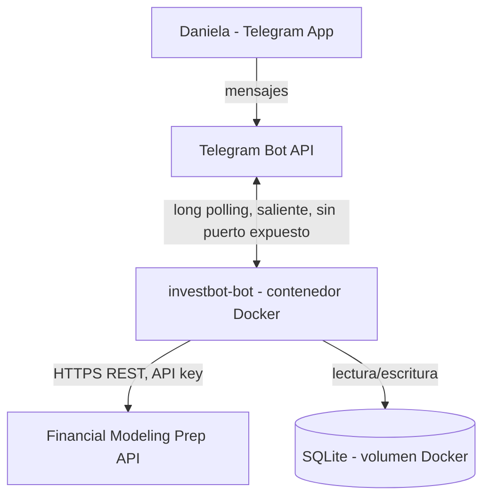
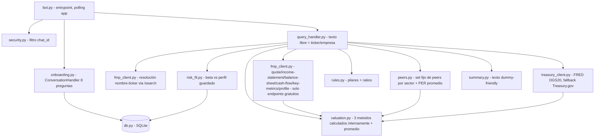

# Spec: InvestBot MVP — Bot de Telegram para análisis de acciones [Iter-1]

**Rol:** `architect` (spec base) + `security` (criterios agregados) + `qa` (criterios de cobertura/testabilidad agregados, ver sección "Criterios QA" al final)
**Pipeline:** BMAD + SDD + Ralph Loop (ver `/Users/danielavergara/Documents/Programming/claude/contextos/pipeline.md`)
**Siguiente paso:** `architect` — `qa` revisó el 2026-07-24 y agregó criterios de test completos, pero encontró **5 bloqueantes** (B1-B5, ver "Bloqueantes para `architect`" y "Veredicto de `qa`" al final del documento): casos límite financieros sin comportamiento definido (EPS≤0, CAGR con datos insuficientes o EPS negativo en año base, liquidez con denominador 0, ambigüedad de frontera en la tabla de perfil de riesgo). **No hay scope freeze todavía.** `architect` debe emitir un spec patch (Iter-2) acotado a B1-B5 antes de que `implementer` pueda arrancar; el patch no necesita volver a pasar por `security` ni `frontend`.
**Estado:** las 5 preguntas abiertas de la versión anterior fueron resueltas por Daniela el 2026-07-24. **Reapertura el mismo día (2026-07-24):** Daniela corrigió explícitamente la pregunta (d) — presupuesto **$0, sin excepciones, ninguna suscripción paga** — antes de que la spec pasara a `security`. Esto invalida la Decisión de diseño #8 original (que asumía plan pago de FMP) y todo lo que dependía de ella (fuente de "g", fuente de Y, y los 3 modelos de valoración). Esta versión reescribe únicamente la integración con datos financieros bajo la restricción de plan gratuito de FMP (250 req/día); el resto de la spec (cuestionario de riesgo, fórmulas de ratios, stack Python, arquitectura de despliegue) no cambia. Spec lista para revisión de `security` tras este ajuste.

---

## Contexto

Daniela quiere un bot de Telegram **personal** (un único usuario, sin multi-tenant/auth) que analice acciones/empresas de bolsa. Se eligió Telegram Bot API (oficial) en vez de WhatsApp porque WhatsApp no tiene forma oficial de leer chats personales sin librerías no oficiales (riesgo de ban).

El bot debe: (1) fijar el perfil de riesgo de Daniela una sola vez vía un cuestionario de 8 preguntas, (2) recibir un ticker o nombre de empresa, (3) traer datos financieros precalculados de Financial Modeling Prep (FMP), (4) validar la empresa contra reglas de análisis fundamental y calcular un "valor justo" promediando 3 métodos, (5) responder en formato "explícamelo como si fuera tonto" con las analogías propias de Daniela, y (6) decir si la empresa encaja con su perfil de riesgo.

Fuente de las reglas de negocio (material propio de Daniela, no reinterpretar):
- `/Users/danielavergara/Documents/Personal/Inversiones/Bolsa/Cursos/Charla Analisis Fundamental - Charla Nico/Los Ratios Financieros.pdf`
- `/Users/danielavergara/Documents/Personal/Inversiones/Bolsa/Cursos/Charla Analisis Fundamental - Charla Nico/PresentaciónAnalisisFundamental.pdf`
- "Instrucciones para saber tu perfil de riesgo.pdf" (cuestionario de perfil — contenido textual ya transcrito en esta spec, ver sección dedicada)

---

## Estado actual

No existe el proyecto. La carpeta propuesta `/Users/danielavergara/Documents/Personal/InvestBot` no existe (se crea en esta tarea solo `contexto/`, sin código todavía).

Referencia de patrón de infraestructura existente: FoodMindAI (`/Users/danielavergara/Documents/Personal/FoodMind/app`) corre en el mismo VPS con Docker + Traefik + Redis + PostgreSQL, red `n8n-traefik_app_network`, dominio `bot.foodmindchat.com`. InvestBot es un **servicio Docker separado** — no comparte base de datos ni contenedores con FoodMindAI (restricción explícita de Daniela).

---

## Estado objetivo

Un servicio Docker (`investbot-bot`) desplegado en el mismo VPS que:

1. Al recibir `/start` del chat_id autorizado, ejecuta el cuestionario de 8 preguntas de perfil de riesgo (una sola vez; re-ejecutable si Daniela vuelve a mandar `/start`), calcula el puntaje total y lo persiste junto con la categoría de perfil resultante.
2. Ignora cualquier mensaje que no venga del chat_id de Daniela (`TELEGRAM_ALLOWED_CHAT_ID`).
3. Si Daniela envía texto libre (ticker o nombre de empresa) y ya completó el onboarding, resuelve la empresa, consulta FMP, calcula el valor justo (promedio de 3 métodos), clasifica "cara"/"barata", evalúa los pilares de "buena empresa" y el encaje con su perfil de riesgo, y responde con un resumen ejecutivo dummy-friendly usando las analogías de Daniela.
4. Si Daniela envía texto libre sin haber completado el onboarding, el bot le pide correr `/start` primero.
5. Persiste el perfil de riesgo en SQLite (un único registro), sobrevive reinicios del contenedor vía volumen Docker.
6. No expone ningún puerto público ni ruta en Traefik (ver "Decisiones de diseño").

---

## Stack propuesto

**Recomendación: Python 3.12 + `python-telegram-bot` (v21, async) + `httpx` + SQLite (stdlib `sqlite3`).**

Evaluado contra Node.js/TypeScript (Telegraf + better-sqlite3) y Java 21/Spring Boot (status quo de FoodMindAI, para no asumir consistencia de stack sin evaluar).

| Criterio | Peso | Python | Node/TS | Java/Spring |
|---|---|---|---|---|
| Alineación con el problema (bot simple, I/O bound, 2 integraciones REST) | 25% | 9 | 8 | 5 |
| Madurez librería Telegram (`python-telegram-bot` vs `telegraf` vs `TelegramBots`) | 20% | 9 | 8 | 7 |
| Performance/escala (irrelevante a este volumen — 1 usuario) | 10% | 8 | 8 | 9 |
| Curva de arranque / velocidad de entrega para MVP | 20% | 9 | 7 | 5 |
| Ecosistema (parsers JSON, HTTP client, testing) | 10% | 9 | 8 | 7 |
| Costo operativo (RAM del contenedor, tamaño de imagen, boilerplate) | 15% | 9 | 8 | 5 |
| **Score total** | | **8.85** | **7.75** | **6.05** |

**Por qué Python y no Java/Spring (aunque FoodMindAI ya use ese stack):**
- Es un proyecto nuevo e independiente, sin código ni base de datos compartida con FoodMindAI — no hay costo de inconsistencia de stack real.
- El dominio del problema es pequeño: recibir un mensaje, llamar 5-6 endpoints REST, hacer aritmética simple, responder texto. Spring Boot añade boilerplate (controllers, DI, entities JPA) que no aporta valor a esta escala.
- `python-telegram-bot` tiene soporte nativo de `ConversationHandler`, ideal para modelar el cuestionario de 8 preguntas como una máquina de estados sin código extra.
- Imagen Docker más liviana (`python:3.12-slim` + deps ≈ 150-200MB vs JVM ≈ 300-400MB) — relevante en un VPS que ya corre FoodMindAI + n8n + Postgres + Redis + Traefik.
- SQLite vía `sqlite3` (stdlib) no requiere driver ni ORM adicional para un único registro de perfil.

**Por qué no Node/TS:** viable y cercano en score, pero `python-telegram-bot` tiene mejor soporte de `ConversationHandler` para flujos tipo wizard que las alternativas en Node, y Python tiene mejor ergonomía para el cálculo numérico de la valoración (aunque aquí es aritmética simple, no justifica el cambio).

**Condición de revisión de esta decisión:** si en el futuro Daniela decide fusionar este bot con FoodMindAI o compartir infraestructura/equipo de código, reevaluar consistencia de stack.

---

## Decisiones de diseño tomadas

*(para que `implementer` no las reabra — cualquier cambio pasa por spec patch)*

1. **Long polling, no webhook.** La Telegram Bot API soporta ambos modos. Para un bot de un solo usuario se recomienda **long polling**: el contenedor abre la conexión saliente hacia Telegram, sin necesitar dominio, certificado TLS, ruta en Traefik ni webhook secret. Esto reduce la superficie de ataque a cero puertos públicos expuestos — más simple y más seguro que el patrón webhook usado en FoodMindAI (que lo necesita porque WhatsApp Business API exige webhook). Trade-off aceptado: el contenedor debe mantenerse corriendo (`restart: unless-stopped`), igual que cualquier otro contenedor del VPS.
2. **Resolución de nombre de empresa → ticker** vía el endpoint de búsqueda de FMP (`/search` o equivalente — confirmar firma exacta durante implementación, ver pregunta abierta (d) sobre plan de FMP). Si hay una sola coincidencia, se usa directo. Si hay varias, el bot lista hasta 5 con botones inline para que Daniela desambigüe. Si hay cero, responde con error claro sin lanzar excepción sin manejar.
3. **Persistencia:** SQLite de un solo archivo en volumen Docker (`/data/investbot.db`), tabla `risk_profile` con un único registro lógico (id fijo). No se justifica PostgreSQL para un solo usuario y un solo registro — evaluado y descartado por sobre-ingeniería (YAGNI).
4. **Growth rate "g" del modelo Graham — revisado 2026-07-24 (presupuesto $0):** el endpoint de estimados de crecimiento de EPS de analistas pertenece al tier pago/premium de FMP y su disponibilidad gratuita no está verificada — no se diseña como fuente primaria. **Fuente única de diseño:** CAGR histórico de EPS calculado a partir de `/income-statement` (anual, ≥5 años, endpoint gratuito). Fórmula: `g = (EPS_año_más_reciente / EPS_año_más_antiguo)^(1/n_años) - 1`. El bot siempre indica en la respuesta que "g" es CAGR histórico (transparencia con Daniela, mismo principio que la versión anterior). Si durante la implementación se verifica que el endpoint de estimados de analistas sí está disponible gratis (ver criterio de aceptación nuevo en "Integración FMP"), puede añadirse como fuente alternativa opcional indicando cuál se usó — pero el diseño no depende de eso para funcionar.
5. **Regla de encaje beta ↔ perfil de riesgo (default, ajustable):** beta (de `/profile/{ticker}`) < 0.8 → compatible con Muy Conservador/Conservador; 0.8-1.2 → compatible con Moderado; > 1.2 → compatible con Agresivo. Toda acción individual se etiqueta como "renta variable" para el mensaje de encaje. Esta regla es una propuesta razonable del architect, no viene del material fuente de Daniela — queda documentada aquí como asunción explícita; Daniela puede pedir ajustarla sin que eso sea una "regresión" de un criterio verde.
6. **"Ventaja competitiva difícil de copiar"** nunca se calcula numéricamente. El bot siempre la reporta como "revisar manualmente" — es señal cualitativa, no forzar un proxy de datos.
7. **Fuente de Y (rendimiento bono tesoro EEUU 20 años) para el modelo Graham — revisado 2026-07-24 (presupuesto $0):** el endpoint `/treasury-rates` de FMP es un endpoint precalculado del tier pago/premium; su disponibilidad gratuita no está verificada (solo la sugiere la página de marketing de FMP) y no se diseña como dependencia dura. **Fuente primaria de diseño: FRED (Federal Reserve Economic Data)**, serie `DGS20` ("20-Year Treasury Constant Maturity Rate"), vía su API REST pública (`https://api.stlouisfed.org/fred/series/observations?series_id=DGS20&api_key=...&file_type=json`). Requiere una API key gratuita de FRED (registro instantáneo, sin costo, sin tarjeta) — ver artefacto `.env.example` para la nueva variable. **Fallback si FRED no responde o la key no está configurada:** feed público de Treasury.gov/TreasuryDirect (Daily Treasury Par Yield Curve Rates, XML/CSV, sin API key) — se documenta como fallback de segundo nivel porque su formato es menos estable para parsear que la respuesta JSON de FRED. Si ninguna de las dos fuentes responde, el bot reporta el fallo explícitamente a Daniela (nunca usa un valor hardcodeado en silencio). Cualquiera de las dos fuentes usada debe indicarse en la respuesta (mismo principio de transparencia que la decisión #4). **Esta llamada no consume el cupo de 250 req/día de FMP** — es un proveedor distinto.
8. **Plan de FMP: gratuito, $0/mes — revisado 2026-07-24 (corrección explícita de Daniela: presupuesto $0, sin excepciones, ninguna suscripción paga).** El diseño de esta spec **no depende de ningún endpoint premium/precalculado de FMP** (`/dcf`, `/sector-pe-ratio`, `/treasury-rates`) — quedan excluidos como dependencia dura porque su disponibilidad gratuita no está verificada con una API key real, solo sugerida por la página de marketing de FMP. Los 3 modelos de valoración se calculan en un **motor propio** (ver decisiones #4, #7, #9, #10 y la sección "Reglas de validación de empresa") usando exclusivamente endpoints de datos crudos, confiablemente gratuitos: `/quote`, `/income-statement`, `/balance-sheet-statement`, `/cash-flow-statement`, `/key-metrics`, `/profile` (sector, beta, market cap de la empresa) y `/search` (resolución nombre→ticker). Límite documentado del plan gratuito: **250 requests/día**. Ver sección dedicada "Presupuesto de requests FMP (plan gratuito)" para el cálculo de cuántas consultas de empresa por día soporta ese límite.
9. **Peer set para el modelo de Múltiplos — nuevo, 2026-07-24 (reemplaza `/sector-pe-ratio`):** el PER promedio del sector se aproxima con un **set fijo de 3 a 5 tickers peer hardcodeados por sector**, mantenido en `src/investbot/peers.py` como diccionario `sector → [tickers]` (ej. `"Technology": ["AAPL", "MSFT", "GOOGL"]`), excluyendo el ticker propio si coincide con algún peer. El sector de la empresa consultada se obtiene de `/profile` (gratuito). Para cada peer se llama `/quote` (gratuito, incluye el campo `pe` — PER trailing) y se promedia. Esta aproximación se documenta explícitamente en la respuesta al usuario como "PER promedio de un set fijo de comparables, no del sector completo" (mismo principio de transparencia). El mantenimiento del set de peers es manual — si un peer deja de cotizar o cambia de sector, es un ajuste de configuración, no un bug, y no es bloqueante para el MVP. Backlog futuro fuera de scope: set de peers dinámico vía un screener de FMP si algún día se paga un plan superior.
10. **Cálculo propio de DCF — nuevo, 2026-07-24 (reemplaza el uso directo de `/dcf`):**
    - **Flujos de caja libres (FCF) históricos:** `Flujo de Caja Operativo - CapEx`, tomados de `/cash-flow-statement` (anual, ≥5 años, gratuito).
    - **Proyección:** FCF proyectado a 5 años usando el mismo CAGR histórico documentado en la decisión #4 (o el CAGR propio de FCF si difiere del de EPS — `implementer` documenta cuál usó por ticker).
    - **WACC simplificado (supuesto explícito, documentado como aproximación, no un cálculo de mesa de trading):**
      - Costo de deuda (Kd) = Gastos por intereses (`/income-statement`) / Deuda total (`/balance-sheet-statement`), ajustado por la tasa impositiva efectiva derivada de `/income-statement`: `Kd × (1 - tasa_impositiva_efectiva)`.
      - Costo de patrimonio (Ke) = CAPM simplificado: `Ke = Y + beta × prima_de_riesgo_de_mercado`, donde Y es la misma tasa libre de riesgo de la decisión #7, beta viene de `/profile`, y la prima de riesgo de mercado es una **constante documentada de 5.5%** (supuesto razonable de largo plazo para EEUU, asunción explícita del `architect` — ajustable por Daniela sin que sea considerado una "regresión" de un criterio verde, mismo tratamiento que la regla beta↔perfil de la decisión #5).
      - Ponderación deuda/patrimonio: deuda total (`/balance-sheet-statement`) vs market cap (`/quote`).
      - `WACC = (E/V × Ke) + (D/V × Kd × (1 - t))`.
    - **Valor terminal:** fórmula de perpetuidad de Gordon Growth ya definida en la spec original — sin cambios.
    - Todo el cálculo vive en `valuation.py`; no hay llamada a `/dcf`. El bot indica en la respuesta que el DCF es una aproximación con supuestos simplificados de WACC (transparencia).

---

## Cuestionario de perfil de riesgo (fuente de verdad textual — no reinterpretar)

Reproducido exactamente como lo entregó Daniela, con las preguntas 5 y 7 ya confirmadas (ver "Decisiones de Daniela" más abajo). `implementer` usa este texto literal para los botones/opciones del `ConversationHandler`, no debe parafrasear.

1. **Edad:** >60 (10) / 50-60 (20) / 40-49 (30) / 30-39 (40) / <30 (50)
2. **Plazo de inversión:** <1 año (10) / 1-2 años (20) / 2-5 años (30) / 5-10 años (40) / >10 años (50)
3. **% de ahorros dispuesto a invertir:** <30% (10) / 30-60% (30) / >60% (50)
4. **Objetivo de inversión:** asegurar y mantener capital (10) / ingresos moderados mensuales (20) / aumentar patrimonio con retornos estables (40) / aumentar patrimonio sin importar riesgos (50)
5. **Fondo de emergencia:** nada (10) / 1 mes de gastos (20) / 3 meses (30) / 6 meses (40) / más de 1 año (50). **Confirmado por Daniela — escala lineal, consistente con las demás preguntas.**
6. **Experiencia en inversiones:** nunca invertido (10) / Fiducuenta o CDT (20) / presta plata a familia/amigos (30) / finca raíz (40) / bolsa (50) / productos alternativos: cripto, crowdfunding (60)
7. **Tolerancia a rendimientos negativos** (3 opciones — la cuarta del PDF fuente, duplicada, queda eliminada por decisión de Daniela): a) Prefiero seguridad y disponibilidad a corto plazo (10) / b) Me interesan inversiones a mediano plazo con rentabilidad baja pero estable (30) / c) Prefiero rentabilidad alta aunque haya años con rendimientos negativos (40).
8. **Reacción si la inversión pierde valor:** vende inmediatamente (10) / consulta a un experto pero mantiene calma (30) / asume pérdidas a corto plazo, espera ganancias a largo plazo (50)

**Tabla de resultado (puntaje total → perfil) — verificada, sin cambios:**

| Rango | Perfil | Señal |
|---|---|---|
| 80-120 | Muy Conservador | renta fija ++, renta variable - |
| 120-180 | Conservador | renta fija +, renta variable - |
| 180-240 | Moderado | renta fija =, renta variable = |
| 240+ | Agresivo | renta fija -, renta variable + |

**Verificación de rango tras el ajuste de la pregunta 7:** la pregunta 7 pasó de 4 opciones (a=10/b=20/c=30/d=40) a 3 opciones (a=10/b=30/c=40) — el **máximo posible de esa pregunta sigue siendo 40** y el **mínimo sigue siendo 10**, así que no cambia el puntaje máximo ni mínimo total del cuestionario. Puntaje mínimo total = 8×10 = 80. Puntaje máximo total = 50+50+50+50+50+60+40+50 = **400**. La tabla de rangos (80-120 / 120-180 / 180-240 / 240+) sigue siendo coherente con ese rango [80, 400] — no requiere ajuste. Confirmar este cálculo con un test unitario (ver Criterios de aceptación).

---

## Reglas de validación de empresa (fuente de verdad textual)

- Pilares de "buena empresa": (1) ingresos que crecen año a año, (2) utilidades positivas y crecientes, (3) ventaja competitiva difícil de copiar (**siempre** "revisar manualmente" — no derivar de datos), (4) deuda controlada, (5) precio razonable (PER/múltiplos).
- **Ratio de Liquidez** = Activos Circulantes / Pasivos Circulantes. Saludable si > 1.
- **Margen Bruto** = (Ventas - Costo de Ventas) / Ventas.
- **EPS** = Ganancia Neta / Número de Acciones.
- **PER (P/E)** = Precio de la Acción / EPS.
- **P/S (Precio-Ventas)** = Capitalización de Mercado / Ventas Totales (útil cuando EPS es negativo).

**Valor Justo = promedio de 3 modelos** (caso real de referencia: Adobe → Múltiplos=658, DCF=289, EPS Model=555 → promedio=500 vs precio de mercado 333 → "barata"):

1. **Múltiplos:** Valor Justo = EPS (TTM) × PER promedio del **set fijo de peers del sector** (ya no usa `/sector-pe-ratio` — ver Decisión de diseño #9).
2. **EPS Model (Graham modificado):** Fair Value = EPS (TTM) × (8.5 + 2×g) × 4.4 / Y — g = % crecimiento anual esperado de EPS, derivado de CAGR histórico (**ver Decisión de diseño #4**), 4.4 = rendimiento histórico bono tesoro 20y época Graham (constante), Y = rendimiento actual bono tesoro EEUU 20 años (**fuente: FRED serie DGS20, fallback Treasury.gov — ver Decisión de diseño #7 revisada**).
3. **DCF:** calculado internamente por el bot — proyección de FCF + WACC simplificado + valor terminal por perpetuidad (**ver Decisión de diseño #10**). Ya no se usa `/dcf` de FMP.

Valor Justo Total = promedio simple de los 3. Precio actual < Valor Justo Total → "barata"; mayor → "cara".

---

## Arquitectura



Contraste explícito con FoodMindAI: FoodMindAI expone `bot.foodmindchat.com` vía Traefik porque WhatsApp Business API exige webhook público. InvestBot **no necesita ninguna ruta en Traefik** — el contenedor solo hace conexiones salientes (a Telegram y a FMP). Esto simplifica el despliegue y reduce la superficie de ataque a comparar con FoodMindAI.

### Módulos (dentro del contenedor)



### Presupuesto de requests FMP (plan gratuito, 250/día)

Cada consulta completa de una empresa dispara varias llamadas a distintos endpoints, todas gratuitas:

| Llamada | Cantidad | Endpoint |
|---|---|---|
| Datos propios del ticker | 6 | `/quote`, `/profile`, `/income-statement`, `/balance-sheet-statement`, `/cash-flow-statement`, `/key-metrics` |
| Resolución nombre→ticker (solo si Daniela no mandó el ticker exacto) | 0-1 | `/search` |
| Peers para el modelo de Múltiplos (Decisión #9) | 3-5 | `/quote` por peer |
| **Total por consulta completa** | **9-12** | |

Con el límite de **250 requests/día** del plan gratuito, el bot soporta aproximadamente **entre 20 y 27 consultas completas de empresa por día** (250 / 12 ≈ 20 en el peor caso con 5 peers y resolución por nombre; 250 / 9 ≈ 27 en el mejor caso con 3 peers y ticker exacto). Esto es muy superior al uso esperado de un solo usuario con consultas esporádicas — no se requiere caché ni rate-limit adicional a nivel de aplicación para este MVP (consistente con la restricción existente de no implementar caché).

La llamada a FRED (o su fallback Treasury.gov) para obtener Y **no cuenta contra este cupo** — es un proveedor distinto de FMP.

### Modelo de datos (SQLite)

```sql
CREATE TABLE risk_profile (
  id INTEGER PRIMARY KEY CHECK (id = 1),   -- fila única, un solo usuario
  respuesta_1 INTEGER, respuesta_2 INTEGER, respuesta_3 INTEGER, respuesta_4 INTEGER,
  respuesta_5 INTEGER, respuesta_6 INTEGER, respuesta_7 INTEGER, respuesta_8 INTEGER,
  puntaje_total INTEGER NOT NULL,
  perfil TEXT NOT NULL CHECK (perfil IN ('muy_conservador','conservador','moderado','agresivo')),
  completed_at TEXT NOT NULL
);
```

---

## Criterios de aceptación

### Seguridad de acceso (un solo usuario)
- [ ] El bot lee `TELEGRAM_ALLOWED_CHAT_ID` de variable de entorno y descarta (sin responder, o con "no autorizado") cualquier update cuyo `chat_id` no coincida.
- [ ] El token del bot y la API key de FMP se leen de variables de entorno, nunca hardcodeadas; `.env` está en `.gitignore`; `.env.example` documenta las variables sin valores reales.

### Onboarding / perfil de riesgo
- [ ] `/start` dispara el cuestionario de 8 preguntas, en el orden y con las opciones/puntajes exactos de la sección "Cuestionario de perfil de riesgo" de esta spec (excepto preguntas 5 y 7, bloqueadas hasta resolver preguntas abiertas (a)/(b)).
- [ ] Cada pregunta se responde vía botones inline (no texto libre) para evitar puntajes inválidos por typos.
- [ ] Al completar las 8 respuestas, el bot calcula `puntaje_total` (suma), determina `perfil` según la tabla de rangos, persiste todo en SQLite, y confirma a Daniela con el resultado.
- [ ] Volver a correr `/start` sobrescribe el perfil anterior (permite recalibrar).
- [ ] Si Daniela envía un ticker/nombre antes de completar el onboarding, el bot responde indicando que debe correr `/start` primero y no ejecuta ningún análisis ni llamada a FMP.
- [ ] Test unitario que verifica el rango de puntaje total del cuestionario: mínimo = 80 (todas las respuestas en su opción más baja), máximo = 400 (todas en su opción más alta, incluyendo la pregunta 7 con 3 opciones), y que la tabla de mapeo a perfil (80-120/120-180/180-240/240+) cubre ese rango completo sin huecos.

### Resolución de ticker / nombre de empresa
- [ ] Texto que coincide con un ticker válido se usa directo.
- [ ] Texto que es un nombre de empresa con una sola coincidencia en la búsqueda de FMP se resuelve automáticamente.
- [ ] Texto con múltiples coincidencias muestra hasta 5 opciones con botones inline para desambiguar.
- [ ] Texto sin ninguna coincidencia responde con error claro y no lanza excepción sin capturar.

### Integración FMP
- [ ] Para el ticker resuelto, llama únicamente a endpoints de datos crudos del plan gratuito de FMP: `/quote`, `/income-statement` (anual, ≥5 años), `/balance-sheet-statement` (anual, ≥5 años), `/cash-flow-statement` (anual, ≥5 años), `/key-metrics` (multi-año), `/profile` (sector, beta, market cap). El bot **no depende** de `/dcf`, `/sector-pe-ratio` ni `/treasury-rates` para funcionar.
- [ ] Para el modelo de Múltiplos, llama a `/quote` de cada ticker del set fijo de peers del sector correspondiente (Decisión de diseño #9).
- [ ] Timeout configurado en el cliente HTTP; error 4xx/5xx o rate-limit de FMP (incluido el límite de 250 req/día del plan gratuito) se traduce en un mensaje claro a Daniela, nunca en un stack trace crudo ni en un crash del proceso de polling.
- [ ] Los datos de un ticker (propio + peers) se piden en vivo (no hace falta caché para MVP — un solo usuario, uso esporádico, presupuesto de requests con margen amplio, ver "Presupuesto de requests FMP"); si se agrega caché en el futuro, es un backlog item, no parte de esta spec.
- [ ] **Nuevo (verificación de endpoints premium):** durante la implementación, con una API key real de FMP en plan gratuito, verificar explícitamente si `/dcf`, `/sector-pe-ratio` y/o `/treasury-rates` responden sin costo. Si alguno resulta disponible gratis en la práctica, puede usarse como atajo opcional/optimización (ej. comparar contra el cálculo propio, o sustituir una llamada), documentado como tal — nunca como requisito para que el bot funcione. Si ninguno está disponible gratis, el diseño ya funciona sin ellos (comportamiento default de esta spec).

### Cálculo de ratios y valor justo
- [ ] Ratio de Liquidez, Margen Bruto, EPS, PER, P/S calculados con las fórmulas exactas de la sección "Reglas de validación de empresa".
- [ ] Valor Justo por Múltiplos = EPS TTM × PER promedio del set fijo de peers del sector (Decisión de diseño #9).
- [ ] Valor Justo EPS Model = EPS TTM × (8.5 + 2×g) × 4.4 / Y, con g obtenido según la Decisión de diseño #4 (CAGR histórico de EPS) y Y según la Decisión de diseño #7 revisada (FRED serie DGS20, fallback Treasury.gov).
- [ ] Valor Justo DCF = calculado internamente por el bot (proyección de FCF + WACC simplificado + valor terminal por perpetuidad), según la Decisión de diseño #10. Sin llamada a `/dcf` de FMP.
- [ ] Valor Justo Total = promedio simple de los 3.
- [ ] Test de regresión con datos mockeados (no llamada real a FMP) que reproduce el caso Adobe de esta spec: Múltiplos=658, DCF=289, EPS Model=555 → Valor Justo Total=500.
- [ ] Clasificación "barata"/"cara" correcta según precio actual vs Valor Justo Total, con el % de diferencia mostrado en la respuesta.

### Pilares de "buena empresa"
- [ ] Se evalúan y listan individualmente en la respuesta: crecimiento de ingresos (multi-año), utilidades positivas/crecientes, deuda controlada (liquidez > 1), precio razonable (PER/múltiplos).
- [ ] "Ventaja competitiva" se muestra siempre como "revisar manualmente", nunca como un dato calculado.

### Resumen dummy-friendly
- [ ] La respuesta usa literalmente los términos "el boletín" (Estado de Resultados), "la foto" (Balance General), "el extracto" (Flujo de Efectivo).
- [ ] La respuesta referencia la analogía de "Tienda de Limonada" al menos una vez cuando el flujo de explicación lo amerite.
- [ ] La respuesta indica explícitamente si la empresa "encaja" o "no encaja" con el perfil de riesgo guardado de Daniela, aplicando la regla beta↔perfil documentada en "Decisiones de diseño" #5.

### Infraestructura / despliegue
- [ ] `docker compose -f docker-compose.prod.yml up -d` levanta `investbot-bot` en el VPS sin exponer ningún puerto público ni ruta en Traefik.
- [ ] El perfil de riesgo persiste tras `docker compose restart` (volumen Docker para el archivo SQLite).
- [ ] `README.md` documenta arranque local (dev) y despliegue (prod); `.env.example` lista todas las variables sin secretos reales.
- [ ] `README.md` (o documento dedicado) indica explícitamente: **plan gratuito de FMP, $0/mes, límite de 250 requests/día**, listando los endpoints de datos crudos usados (`/quote`, `/income-statement`, `/balance-sheet-statement`, `/cash-flow-statement`, `/key-metrics`, `/profile`, `/search`) y el presupuesto de requests calculado (~20-27 consultas de empresa por día, ver sección "Presupuesto de requests FMP (plan gratuito)"). Documenta también que Y (rendimiento del bono del tesoro) se obtiene de FRED (serie DGS20) con fallback a Treasury.gov, **no de FMP** — y que `/dcf`, `/sector-pe-ratio` y `/treasury-rates` son, a lo sumo, atajos opcionales verificados durante la implementación, nunca una dependencia dura.
- [ ] Existe una guía corta de setup manual (`contexto/referencia/SETUP_TELEGRAM_BOT.md`) con los pasos para crear el bot en @BotFather y obtener `TELEGRAM_BOT_TOKEN` — es documentación, no código; Daniela la ejecuta manualmente durante la fase de implementación, antes de que el contenedor pueda arrancar en modo polling.

---

## Artefactos a crear

- `/Users/danielavergara/Documents/Personal/InvestBot/` → nuevo repo (nombre provisional, ver pregunta abierta (e))
- `src/investbot/bot.py` → entrypoint, `Application` en modo polling
- `src/investbot/security.py` → filtro de `chat_id`
- `src/investbot/onboarding.py` → `ConversationHandler` de 8 preguntas
- `src/investbot/query_handler.py` → handler de texto libre (ticker/nombre)
- `src/investbot/fmp_client.py` → wrapper HTTP a FMP (`httpx`), **solo endpoints gratuitos** (`/quote`, `/income-statement`, `/balance-sheet-statement`, `/cash-flow-statement`, `/key-metrics`, `/profile`, `/search`); incluye búsqueda nombre→ticker. `/dcf`, `/sector-pe-ratio` y `/treasury-rates` no son dependencia dura (ver criterio de aceptación de verificación en "Integración FMP").
- `src/investbot/peers.py` → **nuevo** — diccionario `sector → [tickers]` de peers hardcodeados (3-5 por sector) y lógica de promedio de PER para el modelo de Múltiplos (Decisión de diseño #9).
- `src/investbot/treasury_client.py` → **nuevo** — cliente para el rendimiento del bono del tesoro EEUU a 20 años (Y): FRED (serie `DGS20`) como fuente primaria, Treasury.gov como fallback (Decisión de diseño #7 revisada).
- `src/investbot/rules.py` → pilares + ratios (liquidez, margen bruto, EPS, PER, P/S)
- `src/investbot/valuation.py` → **motor propio** de los 3 métodos de valor justo (Múltiplos con `peers.py`, EPS Model con `treasury_client.py`, DCF con proyección de FCF + WACC simplificado, ver Decisión de diseño #10) + promedio. Ya no delega a `/dcf` de FMP.
- `src/investbot/risk_fit.py` → comparación beta/tipo de activo vs perfil guardado
- `src/investbot/summary.py` → construcción del texto dummy-friendly con analogías
- `src/investbot/db.py` → schema SQLite + acceso a `risk_profile`
- `Dockerfile`, `docker-compose.yml` (dev), `docker-compose.prod.yml` (prod, sin Traefik)
- `.env.example`, `.gitignore` → `.env.example` agrega `FRED_API_KEY` (API key gratuita de FRED para Y) junto a `TELEGRAM_BOT_TOKEN`, `TELEGRAM_ALLOWED_CHAT_ID`, `FMP_API_KEY`
- `tests/` (pytest) → incluye test de regresión del caso Adobe
- `README.md` → incluye la sección obligatoria de "plan mínimo de FMP requerido y por qué"
- `contexto/referencia/SETUP_TELEGRAM_BOT.md` → guía corta (documento, no código) de cómo crear el bot en @BotFather y obtener el token; pasos: abrir chat con @BotFather → `/newbot` → elegir nombre y username → guardar el token devuelto en `TELEGRAM_BOT_TOKEN` del `.env` del VPS → enviar `/start` al bot recién creado desde la cuenta de Daniela para obtener su `chat_id` (ej. vía `getUpdates` o un bot auxiliar tipo @userinfobot) y guardarlo en `TELEGRAM_ALLOWED_CHAT_ID`
- `contexto/README.md`, `contexto/arquitectura/` (a poblar por `implementer`/`architect` en iteraciones siguientes)
- `contexto/specs/abiertas/SDD_investbot_mvp.md` → este archivo (se mueve a `specs/cerradas/` cuando el pipeline completo cierre)

---

## Restricciones

- No compartir base de datos ni contenedores con FoodMindAI. Red Docker separada (no reutilizar `n8n-traefik_app_network` salvo decisión explícita futura).
- No autenticación multi-usuario — el único control de acceso es el `chat_id` fijo por variable de entorno.
- **(Revisado 2026-07-24)** El bot SÍ calcula WACC (simplificado, supuestos documentados) y valor terminal (perpetuidad) de forma manual/interna — ya no depende de `/dcf` de FMP (ver Decisión de diseño #10). Esto invierte la restricción de la versión anterior, que asumía plan pago.
- No forzar un cálculo numérico de "ventaja competitiva" — queda como señal cualitativa fija ("revisar manualmente").
- No implementar caché de datos de FMP, histórico de consultas, alertas de precio, multi-idioma, ni dashboard web — fuera de scope MVP (backlog si Daniela lo pide después).
- **(Revisado 2026-07-24)** El diseño completo funciona sobre el **plan gratuito de FMP** (250 req/día) — no hay "modo premium" ni "modo degradado", solo un único diseño calculado con datos crudos gratuitos (ver Decisión de diseño #8 revisada). Los endpoints premium (`/dcf`, `/sector-pe-ratio`, `/treasury-rates`) no son una dependencia dura; si se confirman gratuitos durante la implementación, pueden usarse como atajo opcional, nunca como requisito de diseño.
- Esta spec es solo la fase de diseño (`architect`). No implementar código todavía — falta pasar por `security` y `qa` antes del scope freeze.

---

## Preguntas abiertas para Daniela (bloquean scope freeze)

Estas NO las resuelve el `architect` por su cuenta — requieren respuesta explícita de Daniela antes de que `implementer` pueda arrancar con las partes afectadas:

**(a) RESUELTA 2026-07-24 — Pregunta 5 del cuestionario (fondo de emergencia):** Daniela confirmó escala lineal 10/20/30/40/50. Ver sección "Cuestionario de perfil de riesgo", pregunta 5. Ya no bloquea scope freeze.

**(b) RESUELTA 2026-07-24 — Pregunta 7 del cuestionario (tolerancia a rendimientos negativos):** Daniela confirmó colapsar a 3 opciones (a=10/b=30/c=40), eliminando la opción duplicada del PDF fuente. Ver sección "Cuestionario de perfil de riesgo", pregunta 7, y la verificación de rango del puntaje total. Ya no bloquea scope freeze.

**(c) RESUELTA 2026-07-24 — Fuente de Y (bono tesoro EEUU 20 años):** no depende de FMP. Fuente primaria: FRED (serie `DGS20`, API gratuita con key). Fallback: Treasury.gov/TreasuryDirect (feed público, sin key). Ver Decisión de diseño #7 revisada. Ya no bloquea scope freeze.

**(d) RESUELTA 2026-07-24 — Cuenta/plan de FMP:** Daniela confirmó explícitamente **presupuesto $0, plan gratuito, sin excepciones, ninguna suscripción paga**. El diseño completo de esta spec se rediseñó para funcionar sobre el plan gratuito (250 req/día) con un motor propio de valoración — ver Decisión de diseño #8 revisada y la sección "Presupuesto de requests FMP (plan gratuito)". Ya no bloquea scope freeze.

**(e) Nombre final del bot y token de BotFather:** ¿ya tiene un nombre decidido y el token generado en @BotFather, o hay que crearlo como parte de la implementación? Afecta el nombre del repo (`InvestBot` es provisional) y la variable `TELEGRAM_BOT_TOKEN`.

---

## Handoff → security

### Specs producidas
- Esta spec (`SDD_investbot_mvp.md`), Iter-1.

### Criterios de aceptación base
Ver sección "Criterios de aceptación" completa arriba — agrupados en: seguridad de acceso, onboarding, resolución de ticker, integración FMP, cálculo de valor justo, pilares de buena empresa, resumen dummy-friendly, infraestructura/despliegue.

### Decisiones de diseño tomadas (no reabrir)
1. Python 3.12 + `python-telegram-bot` + `httpx` + SQLite — justificado en "Stack propuesto".
2. Long polling en vez de webhook — sin Traefik, sin dominio, sin puerto expuesto.
3. Persistencia en SQLite de un solo archivo, sin PostgreSQL.
4. Resolución nombre→ticker vía búsqueda FMP con desambiguación por botones.
5. Regla beta↔perfil de riesgo con umbrales default documentados (ajustable, no bloqueante).
6. "Ventaja competitiva" siempre cualitativa ("revisar manualmente").
7. **(2026-07-24)** Motor propio de valoración sobre plan gratuito de FMP (250 req/día): Múltiplos con peer set hardcodeado (Decisión #9), Graham EPS Model con Y de FRED/Treasury.gov (Decisión #7), DCF con FCF proyectado + WACC simplificado (Decisión #10) — sin dependencia de `/dcf`, `/sector-pe-ratio` ni `/treasury-rates` de FMP.

### Foco esperado para `security`
- Validación del filtro de `chat_id` (¿alcanza con comparar el ID, o hay vector de suplantación a nivel de Telegram Bot API que revisar?).
- Manejo de secretos (`TELEGRAM_BOT_TOKEN`, `FMP_API_KEY`, y ahora también **`FRED_API_KEY`**) en el VPS — mismo patrón que ya se auditó en FoodMindAI (`.env` chmod 600, no root).
- Rate-limiting/abuso: aunque es un solo usuario autorizado, ¿qué pasa si el token se filtra? ¿Vale la pena un rate-limit adicional a nivel de aplicación además del filtro de chat_id?
- Manejo de errores de FMP sin filtrar información sensible (API key) en logs o en la respuesta a Telegram.

### Preguntas abiertas que security NO debe resolver por su cuenta
Las (a)-(e) de arriba son de negocio/producto, no de seguridad — quedan pendientes de Daniela independientemente de lo que security agregue.

---

## Criterios de seguridad — agregado por `security` [Iter-1, 2026-07-24]

**Rol:** `security`. Esta sección **agrega** criterios de aceptación a la spec del `architect`; no modifica cuestionario, fórmulas, stack, ni arquitectura de despliegue (todo eso sigue siendo propiedad de `architect`).

**Nivel de verificación (ASVS 5.0):** InvestBot no almacena datos de salud ni datos financieros de cuentas reales — solo un score de perfil de riesgo (8 enteros 10-60) y consultas efímeras a APIs públicas de mercado. Esto es de menor sensibilidad que FoodMind (que sí maneja datos de salud → ASVS L2). Para InvestBot, **ASVS L1 es suficiente como nivel general**, pero el manejo de secretos y logging debe mantener el mismo rigor ya exigido en FoodMindAI (mismo VPS, mismo operador) — no se relaja ese punto por tratarse de un "bot personal".

---

### 1. Filtro de `chat_id` como control de acceso — análisis y vector de suplantación

**Respuesta directa a la pregunta del `architect`:** el `chat_id` **no es falsificable por un tercero a nivel de la Telegram Bot API**. El campo `chat.id`/`from.id` de cada `Update` lo asigna el servidor de Telegram en función de la sesión autenticada de quien envía el mensaje real — un atacante no puede inyectar un `Update` falso con un `chat_id` arbitrario hacia el proceso de long polling de InvestBot sin controlar la cuenta de Telegram de Daniela o el propio token del bot. Es decir: **comparar el ID es una barrera válida contra suplantación remota de identidad**, no es "seguridad ilusoria". Dicho esto, hay tres vectores reales que la spec actual no cubre:

- **(A) Fail-open por configuración ausente/errónea (CWE-1188, CWE-284 / OWASP A01:2025).** Si `TELEGRAM_ALLOWED_CHAT_ID` no está seteada, está vacía, o el código hace un `if chat_id == env_value or not env_value` mal escrito, el filtro puede degradar a "permitir a todos". Esto es plausible como bug de implementación (`.env` faltante tras un despliegue apurado, typo, valor `None` comparado con `int(None)` que no crashea sino que cae en una rama permisiva). Debe ser **fail-closed**: si la variable no está seteada o no es un entero válido, el proceso **debe rechazar arrancar** (crash explícito al boot), nunca arrancar en modo "sin filtro".
- **(B) Cobertura parcial de handlers.** `python-telegram-bot` registra handlers separados para `message`, `callback_query` (los botones inline del cuestionario y de desambiguación de ticker), `edited_message`, etc. Si el filtro de `chat_id` solo se aplica al handler de texto libre y no al `CallbackQueryHandler` de los botones, un usuario no autorizado que descubra el bot (los bots de Telegram son buscables por username) podría interactuar con el cuestionario vía botones sin pasar por el filtro. El filtro debe aplicarse como el **primer handler global** (`group=-1` o equivalente) que intercepta **todos** los tipos de update antes de que lleguen a `onboarding.py`, `query_handler.py` o cualquier `ConversationHandler`.
- **(C) Pérdida de control de la cuenta de Telegram de Daniela.** Si la cuenta de Telegram de Daniela sufre SIM-swap o secuestro de sesión, el atacante hereda el mismo `chat_id` y el filtro lo autoriza legítimamente — esto es un riesgo sistémico de la plataforma Telegram, no algo que el bot pueda mitigar por sí solo con más código. Se documenta como **riesgo residual aceptado** (fuera del control del bot), no como criterio a implementar. Mitigación recomendada a nivel de cuenta (fuera de scope de código): 2FA/verificación en dos pasos activada en la app de Telegram de Daniela.

**Filtrado por tipo de chat (defensa adicional, bajo costo):** dado que el bot solo debe operar en chat privado con Daniela, el filtro debe verificar además `update.effective_chat.type == "private"`, no solo el ID — así, si en el futuro alguien agrega el bot a un grupo (conociendo su username), el bot lo ignora aunque por algún bug el ID coincidiera con un chat distinto.

**Respuesta a "revocación del bot si Daniela pierde el control":** el token se revoca/regenera desde @BotFather (`/revoke`) en cualquier momento sin perder el `chat_id` (que es propiedad de la cuenta de Telegram, no del bot). Esto debe documentarse como procedimiento de respuesta a incidente, no como código.

**Criterios de aceptación nuevos:**
- [ ] Si `TELEGRAM_ALLOWED_CHAT_ID` no está seteada o no es parseable como entero, el proceso falla al arrancar (log claro + exit code ≠ 0) — nunca arranca en modo permisivo.
- [ ] El filtro de `chat_id` se registra como handler global de máxima prioridad (`group=-1` en `python-telegram-bot` o equivalente) y cubre explícitamente: mensajes de texto, `callback_query` (botones inline), y cualquier otro tipo de update que el bot registre. Test que verifica que un `callback_query` con `chat_id` distinto al autorizado es rechazado sin ejecutar el callback del `ConversationHandler`.
- [ ] El filtro valida `chat.type == "private"` además del `chat_id`.
- [ ] `contexto/referencia/SETUP_TELEGRAM_BOT.md` (ya existe como artefacto planeado) incluye una sección "Respuesta a incidente: token comprometido" con el procedimiento de revocar/regenerar el token en @BotFather y actualizar `.env` en el VPS.
- [ ] Riesgo residual de secuestro de cuenta de Telegram documentado explícitamente en `README.md` como limitación conocida (no es un bug del bot).

---

### 2. Gestión de secretos (`TELEGRAM_BOT_TOKEN`, `FMP_API_KEY`, `FRED_API_KEY`)

**Patrón base (heredado de la auditoría de FoodMindAI, memoria del 2026-07-23/24):** `.env` con `chmod 600`, propiedad del usuario sin privilegios root (`daniela`, grupo `docker`), nunca en git, `.env.example` sin valores reales. Este patrón ya está como criterio de aceptación del `architect` (sección "Seguridad de acceso") — se confirma y se extiende:

- **Hallazgo concreto de mayor severidad — logging de librerías HTTP en modo debug (CWE-532, OWASP A09:2025).** La Telegram Bot API pasa el token **en el path de la URL** (`https://api.telegram.org/bot<TOKEN>/getUpdates`), no en un header ni en el body. Si en algún momento (debug local, troubleshooting en el VPS) se sube el nivel de log de `httpx` o de `python-telegram-bot` a `DEBUG`, **cada línea de log incluirá el token completo en texto plano**, y esos logs persisten en `docker logs` / el driver de logging del host. Esto es el hallazgo de mayor severidad de esta revisión porque compromete el secreto más crítico (control total del bot) con una sola línea de configuración incorrecta, sin que haga falta ningún bug de lógica.
- **FMP y FRED pasan la API key como query param** (`?apikey=...` y `?api_key=...` respectivamente) — esto es CWE-598 (Use of GET Request Method With Sensitive Query Strings): la key queda en cualquier URL completa que se loguee, en el objeto de excepción de `httpx` (que incluye la URL con query string en su `repr()`/mensaje), y potencialmente en proxies/herramientas de red intermedias si algún día se añade uno.
- El `docker-compose.prod.yml` debe pasar secretos vía `env_file: .env`, nunca como `environment: TOKEN=xxx` hardcodeado dentro del propio compose file (que sí podría terminar committeado por error) ni vía `docker run -e`/línea de comandos (queda en `.bash_history` y en `ps aux` mientras el proceso corre).
- El `Dockerfile` no debe copiar `.env` a la imagen ni usar `ARG`/`ENV` con valores de secretos — los secretos entran solo en runtime vía `env_file`/volumen, nunca en una capa de la imagen (una imagen con secretos embebidos persiste el secreto aunque se borre después, y puede quedar en `docker history`).

**Criterios de aceptación nuevos:**
- [ ] El nivel de logging de los loggers `httpx`, `httpcore` y `telegram` (python-telegram-bot) se fija explícitamente a `WARNING` o superior en producción (nunca `DEBUG`/`INFO` por defecto); si se necesita debug temporal, se documenta como acción manual explícita, no como default del código.
- [ ] Ningún log persistente (`docker logs`, o cualquier logger propio del bot) contiene la URL completa con query string de una llamada a FMP o FRED. El wrapper HTTP (`fmp_client.py`, `treasury_client.py`) loguea únicamente endpoint/ticker/status code, nunca la URL cruda ni el diccionario de params sin sanitizar.
- [ ] Test unitario que verifica que una excepción real de `httpx` (p. ej. `httpx.HTTPStatusError`, que en su mensaje por defecto incluye la URL con query string) nunca se propaga sin sanitizar hacia `logger.*()` ni hacia el mensaje enviado a Telegram — se captura, se reconstruye un mensaje/log sin el query string, y **recién entonces** se loguea/envía.
- [ ] `docker-compose.prod.yml` usa `env_file: .env` para los 3 secretos; no hay ningún secreto en texto plano dentro del propio `docker-compose.prod.yml`, `docker-compose.yml` ni `Dockerfile`.
- [ ] `.env` en el VPS: `chmod 600`, propietario el usuario sin privilegios root ya usado para FoodMindAI (mismo patrón, no usuario nuevo ni root).
- [ ] `.gitignore` cubre `.env` y cualquier archivo `*.env.local`/backup (`.env.bak`, etc.) — ya está como criterio del architect para `.env`, se extiende a variantes de backup.

---

### 3. Manejo de errores de FMP/FRED sin filtrar la API key (a Daniela o a logs)

Extiende el criterio ya existente del `architect` ("error 4xx/5xx o rate-limit de FMP se traduce en un mensaje claro... nunca un stack trace crudo") con el detalle concreto de **qué** puede filtrar la key y **dónde**:

- Mensaje de error hacia Telegram: siempre un texto plantillado y genérico (p. ej. `"No pude obtener los datos de {ticker} ahora mismo, intenta más tarde."`), nunca `str(exception)` ni el body crudo de la respuesta de error de FMP/FRED (que en teoría podría incluir la URL solicitada o parámetros en su payload de error).
- Los códigos HTTP (429 rate-limit, 401/403 key inválida, 5xx) pueden diferenciarse en el mensaje a Daniela ("parece que se acabó el cupo de FMP por hoy" vs "FMP no responde") **sin** incluir la URL ni el header/param de autenticación.
- El manejo de la excepción debe ocurrir **en el wrapper HTTP mismo** (`fmp_client.py`/`treasury_client.py`), no dejarse "burbujear" hasta un `except Exception` genérico en `bot.py` que podría loguear/reenviar el objeto de excepción original tal cual.

**Criterios de aceptación nuevos:**
- [ ] `fmp_client.py` y `treasury_client.py` capturan las excepciones de `httpx` (timeout, `HTTPStatusError`, `RequestError`) en el punto de la llamada, y traducen a una excepción propia (`FMPError`, `TreasuryError`) que **no** incluye la URL ni los params originales en su mensaje.
- [ ] El handler que arma la respuesta a Telegram (`query_handler.py`) solo conoce/usa el mensaje sanitizado de la excepción propia, nunca la excepción de `httpx` original.
- [ ] Test que simula una respuesta 401 de FMP (key inválida/vencida) con `apikey=SECRETO123` en la URL de la request mockeada, y verifica que ni el mensaje enviado a Telegram ni ninguna llamada a `logger.*` en ese test contienen la substring `SECRETO123`.

---

### 4. Validación de input del "ticker" / nombre de empresa

Daniela puede mandar cualquier texto libre. Análisis de superficie:

- **Inyección en la URL de FMP (`/search?query=...`):** si `implementer` usa `httpx.get(url, params={"query": texto, "apikey": key})` (diccionario de params de `httpx`), el propio `httpx` hace el URL-encoding correcto y no hay forma de que el texto "escape" a otro parámetro o path — esto ya mitiga la clase de inyección más obvia. El riesgo real es que alguien construya la URL por concatenación/f-string en vez de usar `params=`; eso sí sería explotable (aunque el "atacante" aquí es la propia Daniela, no hay usuario no autorizado con esta superficie gracias al filtro de `chat_id` — el objetivo de este control es robustez/defensa en profundidad, no defensa contra un atacante externo, ya que un no-autorizado nunca llega a este código).
- **No es SSRF (OWASP A10):** el host de destino (`financialmodelingprep.com`, `api.stlouisfed.org`) está fijo en el código; el input de Daniela solo llega a un query param, nunca determina el host/esquema de la request. Se documenta explícitamente para dejar constancia de que se evaluó y no aplica.
- **Inyección de logs (CWE-117):** si el texto libre de Daniela (que puede incluir saltos de línea, caracteres de control, o secuencias que parezcan otra línea de log) se loguea directo, podría falsear/insertar líneas de log falsas en `docker logs`. Bajo impacto (un solo usuario, no hay SIEM parseando estos logs hoy) pero trivial de mitigar.
- **Presupuesto de requests (CWE-400, disponibilidad):** un texto absurdamente largo o repetido rápido no rompe nada técnicamente (httpx lo encodea igual), pero si por bug de UI Daniela reenvía rápido o pega un texto enorme repetidamente, puede gastar el cupo de 250 req/día sin intención. Cubierto por el rate-limit defensivo de la sección 5.

**Criterios de aceptación nuevos:**
- [ ] Todas las llamadas a FMP y FRED usan el parámetro `params=` de `httpx` (o equivalente que garantice URL-encoding) — **nunca** f-string/concatenación de texto de usuario dentro de la URL. Code review / test que falla si aparece concatenación directa.
- [ ] El texto libre recibido se normaliza antes de usarse: `strip()`, colapsar espacios repetidos, límite de longitud (p. ej. 100 caracteres — suficiente para cualquier ticker o nombre de empresa real) — texto que excede el límite se rechaza con mensaje claro antes de llamar a FMP.
- [ ] El texto libre se sanitiza (remover saltos de línea/caracteres de control) antes de aparecer en cualquier línea de log, incluso en logs de debug/desarrollo.
- [ ] Documentado explícitamente en esta spec (este párrafo cuenta como esa documentación) que el host de FMP/FRED es fijo en código y el input de usuario nunca determina host/esquema — no aplica SSRF, evaluado y descartado.

---

### 5. Otros hallazgos — bot de un solo usuario, 3 API keys, VPS compartido con FoodMindAI en producción

- **Rate-limit defensivo a nivel de aplicación (CWE-400).** Aunque el filtro de `chat_id` hace que solo Daniela pueda gastar el cupo de FMP, un límite adicional simple (p. ej. máximo 10 consultas/minuto desde el chat autorizado, contador en memoria, sin necesidad de Redis) protege contra: bugs propios (doble tap de un botón, loop accidental en el `ConversationHandler`) y contra el escenario "el token de Telegram se filtró" que la spec pregunta explícitamente — si alguien más obtiene el token y logra interactuar (poco probable dado el filtro de `chat_id`, pero es defensa en profundidad barata), el rate-limit acota el daño al presupuesto de 250 req/día. Costo de implementación bajo, se recomienda incluir en el MVP en vez de dejarlo como backlog.
- **Detección de uso concurrente del token (señal gratuita de compromiso).** La Telegram Bot API permite un solo consumidor de `getUpdates` a la vez; si otro proceso usa el mismo token para hacer polling, InvestBot empezará a recibir errores `Conflict` (409) de Telegram. Esto es una señal de que el token se filtró y alguien más lo está usando activamente. Se recomienda loguear (nivel WARNING, sin exponer el token) y, si es viable, notificar a Daniela por el propio bot cuando se detecten `Conflict` repetidos — es una forma barata y concreta de responder a "¿qué pasa si el token se filtra?" con una señal accionable en vez de solo prevención.
- **Usuario no-root dentro del contenedor.** El `Dockerfile` debe definir un `USER` no-root para el proceso del bot (no ejecutar como root dentro del contenedor), consistente con buenas prácticas de hardening de contenedores — reduce el impacto de un eventual escape de contenedor en un VPS que también corre FoodMindAI en producción.
- **Límites de recursos del contenedor.** `docker-compose.prod.yml` debe fijar límites de memoria/CPU para `investbot-bot` (p. ej. `mem_limit`/`deploy.resources.limits`), para que un bug o abuso en este servicio nuevo no consuma recursos que afecten la disponibilidad de FoodMindAI en el mismo VPS (relevante justamente por ser "servicio separado pero VPS compartido").
- **Cadena de suministro (informativo, no bloqueante):** pinnear versiones de `python-telegram-bot`/`httpx` en `requirements.txt`/`pyproject.toml`, y considerar un scan tipo Trivy de la imagen final — mismo pendiente que ya existe abierto para la imagen de FoodMindAI (ver memoria del proyecto); se registra aquí como mismo tipo de deuda para InvestBot, no urgente para el MVP.
- **No se recomienda agregar un endpoint HTTP de administración/observabilidad para este bot.** A diferencia de la preferencia general de Daniela ("endpoints, no paneles"), aquí aplica la restricción explícita del `architect`: cero puertos expuestos, sin Traefik. Cualquier observabilidad debe resolverse con `docker logs`/healthcheck de Docker, no con un servidor HTTP nuevo — esto sería una regresión directa de la Decisión de diseño #1 (superficie de ataque cero). Se deja constancia explícita de que se evaluó y se descarta por conflicto con una decisión de diseño ya tomada.

**Criterios de aceptación nuevos:**
- [ ] Rate-limit en memoria por chat autorizado: máximo N consultas de empresa por minuto (valor sugerido: 10; ajustable, no bloqueante) — al superarse, el bot responde con un mensaje claro en vez de llamar a FMP.
- [ ] Errores `Conflict` (409) de `getUpdates` se loguean explícitamente a nivel WARNING con un mensaje distintivo (p. ej. `"posible uso concurrente del token detectado"`), sin incluir el token en el log.
- [ ] `Dockerfile` define un `USER` no-root para el proceso de la aplicación.
- [ ] `docker-compose.prod.yml` define límites de memoria/CPU para el servicio `investbot-bot`.
- [ ] `requirements.txt`/`pyproject.toml` fija versiones (no rangos abiertos) de `python-telegram-bot` y `httpx`.

---

### Veredicto de `security`

**Ningún hallazgo es bloqueante.** Todos los criterios agregados son implementables dentro de la arquitectura, el stack y las decisiones de diseño ya tomadas por `architect` (long polling, SQLite, sin Traefik, motor propio de valoración) — ninguno requiere reabrir esas decisiones ni volver a `architect` con un spec patch. El hallazgo de mayor severidad (logging en modo DEBUG filtrando el token de Telegram vía la URL) es un riesgo de configuración/implementación, no de diseño.

**La spec queda lista para pasar a `qa`** (siguiente paso del pipeline) con los criterios de esta sección agregados a los del `architect`. No hay necesidad de escalar a `architect` en esta iteración.

Nota: la spec original no describe una interfaz web/HTML — la única "UI" son botones inline nativos de Telegram, cubiertos funcionalmente por los criterios de "Onboarding" y "Resolución de ticker" ya existentes. Si el pipeline considera que `frontend` no aplica a un bot de Telegram sin UI web, el siguiente paso natural tras `security` es `qa` directamente (decisión de proceso, no de este agente).

---

## Handoff → qa

### Specs producidas
- `SDD_investbot_mvp.md`, Iter-1, con criterios de `architect` + `security` (esta revisión, 2026-07-24).

### Criterios de aceptación (base + seguridad)
Ver "Criterios de aceptación" (architect) + "Criterios de seguridad" (security, secciones 1-5 arriba) — ambos conjuntos deben cubrirse; ninguno reemplaza al otro.

### Sin bloqueantes
`security` no encontró ningún hallazgo que requiera spec patch de `architect`. Todos los criterios agregados son verificables por `qa`/`implementer` sin cambiar diseño, stack ni arquitectura.

### Foco esperado para `qa`
- Testabilidad de los criterios de seguridad nuevos: en particular, los tests de "no debe aparecer la API key en logs/mensajes" (sección 3) y de "filtro de chat_id cubre todos los tipos de update" (sección 1) requieren mocks explícitos de `httpx`/`python-telegram-bot` — confirmar que son automatizables, no solo revisión manual.
- Cobertura del test de regresión del caso Adobe (ya pedido por `architect`) junto con el nuevo test de rango de puntaje del cuestionario.
- Confirmar que los criterios de seguridad quedan en el checklist de scope freeze antes de pasar a `implementer`.

---

## Criterios QA — agregado por `qa` [Iter-1, 2026-07-24]

**Rol:** `qa`. Esta sección **agrega** criterios de cobertura y testabilidad a la spec de `architect` + `security`; no reescribe cuestionario, fórmulas, stack, arquitectura ni criterios de seguridad ya definidos.

**Antes de los criterios:** esta revisión encontró **5 huecos de diseño** (4 de ellos causan crash real, no solo "resultado feo") en los casos límite financieros que `architect` no definió. Sin resolverlos, no se puede escribir un test con output esperado determinista — no se documentan como criterio silencioso, se documentan como **bloqueante** en la sección dedicada al final de este bloque, antes del veredicto.

### Tipo de prueba principal
**Unit testing (pytest)** como base — coherente con la pirámide 70/20/10: el riesgo dominante de este proyecto es matemático (4 fórmulas: Múltiplos, Graham EPS Model, DCF, puntaje de perfil de riesgo), no de integración entre muchos componentes. Se complementa con **integration testing acotado** (wrappers HTTP mockeados, sin red real) para `fmp_client.py`/`treasury_client.py`, y un **smoke/E2E mínimo** del flujo conversacional completo (las 8 preguntas de principio a fin) — no se justifica una suite E2E amplia para un bot de un solo usuario sin UI web.

---

### 1. Tests unitarios de fórmulas — inputs conocidos, outputs verificables a mano

**Caso de regresión Adobe (ya exigido por `architect`, se detalla la tolerancia):**
- [ ] `test_valuation_adobe_regression`: con los datos históricos reales de Adobe mockeados (fixture, no llamada real a FMP/FRED), Múltiplos ≈ 658, DCF ≈ 289, EPS Model ≈ 555, promedio (Valor Justo Total) ≈ 500, con **tolerancia ±1%** sobre cada uno de los 4 valores (658/289/555/500) — no exigir igualdad exacta de punto flotante, sí exigir que la diferencia frente al caso documentado en la spec no se deba a un cambio silencioso de fórmula. Si el `implementer` obtiene un valor fuera de esa tolerancia, es fallo de este test, no un "ajuste menor" de la tolerancia.
- [ ] El fixture con los datos crudos de Adobe (income statement, balance sheet, cash flow, quote, profile, peers, Y de FRED) que reproducen ese resultado se guarda en `tests/fixtures/adobe/` como JSON, documentado con la fecha/fuente de captura — es el dato de prueba más importante del proyecto, debe ser trazable.

**Modelo de Múltiplos (`valuation.py`):**
- [ ] Test con EPS TTM y PER promedio de peers conocidos → Valor Justo = EPS × PER_promedio, verificado a mano con 2-3 sets de números simples (ej. EPS=2, PER_promedio=15 → 30).
- [ ] Test de `peers.py`: promedio de PER correcto cuando el ticker propio coincide con un peer del set (debe excluirse de su propio promedio, según Decisión de diseño #9) — verificar con un caso donde el ticker consultado está hardcodeado como peer de su propio sector.

**Graham EPS Model (`valuation.py`):**
- [ ] Test con EPS, g, Y conocidos → Fair Value = EPS × (8.5 + 2×g) × 4.4 / Y, verificado a mano (ej. EPS=3, g=0.10, Y=0.04 → 3 × 10.5 × 4.4 / 0.04 = 3465; usar números que permitan verificación manual exacta, no solo aproximada).
- [ ] Test de cálculo de `g` (CAGR histórico, Decisión #4) aislado del resto del modelo: `g = (EPS_reciente/EPS_antiguo)^(1/n_años) - 1`, con un caso de 5 años de EPS positivos y crecientes, verificado a mano.

**DCF (`valuation.py`):**
- [ ] Test de WACC aislado: Kd, Ke (CAPM con prima de mercado constante 5.5%), ponderación E/V y D/V, con un set de balance/income statement mockeado — verificar el número de WACC a mano antes de usarlo en la proyección.
- [ ] Test de proyección de FCF a 5 años + valor terminal (Gordon Growth) con WACC y g conocidos — verificar el valor presente descontado a mano para al menos un flujo del set.
- [ ] Estos tests deben poder ejecutarse **encadenados o aislados**: el test de WACC no debe requerir correr todo el pipeline de DCF para validarse (facilita diagnóstico cuando algo falla).

**Puntaje de perfil de riesgo (`onboarding.py` o donde viva el cálculo):**
- [ ] `test_puntaje_minimo`: las 8 respuestas en su opción más baja → total = 80 → perfil = Muy Conservador.
- [ ] `test_puntaje_maximo`: las 8 respuestas en su opción más alta (incluida la pregunta 7 con 3 opciones, máximo 40) → total = 400 → perfil = Agresivo.
- [ ] **Casos borde en cada frontera de la tabla** (80, 120, 180, 240) — ver bloqueante B5 más abajo: la spec no define si el límite superior de cada rango es inclusivo o exclusivo (¿120 es "Muy Conservador" o "Conservador"?). Los tests de frontera solo pueden escribirse determinísticamente después de que `architect` fije la convención. Una vez fijada, se requiere un test por cada uno de los 8 valores límite (79/80, 120/121, 180/181, 240/241 o la convención equivalente que se acuerde).

---

### 2. Tests de casos límite financieros

- [ ] **EPS negativo o cero:** test que alimenta EPS TTM = 0 y EPS TTM = -1.5 a `rules.py` (PER) y a `valuation.py` (Múltiplos, Graham). Sin una definición de comportamiento esperado (ver bloqueante B4), este test no puede fijar un assert de resultado — por ahora, el criterio mínimo no bloqueante es: **debe fallar de forma controlada** (excepción propia con mensaje claro) en vez de propagar `ZeroDivisionError` o un valor `nan`/negativo sin explicar a Daniela.
- [ ] **Pasivos circulantes = 0** (empresa sin deuda de corto plazo): test que alimenta ese caso al Ratio de Liquidez. Mismo criterio mínimo: no debe lanzar `ZeroDivisionError` sin capturar (ver bloqueante B3).
- [ ] **Menos de 2 años de income statement anual** (empresa recién salida a bolsa, historial insuficiente para CAGR): test que alimenta 0 o 1 año de datos al cálculo de `g`. Mismo criterio mínimo: no debe lanzar `ZeroDivisionError`/`IndexError` sin capturar (ver bloqueante B2).
- [ ] **g negativo** (EPS decreciente en el período histórico, pero sin cruzar a valores negativos/cero): test que verifica que la fórmula de Graham `(8.5 + 2×g)` con g negativo (ej. g = -0.05) produce un multiplicador menor pero sigue siendo un cálculo válido — este caso **no es bloqueante**, solo requiere cobertura de test, la fórmula funciona matemáticamente con g negativo mientras `(8.5 + 2×g) > 0`.
- [ ] **EPS que cambia de signo dentro de la ventana histórica** (ej. pérdida en el año 2, ganancia en los demás): test que confirma que el cálculo no produce un número complejo silencioso (ver bloqueante B1) — mismo criterio mínimo de fallo controlado hasta que se resuelva el bloqueante.

---

### 3. Testabilidad de llamadas a APIs externas (FMP, FRED, Telegram)

**Requisito de diseño para que esto sea testeable (confirmar con `implementer`, no reabre arquitectura):**
- [ ] `fmp_client.py` y `treasury_client.py` reciben el cliente HTTP (`httpx.AsyncClient` o `httpx.Client`) **inyectado en el constructor/función**, no instanciado como global de módulo — así los tests pueden pasar un cliente con `transport` mockeado (ej. `httpx.MockTransport` o la librería `respx`) sin tocar red real.
- [ ] Ningún test de la suite depende de `FMP_API_KEY`, `FRED_API_KEY` ni `TELEGRAM_BOT_TOKEN` reales — `pytest` debe correr en verde en un entorno sin esas variables seteadas o con valores dummy (`"test-key"`), consistente con el criterio de seguridad de no consumir el cupo real de 250 req/día en CI.
- [ ] Fixtures de respuestas JSON reales (capturadas una vez con una key real, luego usadas offline) para: `/quote`, `/income-statement`, `/balance-sheet-statement`, `/cash-flow-statement`, `/key-metrics`, `/profile`, `/search` (caso 0/1/N resultados), y la respuesta de FRED `DGS20`. Viven en `tests/fixtures/fmp/` y `tests/fixtures/fred/`, con nombre descriptivo (`quote_adbe.json`, `search_multiple_matches.json`, `search_no_matches.json`).
- [ ] Test de manejo de error HTTP (429, 401, 5xx, timeout) por cada wrapper, simulado vía el transport mockeado — no depende de que FMP/FRED realmente esté caído para poder correr.
- [ ] Test del criterio de seguridad de la sección 3 (`security`): respuesta 401 con `apikey=SECRETO123` en la URL mockeada → ni el mensaje a Telegram ni ningún log contienen esa substring. Se lista aquí como cruce explícito con `security` para que quede en el checklist de scope freeze, no se duplica el criterio.
- [ ] Para Telegram: los handlers (`security.py`, `onboarding.py`, `query_handler.py`) se testean **invocando la función del handler directamente** con objetos `Update`/`Context` construidos a mano o vía `Update.de_json(...)` sobre un diccionario de fixture, y con `bot.send_message` mockeado (`unittest.mock`/`pytest-mock`) — no hace falta levantar el `Application` en modo polling real para la suite de unit tests. Esto es el patrón estándar de test de `python-telegram-bot`.

---

### 4. Cobertura del flujo conversacional (`ConversationHandler`, 8 preguntas)

- [ ] Test que el estado avanza correctamente pregunta a pregunta: simular las 8 respuestas vía `callback_query` en orden y verificar que el `ConversationHandler` pasa por los 8 estados internos hasta `ConversationHandler.END`, y que el mensaje de confirmación final incluye puntaje y perfil correctos.
- [ ] Test de reinicio: enviar `/start` a mitad del cuestionario (ej. después de responder 3 de 8) → el estado vuelve a la pregunta 1, sin mezclar respuestas de la corrida anterior con la nueva.
- [ ] Test de sobrescritura: completar el cuestionario una vez, correr `/start` de nuevo y completarlo con respuestas distintas → el registro en SQLite (fila única, `id=1`) refleja el segundo resultado, no un duplicado ni el promedio de ambos (cruza con el criterio ya existente del `architect`: "Volver a correr `/start` sobrescribe el perfil anterior").
- [ ] Test de escritura atómica: abandonar el cuestionario a mitad de camino (responder 4 de 8 y no continuar) → no debe quedar ninguna fila parcial/corrupta en `risk_profile` (la spec del `architect` ya implica que la escritura ocurre solo "al completar las 8 respuestas" — este test lo verifica explícitamente).
- [ ] **Test de chat_id no autorizado nunca entra al flujo** (cruce directo con el criterio de `security`, sección 1): un `chat_id` distinto al autorizado que envía `/start` y luego un `callback_query` de respuesta **no** avanza ningún estado del `ConversationHandler` y **no** escribe en SQLite. Este es el mismo test que `security` ya pidió ("Test que verifica que un `callback_query` con `chat_id` distinto al autorizado es rechazado sin ejecutar el callback del `ConversationHandler`") — QA no lo duplica, lo deja listado aquí para que quede explícito en el checklist de scope freeze que es un test automatizado (no solo revisión de código), y agrega el chequeo de que tampoco hay escritura en SQLite como aserción adicional.

---

### 5. Cobertura mínima requerida

- [ ] `valuation.py` (Múltiplos, Graham EPS Model, DCF) y el cálculo de puntaje de perfil de riesgo: **≥ 95% líneas / 100% de las ramas de los casos límite listados en la sección 2** (una vez resueltos los bloqueantes B1-B4). Es el corazón matemático del producto, con fórmulas fijas y pocas dependencias — cubrir al 100% las ramas de error no es sobre-ingeniería aquí, es barato de lograr.
- [ ] Resto del proyecto (`fmp_client.py`, `treasury_client.py`, `security.py`, `onboarding.py`, `query_handler.py`, `db.py`, `summary.py`, `risk_fit.py`, `rules.py`): **≥ 70% líneas** — piso razonable para un MVP personal, no un sistema crítico. No se exige 100% global (falsa seguridad, ver Quick Reference del framework QA).
- [ ] Cobertura total del proyecto reportada: **≥ 75% líneas** al cierre de `implementer`.
- [ ] Todos los criterios de aceptación de `architect` y todos los criterios de `security` (secciones 1-5) están cubiertos por al menos un test automatizado — no se acepta "revisión manual" como evidencia de cierre para ninguno de los dos, excepto los puntos que `security` documentó explícitamente como no-código (procedimiento de incidente en `SETUP_TELEGRAM_BOT.md`, riesgo residual documentado en `README.md`).

---

### 6. Testabilidad — estructura de código requerida

- [ ] Las fórmulas de valoración son funciones puras (input → output, sin I/O ni llamada HTTP dentro de la función de cálculo) en `valuation.py`/`rules.py` — la obtención de datos (FMP, FRED, peers) vive separada en los clientes, y `valuation.py` los recibe ya resueltos como parámetros. Esto es lo que permite los tests de la sección 1 sin mockear HTTP.
- [ ] Los clientes HTTP (`fmp_client.py`, `treasury_client.py`) exponen funciones/métodos inyectables con el cliente HTTP como parámetro (ver sección 3) — no hay un cliente global instanciado a nivel de módulo que impida sustituirlo en tests.
- [ ] El filtro de `chat_id` (`security.py`) es una función/handler testeable de forma aislada, sin depender de que el `Application` completo esté corriendo.
- [ ] No hay lógica de negocio (fórmulas, reglas de validación, cálculo de puntaje) escondida dentro de callbacks del `ConversationHandler` sin poder invocarse por separado — cada cálculo debe poder testearse sin simular la conversación completa de Telegram.

---

### 7. Definición de "listo" medible

- **Comando de test:** `pytest -v --cov=src/investbot --cov-report=term-missing --cov-fail-under=75` corrido localmente (Python 3.12, mismo patrón que FoodMindAI: se verifica local, no depende de que el contenedor esté desplegado en el VPS).
- **Cobertura mínima exigida:** 75% líneas del proyecto total, con el detalle diferenciado de la sección 5 (95%+ en `valuation.py`/scoring, 70%+ en el resto). No se pide más que esto — es un MVP personal, un solo usuario, sin datos sensibles de terceros (ver nivel ASVS L1 ya fijado por `security`).
- **Evidencia que `implementer` debe presentar al cerrar (no basta "pasé los tests"):**
  - Output real y completo del comando `pytest --cov` de la corrida final (no resumido, no editado), incluyendo la tabla de cobertura por archivo.
  - Confirmación explícita de que `test_valuation_adobe_regression` está en el output y pasó, citado por nombre.
  - Lista de los fixtures JSON usados (`tests/fixtures/...`) y de dónde salieron (captura real vs sintético).
  - Confirmación de que la suite corre sin red real: describir cómo se verificó (ej. correr con red deshabilitada, o confirmar que no hay ninguna URL real de `financialmodelingprep.com`/`stlouisfed.org`/`api.telegram.org` alcanzada durante la corrida).
  - 0 tests skippeados/comentados/marcados `xfail` sin justificación documentada.

### Criterio de exit de QA
- Todos los tests pasan (`pytest` sale con código 0).
- Cobertura ≥ 75% total, ≥ 95% en `valuation.py`/scoring de riesgo, según sección 5.
- Sin tests ignorados o comentados para pasar CI.
- Flaky rate = 0 en la nueva suite (correr la suite 2 veces seguidas debe dar el mismo resultado).
- Los 5 bloqueantes de la sección siguiente están resueltos con un spec patch de `architect` **antes** de que `implementer` empiece (no después).

---

### Bloqueantes para `architect` — antes de scope freeze

Estos 5 puntos no se agregan como criterio de test silencioso porque, tal como está escrita la spec hoy, **no hay un resultado esperado definido** para escribirlos como test determinista. Son huecos de diseño de casos límite, no de seguridad ni de stack — se resuelven con un spec patch corto de `architect`, no requieren volver a pasar por `security` ni `frontend`.

**B1 — CAGR de EPS con un año base negativo o con cambio de signo en la ventana histórica.**
`g = (EPS_reciente/EPS_antiguo)^(1/n_años) - 1` (Decisión de diseño #4). Si `EPS_antiguo` es negativo (empresa con pérdidas hace 5 años), Python evalúa una base negativa elevada a un exponente fraccionario y devuelve un **número complejo** silenciosamente (no lanza excepción de inmediato) — el error aparece más adelante, al comparar o sumar ese `g` complejo con el resto de la aritmética, con un traceback que no apunta a la causa real. `architect` debe definir: ¿se excluye el modelo Graham del promedio en este caso (mostrando 2 de 3 valores y aclarándolo a Daniela), se usa un `g` de respaldo (ej. 0%), o se reporta el fallo explícitamente como ya se hace con FRED/Treasury caídos (Decisión #7)? Recomendación de `qa` (no vinculante): mismo patrón que Decisión #7 — nunca inventar un número en silencio, reportar a Daniela que ese modelo no se pudo calcular para esta empresa y promediar solo los otros 2.

**B2 — Menos de 2 años de `/income-statement` anual disponibles.**
Empresa recién salida a bolsa. La Decisión #4 pide "≥5 años" pero no define qué pasa con menos. Con 0 o 1 año de datos, `n_años` en la fórmula de CAGR es 0 o indefinido → `ZeroDivisionError` o `IndexError` si no se maneja. `architect` debe definir el mínimo real de años aceptable (¿2? ¿3?) y el comportamiento por debajo de ese mínimo (mismo patrón sugerido que B1: excluir el modelo Graham/DCF del promedio y avisar a Daniela, en vez de crashear).

**B3 — Pasivos Circulantes = 0 en el Ratio de Liquidez.**
`Ratio de Liquidez = Activos Circulantes / Pasivos Circulantes` (sección "Reglas de validación de empresa"). Una empresa sin deuda de corto plazo (caso real, no hipotético — ocurre) produce `ZeroDivisionError` con la fórmula tal cual está escrita. `architect` debe definir el valor a mostrar en ese caso (ej. "liquidez excelente / no aplica división", o un valor centinela documentado) — no es aceptable que este cálculo crashee el análisis completo de una empresa sin deuda.

**B4 — EPS TTM ≤ 0.**
Rompe PER (`Precio/EPS`, división por cero si EPS=0, resultado negativo sin sentido de negocio si EPS<0) y hace que el modelo de Múltiplos y el modelo Graham produzcan un "valor justo" negativo o indefinido — que luego se promedia con el DCF (que sí puede seguir siendo positivo) sin que la spec diga si eso es válido. La sección "Reglas de validación de empresa" ya reconoce el problema para P/S ("útil cuando EPS es negativo") pero esa alternativa no está conectada a `valuation.py`. `architect` debe definir: ¿se excluyen Múltiplos y Graham del promedio cuando EPS≤0 y se usa solo DCF (aclarándolo a Daniela), se sustituye por P/S como ya insinúa la spec, o se muestra igual con una advertencia explícita de "EPS negativo, valor de Múltiplos/Graham no confiable"?

**B5 — Ambigüedad de frontera en la tabla de perfil de riesgo (menor, no crashea).**
La tabla ("80-120 / 120-180 / 180-240 / 240+") no especifica si el límite superior de cada rango es inclusivo o el inferior del siguiente. Un puntaje de exactamente 120 podría caer en "Muy Conservador" o "Conservador" según cómo se implemente `if/elif`, y hoy dos implementaciones igual de razonables del mismo texto dan resultados distintos para Daniela. Recomendación de `qa`: convención estándar de rango semiabierto — `[80,120) [120,180) [180,240) [240,∞)` (límite inferior inclusivo, superior exclusivo) — pero **`architect` debe confirmarlo explícitamente por escrito en la spec**, no asumirlo implícito, porque determina un resultado real de negocio (el perfil de riesgo de Daniela) en un valor límite plausible.

**Impacto en el pipeline:** siguiendo la Regla 3/Regla 4 de `pipeline.md`, esto es un **bloqueante** (huecos de diseño, no detalle de implementación) → vuelve a `architect` como Iter-2 con un **spec patch** acotado a estos 5 puntos. No toca stack, arquitectura, seguridad ni el resto de las fórmulas — no requiere pasar de nuevo por `security` ni `frontend` salvo que el patch cambie superficie de seguridad (no debería). Una vez emitido el patch, `qa` solo necesita confirmar en una revisión corta que los 5 puntos quedaron con comportamiento definido y testeable — no hace falta rehacer esta sección completa.

---

### Veredicto de `qa`

**La spec NO queda lista para scope freeze todavía.** Las secciones 1 a 7 de este bloque (criterios de test, testabilidad de APIs, cobertura del flujo conversacional, definición de "listo") están completas y no requieren más trabajo de `qa` — pero **5 casos límite financieros (B1-B4 con riesgo real de crash, B5 de ambigüedad de negocio) no tienen comportamiento definido en la spec de `architect`**, y sin eso no se pueden escribir como criterios de aceptación deterministas ni como tests con output esperado.

**Siguiente paso:** `architect` emite un spec patch acotado a B1-B5 (Regla 4 de `pipeline.md` — patch mínimo, no spec nueva, no reinicia el pipeline). El patch no debería tocar seguridad, stack ni el resto de las fórmulas, así que no necesita volver a pasar por `security`. Con el patch resuelto, `qa` confirma en una pasada corta y el pipeline puede ir directo a `implementer` (sigue sin aplicar `frontend` — no hay UI).

**Todo lo demás de la spec (architect + security + esta sección de qa) queda congelado y no se reabre** — el patch de `architect` debe limitar su alcance exactamente a B1-B5.

---

## Spec Patch [Iter-2] para: SDD_investbot_mvp.md

**Rol:** `architect`. **Fecha:** 2026-07-27. **Alcance:** acotado exactamente a los 5 bloqueantes B1-B5 reportados por `qa` en la sección "Bloqueantes para `architect` — antes de scope freeze" de este mismo documento. No reabre stack, arquitectura de despliegue, ni ningún criterio de seguridad de las secciones 1-5 de `security` (ver "Criterios que NO cambian" abajo).

### Criterio que falló

`qa` no pudo convertir en tests deterministas los siguientes 5 puntos porque la spec Iter-1 no define un resultado esperado para casos límite financieros reales:

- **B1** — `g = (EPS_reciente/EPS_antiguo)^(1/n_años) - 1` (Decisión #4) devuelve un número complejo en silencio cuando `EPS_antiguo` (o `EPS_reciente`) es negativo, en vez de lanzar una excepción visible en el punto del error.
- **B2** — la Decisión #4 pide "≥5 años" de `/income-statement` como ideal pero no define el piso mínimo aceptable ni el comportamiento por debajo de ese piso; con 0-1 años, `n_años` es 0/indefinido → `ZeroDivisionError`/`IndexError`.
- **B3** — `Ratio de Liquidez = Activos Circulantes / Pasivos Circulantes` no define qué hacer cuando Pasivos Circulantes = 0 (empresa sin deuda de corto plazo, caso real) → `ZeroDivisionError`.
- **B4** — no hay comportamiento definido para Múltiplos y Graham EPS Model cuando `EPS TTM ≤ 0`; la spec menciona P/S como alternativa pero nunca la conecta a `valuation.py`.
- **B5** — la tabla de perfil de riesgo (80-120/120-180/180-240/240+) no especifica si el límite superior de cada rango es inclusivo o exclusivo; dos implementaciones igual de razonables del mismo texto dan un perfil distinto a Daniela para un puntaje de exactamente 120, 180 o 240.

### Ajuste de diseño

**Principio general que gobierna B1, B2 y B4 (nuevo, no existía en Iter-1): exclusión de modelo + promedio parcial, nunca inventar un número.**

Se adopta y generaliza la recomendación de `qa` para B1 (mismo patrón que la Decisión de diseño #7: nunca inventar un número en silencio). Se aplica como regla única a los 3 modelos de valoración:

- Cada uno de los 3 modelos (Múltiplos, Graham EPS Model, DCF) se calcula de forma independiente. Si un modelo no puede calcularse porque los datos de entrada son inválidos o insuficientes (según las reglas específicas de B1/B2/B4 más abajo), **se excluye del promedio** — nunca se sustituye por `0`, `None` tratado como cero, o un valor de respaldo inventado.
- `Valor Justo Total` = promedio simple **únicamente de los modelos calculables** en esa consulta.
- Si se excluye 1 de 3 modelos: se promedian los 2 restantes, y la respuesta a Daniela indica explícitamente cuál se excluyó y por qué (en el estilo dummy-friendly ya definido, sin jerga).
- Si se excluyen 2 de 3 modelos: se muestra el único valor restante, etiquetado explícitamente como **"valor aproximado, basado en un solo modelo"** — nunca como "Valor Justo Total" promedio, para no sugerir una precisión que no existe.
- Si se excluyen los 3 (caso extremo, ej. empresa sin historial suficiente y con pérdidas simultáneamente): el bot **no muestra ningún Valor Justo**, responde con un mensaje explícito de que no fue posible valorar la empresa con los datos disponibles, y **sigue mostrando el resto del análisis** que sí sea calculable (pilares de "buena empresa" que no dependan de valoración, ej. liquidez, crecimiento de ingresos). El proceso nunca crashea ni deja de responder.

**Estructura de datos requerida para que esto sea testeable (consistente con la sección 6 de `qa`, "funciones puras"):** `valuation.py` retorna una estructura con, como mínimo:
```
{
  "valor_justo_multiplos": float | None,
  "valor_justo_graham": float | None,
  "valor_justo_dcf": float | None,
  "valor_justo_total": float | None,   # None solo si los 3 son None
  "modelos_excluidos": [ {"modelo": "graham", "motivo": "eps_base_negativo"}, ... ],
}
```
`summary.py` (no `valuation.py`) es responsable de convertir `modelos_excluidos` en el texto dummy-friendly que ve Daniela — mantiene la separación ya exigida por `qa` (cálculo puro vs. presentación). Los tests de `qa` sobre B1/B2/B4 assertan contra esta estructura, no contra el texto final renderizado.

---

#### B1 — CAGR con EPS base negativo o cambio de signo

**Decisión:** se introduce una función auxiliar única, reutilizada por **todo** cálculo de CAGR del sistema (no solo el `g` de EPS para Graham — también el CAGR de FCF que la Decisión #10 usa para proyectar el DCF, porque tiene exactamente el mismo riesgo matemático con una base de FCF negativa o cero):

```python
def calculate_cagr(valor_reciente: float, valor_antiguo: float, n_años: int) -> Optional[float]:
    """
    Nunca lanza excepción, nunca devuelve un número complejo. Devuelve None cuando
    el CAGR no es matemáticamente válido o financieramente significativo:
      - valor_antiguo <= 0  → año base en pérdidas o en cero: una base negativa
        elevada a un exponente fraccionario produce un complejo en Python; base 0
        hace la tasa indefinida.
      - valor_reciente <= 0 → año más reciente en pérdidas o en cero: el ratio
        resultante es <= 0, con el mismo riesgo de complejo o de resultado sin
        sentido de negocio.
      - n_años < 2 → ver B2 (piso mínimo de historial).
    El llamador es responsable de excluir el modelo correspondiente del promedio
    y registrar el motivo en `modelos_excluidos` — nunca de sustituir el resultado
    por un valor de respaldo.
    """
```

- Si `calculate_cagr(...)` para el CAGR de EPS retorna `None` → se excluye el **Graham EPS Model** del promedio, motivo `"eps_base_no_positivo"` o `"eps_reciente_no_positivo"` (según cuál de los dos falló).
- Si `calculate_cagr(...)` para el CAGR de FCF retorna `None` (aplicando la misma guarda a los datos de `/cash-flow-statement`) → se excluye el **DCF** del promedio, motivo `"fcf_base_no_positivo"` o `"fcf_reciente_no_positivo"`. Esto cierra un hueco que la Decisión #10 dejaba abierto (reutiliza el mismo CAGR o uno propio de FCF, sin definir qué pasa si tampoco es calculable).
- El modelo de **Múltiplos no depende de CAGR** (Decisión #9) — nunca se excluye por esta razón.

**Criterios de aceptación (testeables):**
- [ ] `test_calculate_cagr_base_negativa`: `calculate_cagr(reciente=5, antiguo=-2, n_años=5)` retorna `None` (no lanza excepción, no retorna un `complex`).
- [ ] `test_calculate_cagr_base_cero`: `calculate_cagr(reciente=5, antiguo=0, n_años=5)` retorna `None`.
- [ ] `test_calculate_cagr_reciente_negativo`: `calculate_cagr(reciente=-1, antiguo=5, n_años=5)` retorna `None`.
- [ ] `test_calculate_cagr_valido`: `calculate_cagr(reciente=8, antiguo=5, n_años=4)` retorna un `float` positivo, verificado a mano.
- [ ] `test_valuation_graham_excluido_por_eps_base_negativo`: con EPS histórico que tiene un año base negativo, `valuation.py` retorna `valor_justo_graham=None`, `"graham"` presente en `modelos_excluidos` con motivo `"eps_base_no_positivo"`, y `valor_justo_total` = promedio de Múltiplos y DCF únicamente (no incluye a Graham ni lo trata como 0).
- [ ] `test_valuation_dcf_excluido_por_fcf_base_negativo`: mismo patrón que el test anterior, aplicado a FCF y al modelo DCF.

---

#### B2 — Menos de 2 años de `/income-statement` (o `/cash-flow-statement`) anual disponibles

**Decisión:** el piso mínimo aceptable para calcular cualquier CAGR (EPS o FCF) es **3 registros anuales** (es decir, `n_años >= 2` entre el dato más antiguo y el más reciente en la fórmula de `calculate_cagr`). Con 0, 1 o 2 registros anuales (`n_años < 2`), `calculate_cagr` retorna `None` por la misma guarda de B1 — no se intenta ni se acerca a una división por cero o índice fuera de rango.

**Justificación del piso (3, no 2):** un CAGR calculado sobre un solo período interanual (`n_años=1`, 2 registros) es demasiado ruidoso para proyectar 5 años hacia adelante (base del DCF) o para ponderar el multiplicador de Graham — se prefiere no calcular el modelo a calcularlo con una señal de baja confianza sin advertirlo. Esto no cambia la Decisión #4 (que sigue pidiendo ≥5 años como caso ideal); B2 solo define el piso por debajo del cual el motor deja de intentarlo.

**Criterios de aceptación (testeables):**
- [ ] `test_calculate_cagr_menos_de_3_años`: `calculate_cagr(reciente=5, antiguo=3, n_años=1)` retorna `None`.
- [ ] `test_calculate_cagr_exactamente_piso`: `calculate_cagr(reciente=5, antiguo=3, n_años=2)` (3 registros) retorna un `float` válido, no `None`.
- [ ] `test_valuation_empresa_reciente_ipo`: con 1 año de `/income-statement` mockeado (empresa recién salida a bolsa), `valuation.py` retorna `valor_justo_graham=None` y `valor_justo_dcf=None` (si el DCF también depende de FCF con el mismo historial insuficiente), ambos en `modelos_excluidos` con motivo `"historial_insuficiente"`, y `valor_justo_total` = valor de Múltiplos únicamente, etiquetado como aproximado según la regla general.
- [ ] `test_valuation_0_de_3_modelos`: con datos que invalidan los 3 modelos simultáneamente (historial insuficiente + EPS TTM ≤ 0, ver B4), `valuation.py` retorna `valor_justo_total=None` sin lanzar excepción; `query_handler.py`/`summary.py` responde con un mensaje explícito de "no fue posible valorar la empresa" y sigue mostrando el resto del análisis no dependiente de valoración (test de integración, no solo unitario).

---

#### B3 — Pasivos Circulantes = 0 en el Ratio de Liquidez

**Decisión:** `rules.py` nunca ejecuta la división si el denominador es 0. Cuando `Pasivos Circulantes == 0`:
- `ratio_liquidez` se retorna como `None` (no `float('inf')`, no un número inventado).
- Se agrega un flag `liquidez_sin_pasivos_circulantes = True` en el resultado de `rules.py`.
- El pilar **"deuda controlada"** (sección "Pilares de buena empresa") se marca `True` cuando `liquidez_sin_pasivos_circulantes` es `True` — una empresa sin deuda de corto plazo satisface trivialmente el criterio de "deuda controlada", no es un caso de error de negocio, solo de aritmética.
- `summary.py` muestra el mensaje "Sin deuda de corto plazo — señal muy positiva" en vez de un número, cuando `liquidez_sin_pasivos_circulantes` es `True`.

**Criterios de aceptación (testeables):**
- [ ] `test_ratio_liquidez_pasivos_circulantes_cero`: con `Activos Circulantes=100`, `Pasivos Circulantes=0`, `rules.py` retorna `ratio_liquidez=None`, `liquidez_sin_pasivos_circulantes=True`, sin lanzar `ZeroDivisionError`.
- [ ] `test_pilar_deuda_controlada_sin_pasivos_circulantes`: con el resultado anterior, el pilar "deuda controlada" se evalúa como cumplido (`True`) en la salida de `rules.py`/`query_handler.py`.
- [ ] `test_ratio_liquidez_caso_normal`: con `Pasivos Circulantes > 0`, el comportamiento no cambia respecto a la fórmula original de Iter-1 (regresión).

---

#### B4 — EPS TTM ≤ 0

**Decisión:** se excluyen **Múltiplos y Graham EPS Model** del promedio cuando `EPS TTM <= 0` — **no** se conecta P/S como sustituto numérico dentro del promedio de Valor Justo. Motivo explícito de por qué no (para que `implementer` no lo reabra): calcular un "Valor Justo por P/S" comparable requiere el P/S de cada peer del set fijo (Decisión #9), lo que implica una llamada adicional (`/key-metrics` o `/income-statement` de cada peer) por consulta — esto reabriría el presupuesto de requests de la Decisión #8/#9 (250 req/día, 9-12 por consulta), que está fuera del alcance de este patch (B1-B5 no tocan infraestructura de despliegue ni las decisiones de presupuesto de FMP). En vez de eso:

- `PER` se retorna como `None` con flag `per_no_aplicable = True` cuando `EPS TTM <= 0` (mismo patrón que B3: nunca una división por cero ni un PER negativo sin sentido).
- `P/S` se sigue calculando y mostrando **siempre** (ya está en el motor de ratios de Iter-1, "Reglas de validación de empresa" — no es un cálculo nuevo) — cuando `EPS TTM <= 0`, se muestra como la métrica de referencia informativa del pilar "precio razonable" en lugar del PER, con una nota aclaratoria de que el PER no aplica por EPS negativo/cero. **No participa del promedio de Valor Justo Total** — sigue siendo solo una métrica del análisis de ratios, igual que en Iter-1.
- Múltiplos y Graham se excluyen del promedio con motivo `"eps_ttm_no_positivo"` cada uno; DCF (que no depende de EPS TTM, solo de FCF) sigue siendo calculable de forma independiente y normalmente participa solo (regla general: "1 de 3" → etiquetado como aproximado).

**Criterios de aceptación (testeables):**
- [ ] `test_per_eps_cero`: con `EPS TTM = 0`, `rules.py` retorna `per=None`, `per_no_aplicable=True`, sin `ZeroDivisionError`.
- [ ] `test_per_eps_negativo`: con `EPS TTM = -1.5`, mismo resultado que el test anterior (`per=None`, `per_no_aplicable=True`).
- [ ] `test_valuation_multiplos_y_graham_excluidos_eps_no_positivo`: con `EPS TTM <= 0`, `valuation.py` retorna `valor_justo_multiplos=None` y `valor_justo_graham=None`, ambos en `modelos_excluidos` con motivo `"eps_ttm_no_positivo"`, y `valor_justo_total` = solo el valor de DCF, etiquetado como aproximado (si DCF sí es calculable).
- [ ] `test_ps_se_muestra_cuando_eps_no_positivo`: con `EPS TTM <= 0`, el resultado de `rules.py` incluye `ps` (Precio/Ventas) calculado normalmente y no `None` (asumiendo Ventas Totales > 0).
- [ ] `test_ps_no_participa_del_promedio`: confirmar explícitamente que `valor_justo_total` nunca incorpora `ps` como cuarto término del promedio — sigue siendo promedio de máximo 3 modelos (Múltiplos, Graham, DCF), nunca 4.

---

#### B5 — Frontera de la tabla de perfil de riesgo

**Decisión:** se confirma por escrito la recomendación de `qa` — **convención de rango semiabierto, límite inferior inclusivo, límite superior exclusivo**, excepto el último rango que es abierto hacia arriba:

```
[80, 120)  → Muy Conservador
[120, 180) → Conservador
[180, 240) → Moderado
[240, ∞)   → Agresivo   (en la práctica, [240, 400] por el máximo ya verificado en Iter-1)
```

Equivalente en código:
```python
def calcular_perfil(puntaje: int) -> str:
    if puntaje < 120:
        return "muy_conservador"
    elif puntaje < 180:
        return "conservador"
    elif puntaje < 240:
        return "moderado"
    else:
        return "agresivo"
```

Esto es consistente con el mínimo=80/máximo=400 ya verificado en Iter-1 (sección "Verificación de rango tras el ajuste de la pregunta 7") — el motor del cuestionario garantiza por construcción (suma de valores fijos de opciones, 8 preguntas) que el puntaje siempre cae en `[80, 400]`, así que no se requiere manejo adicional de rango fuera de esos límites (ni `puntaje < 80` ni `puntaje > 400` son alcanzables con el cuestionario tal como está definido).

**Criterios de aceptación (testeables) — 8 valores límite, uno por cada frontera:**
- [ ] `test_perfil_80` → `"muy_conservador"` (mínimo posible).
- [ ] `test_perfil_119` → `"muy_conservador"`.
- [ ] `test_perfil_120` → `"conservador"` (frontera: inclusivo hacia el rango superior).
- [ ] `test_perfil_179` → `"conservador"`.
- [ ] `test_perfil_180` → `"moderado"`.
- [ ] `test_perfil_239` → `"moderado"`.
- [ ] `test_perfil_240` → `"agresivo"`.
- [ ] `test_perfil_400` → `"agresivo"` (máximo posible).

---

### Criterios adicionales

- [ ] Los 5 conjuntos de criterios de aceptación de B1-B5 arriba (28 tests puntuales en total) se agregan al checklist de scope freeze junto con los ya existentes de `architect`/`security`/`qa` Iter-1.
- [ ] `valuation.py` expone la estructura de retorno documentada en "Ajuste de diseño" (`valor_justo_*`, `modelos_excluidos`) — es un criterio de estructura de código, no solo de comportamiento, y es lo que hace testeables B1/B2/B4 sin parsear texto.
- [ ] `rules.py` expone `per_no_aplicable`/`liquidez_sin_pasivos_circulantes` como flags explícitos en su resultado, no solo como valores `None` sin contexto — así los tests de B3/B4 pueden assertar sobre el motivo, no solo sobre la ausencia de crash.
- [ ] Ningún criterio nuevo de este patch requiere una llamada adicional a FMP/FRED más allá de las ya aprobadas en Iter-1 (confirmado explícitamente en la decisión de B4 al descartar P/S como sustituto activo en el promedio).
- [ ] El caso de regresión Adobe (`test_valuation_adobe_regression`, ya exigido por `architect`+`qa` en Iter-1) sigue pasando sin cambios — ninguna de las 5 decisiones de este patch altera el resultado cuando los 3 modelos son calculables normalmente (que es el caso de Adobe).

### Criterios que NO cambian

Todos los demás criterios de la spec original (Iter-1) siguen vigentes sin cambios, en particular:
- Stack (Python 3.12 + `python-telegram-bot` + `httpx` + SQLite), arquitectura de despliegue (long polling, sin Traefik, sin puertos públicos), y el modelo de datos SQLite — sin cambios.
- Las 5 secciones de `security` (filtro de `chat_id`, gestión de secretos, manejo de errores de FMP/FRED, validación de input, rate-limit/hardening de contenedor) — **vigentes sin cambios, ninguna de las 5 decisiones de este patch toca superficie de seguridad.** B1-B4 son cambios puramente aritméticos dentro de `valuation.py`/`rules.py` (funciones puras, sin I/O, según la sección 6 de `qa`); B5 es una función de mapeo puntaje→string sin entrada externa. Ninguno introduce una llamada HTTP nueva, un secreto nuevo, ni un vector de input no validado.
- Las Decisiones de diseño #1-#10 del `architect` (Iter-1) — sin cambios; este patch **refina** las Decisiones #4 y #10 (define el piso de años y la guarda de `calculate_cagr`) pero no las contradice ni reabre su justificación de fondo (CAGR histórico como fuente de `g`, FRED/Treasury.gov como fuente de Y, motor propio de DCF).
- El caso de regresión Adobe, el cuestionario de 8 preguntas (texto, opciones, puntajes), el presupuesto de requests FMP (9-12 por consulta, ~20-27 consultas/día), y todos los criterios de infraestructura/despliegue — sin cambios.

---

### Handoff → qa

**Specs producidas:** este Spec Patch [Iter-2], agregado al final de `SDD_investbot_mvp.md` (no reemplaza ninguna sección anterior).

**Lo que `qa` debe confirmar (pasada corta, no repetir el análisis completo de Iter-1):**
- [ ] Los 5 bloqueantes (B1-B5) quedaron con comportamiento definido y testeable — en particular, que la estructura de retorno de `valuation.py`/`rules.py` (`modelos_excluidos`, `per_no_aplicable`, `liquidez_sin_pasivos_circulantes`) es suficiente para escribir los 28 tests puntuales listados sin ambigüedad de assert.
- [ ] No quedó ningún caso límite de los 5 originales sin cubrir (ej. confirmar que la combinación "0 de 3 modelos calculables" del test `test_valuation_0_de_3_modelos` está efectivamente cubierta y no es solo una mención).
- [ ] El principio general de "exclusión de modelo + promedio parcial" no introdujo un caso límite nuevo no cubierto (ej. ¿qué pasa si `modelos_excluidos` está vacío pero igual falta un valor? — no debería ocurrir con el diseño propuesto, pero es la clase de chequeo que le corresponde a `qa` confirmar, no a `architect` asumir).

**Si `qa` confirma los 3 puntos anteriores:** el pipeline va **directo a `implementer`** — no vuelve a pasar por `security` ni `frontend`, porque ninguna de las 5 decisiones de este patch toca superficie de seguridad (justificado arriba, en "Criterios que NO cambian") ni hay UI web en este proyecto (ya confirmado por `security` en Iter-1: "no aplica `frontend` a un bot de Telegram sin UI web").

**Si `qa` encuentra que alguno de los 5 sigue sin ser testeable de forma determinista:** vuelve a `architect` como Iter-3, con diagnóstico puntual de cuál de los 5 quedó incompleto — no se reabren los otros 4 que sí queden confirmados (Regla 2 de `pipeline.md`, criterios congelados).

---

## Confirmación de qa — Spec Patch Iter-2 [2026-07-27]

**Rol:** `qa`. Pasada corta de confirmación sobre el Spec Patch [Iter-2] — no repite el análisis de Iter-1 (esa sección sigue congelada).

### B1-B5, uno por uno

- **B1** — Sin ambigüedad. `calculate_cagr` tiene contrato explícito (`None` en base≤0, reciente≤0, n_años<2) y 6 tests con inputs/outputs numéricos concretos, verificables a mano. Testeable tal cual.
- **B2** — Sin ambigüedad. Piso fijado en 3 registros (`n_años>=2`), con test de frontera exacta (`n_años=1`→`None`, `n_años=2`→float válido). Único punto no crítico: `test_valuation_empresa_reciente_ipo` dice que DCF se excluye "si también depende de FCF con el mismo historial insuficiente" — es condicional en la redacción, pero se resuelve construyendo el fixture con income-statement y cash-flow-statement ambos de 1 año; no es una decisión de diseño pendiente, es detalle de fixture. No bloquea.
- **B3** — Sin ambigüedad. Retorno `None` + flag `liquidez_sin_pasivos_circulantes=True` + pilar "deuda controlada" = `True`. Los 3 tests tienen assert determinista directo.
- **B4** — Sin ambigüedad. `per=None` + `per_no_aplicable=True`; P/S se calcula y se muestra pero nunca entra al promedio (test dedicado a confirmar que el promedio nunca tiene 4 términos). Motivo de por qué no se usa P/S como sustituto queda documentado, evitando que `implementer` lo reabra.
- **B5** — Sin ambigüedad. Convención semiabierta confirmada por escrito, con función de referencia y 8 tests de frontera exacta (79/80 no incluido explícitamente pero 119/120 sí, cubre igual el par crítico de cada borde). Totalmente determinista.

**`test_valuation_0_de_3_modelos`** (combinación B2+B4): la parte estructural (`valor_justo_total=None`) es determinista; la verificación del mensaje a Daniela solo exige que el texto contenga la idea de "no fue posible valorar" (no un string exacto) — correcto, porque `summary.py` es responsable del copy y no se le exige a `architect` fijar redacción exacta en este patch. Test escribible como substring/contains, no como igualdad estricta. No es un hallazgo, es la forma correcta de testear texto de UI conversacional.

### Reapertura de lo congelado

Confirmado: el patch no reabre stack, arquitectura de despliegue, modelo de datos, las 5 secciones de `security` (Iter-1), ni los criterios de `qa` Iter-1 fuera de B1-B5. Las Decisiones #4 y #10 se refinan (piso de años, guarda de CAGR) sin contradecir su justificación de fondo. El caso de regresión Adobe y el cuestionario de 8 preguntas quedan intactos. No se detectó ningún criterio nuevo fuera del alcance B1-B5.

### Confirmación de superficie de seguridad/UI

Se confirma la afirmación de `architect`: B1-B4 son cambios puramente aritméticos en funciones puras (`valuation.py`/`rules.py`, sin I/O), B5 es un mapeo puntaje→string sin input externo. Ninguno introduce llamada HTTP nueva, secreto nuevo, ni vector de input no validado — no hay razón para volver a pasar por `security`. No hay UI web en este proyecto (bot de Telegram), por lo que `frontend` tampoco aplica, consistente con lo ya establecido en Iter-1.

### Veredicto de `qa`

**SCOPE FREEZE confirmado.** Los 5 bloqueantes B1-B5 quedaron con comportamiento definido, estructura de retorno concreta (`modelos_excluidos`, `per_no_aplicable`, `liquidez_sin_pasivos_circulantes`) y criterios de aceptación con assert determinista, escribibles como test unitario sin inventar nada. El pipeline pasa **directo a `implementer`**, sin volver a `security` ni a `frontend`.
